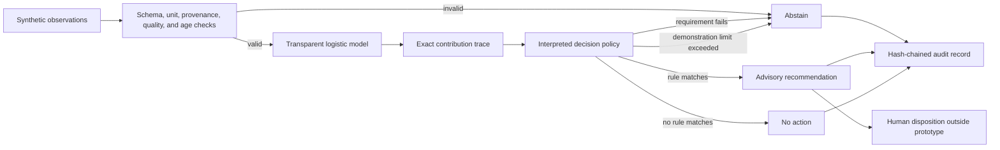
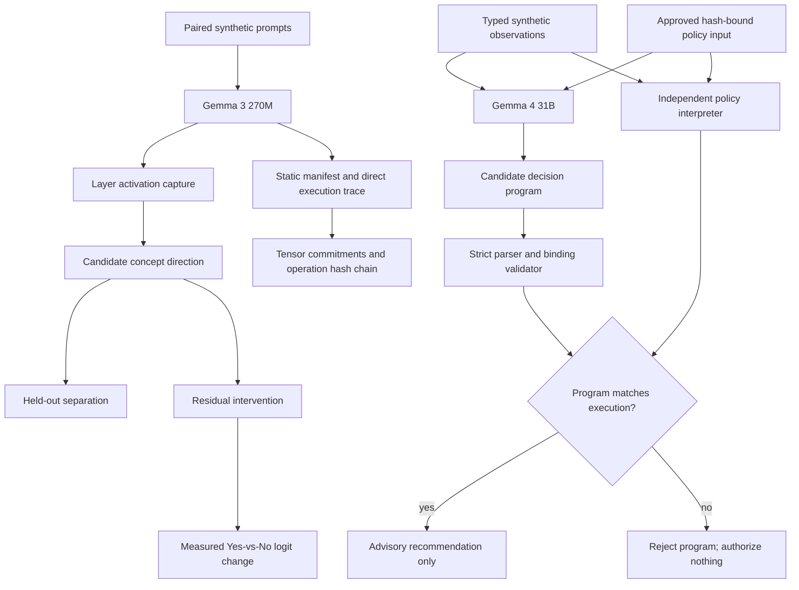

# Bioprocess Decision Runtime

A public, synthetic demonstration of **interpretable-by-construction**, bounded AI-assisted decision logic for a bioprocess scenario.

The project now tests two related objectives:

1. **Investigate internal computation:** capture Gemma residual-stream activations, test candidate concept directions on held-out prompts, and apply controlled residual-stream interventions.
2. **Require executable decisions:** constrain Gemma to a small evidence-bound program whose claims must exactly match independent execution of an approved policy.

The central question is not whether a second model can invent a convincing explanation for a first model. It is whether internal-representation claims can survive causal tests and whether the operational decision can be represented as an executable, inspectable policy whose inputs, mathematical contributions, rules, and limits are preserved in the decision record.

> **Research prototype only.** This repository uses synthetic scenarios and illustrative policy values. It is not validated, qualified, or intended for GMP, clinical, laboratory, manufacturing, process-control, or patient-care use. It does not claim regulatory acceptance or patient-safety assurance.

## What this demonstrates

- A seeded synthetic-data training pipeline with held-out and cross-validation metrics
- Translation of a fitted scikit-learn pipeline into raw-unit executable coefficients
- A small domain-specific policy language with an interpreter
- An inherently transparent logistic model with exact per-input contributions
- Declared intended use and advisory-only authority
- Required units, provenance, quality status, ranges, and observation age
- Explicit abstention on missing, stale, malformed, conflicting, or out-of-envelope evidence
- Rule execution traces that are the decision computation, not post-hoc generated rationales
- Exact replay checks under the same runtime implementation
- A tamper-evident, SHA-256 hash-chained NDJSON audit log
- Scenario-based evaluation suitable for developing operator-training exercises
- Residual-stream activation capture across all 18 layers of Gemma 3 270M
- Held-out linear-separation tests for a candidate low-oxygen language direction
- Residual-stream interventions with measured next-token logit effects
- A strict evidence-bound decision program generated by local Gemma 4 31B
- Independent rejection of invented rules, altered policy hashes, incorrect statuses, and incorrect proposals
- A static Gemma architecture manifest with deterministic logical-value hashes after contiguous CPU canonicalization
- Deterministic greedy token-prefix prediction with full logits commitments
- Hash-chained leaf-module and dispatched ATen operation provenance
- Verification that manual prediction matches a separate `transformers.generate` invocation
- An independently orchestrated eager Gemma forward path using frozen weights and explicit equations
- Fixed-input, zero-tolerance equivalence certificates across 19 model boundaries and vocabulary logits
- Comparison between explicit eager arithmetic and the deployed SDPA attention path
- Architecture-defined coordinate semantics separated from empirical biological interpretations
- Per-layer explicit-attention versus SDPA comparisons using identical Q/K/V tensors and masks for non-softcapped attention; softcapped configurations are rejected because SDPA cannot reproduce the score transform
- Exhaustive reference/eager/deployed checks over caller-declared finite canonical input grids

## What this does not demonstrate

- A validated bioreactor model or control strategy
- Scientifically justified process limits
- Compatibility with DeltaV or any commercial control system
- Autonomous process actuation
- GMP compliance or regulatory acceptance
- Clinical, product-quality, or patient-safety performance
- That transparent models are always more accurate than other approaches
- Complete interpretation of Gemma or identification of a complete causal circuit
- That a linearly separable activation direction has stable human semantics
- That Gemma 3 270M findings transfer to the operational Gemma 4 31B checkpoint
- That an accepted decision program explains every internal cause of Gemma's token selection
- A universal equivalence proof over all token sequences or an independently verified implementation of every primitive CUDA/PyTorch kernel
- Semantic meaning from tensor hashes or operation records alone

## Architecture



The runtime never writes to process equipment. A recommendation has `authority: advisory_only` and requires human review. An abstention also requests review because it indicates missing, conflicting, stale, or out-of-envelope evidence; it does not authorize an action.

The Gemma experiments add two paths without changing that authority boundary:



## Quick start

Requires Python 3.11 or newer. Install the project and its scikit-learn dependency:

```powershell
python -m pip install -e .
python -m bioprocess_runtime scenario low_oxygen
python -m bioprocess_runtime suite
```

The Gemma experiments use optional dependencies. The tested NVIDIA installation is:

```powershell
python -m pip install "torch==2.7.1" --index-url https://download.pytorch.org/whl/cu128
python -m pip install -e ".[gemma,proof]"
```

Download the 536 MB Transformers checkpoint used for activation experiments. The model uses Google's Gemma license and is excluded from Git:

```powershell
python -c "from huggingface_hub import snapshot_download; snapshot_download('unsloth/gemma-3-270m-it', local_dir='.models/gemma-3-270m-it')"
```

Train a transparent logistic model on seeded illustrative synthetic data, translate its standardized coefficients back into declared input units, and emit an executable policy plus evaluation report:

```powershell
python -m bioprocess_runtime train --output-policy artifacts/learned_policy.bpr --report artifacts/training_report.json
python -m bioprocess_runtime scenario low_oxygen --policy artifacts/learned_policy.bpr
```

The training report includes held-out ROC AUC, accuracy, Brier score, five-fold cross-validation results, raw-unit coefficients, and the numerical error introduced when translating the fitted scikit-learn pipeline into the policy language. These metrics characterize only the synthetic generator.

Record all suite decisions and verify the audit chain:

```powershell
python -m bioprocess_runtime suite --audit artifacts/audit.ndjson --output artifacts/evaluation.json
python -m bioprocess_runtime audit-verify artifacts/audit.ndjson
python -m bioprocess_runtime replay artifacts/audit.ndjson <decision-id>
```

Run the tests:

```powershell
python -m unittest discover -s tests -v
```

The editable installation also provides the equivalent `bioprocess-runtime` command:

```powershell
bioprocess-runtime suite
```

## Executable policy

The demonstration policy is in [`policies/oxygen_advisory.bpr`](policies/oxygen_advisory.bpr):

```text
POLICY oxygen_advisory VERSION 1.0.0
INTENDED_USE "Generate advisory agitation recommendations in a synthetic stirred-tank scenario"
MODE ADVISORY

INPUT dissolved_oxygen_pct NUMBER UNIT percent MIN 0 MAX 100 MAX_AGE_SECONDS 30
INPUT agitation_rpm NUMBER UNIT rpm MIN 0 MAX 200 MAX_AGE_SECONDS 30

MODEL oxygen_risk LOGISTIC
BIAS 5.0
WEIGHT dissolved_oxygen_pct -0.12
WEIGHT dissolved_oxygen_slope -1.5
END_MODEL

RULE low_oxygen_advisory
WHEN oxygen_risk >= 0.75
REQUIRE sensor_agreement == true
RECOMMEND agitation_rpm DELTA 5 MAX 120 rpm
ELSE_ABSTAIN "Redundant synthetic sensors disagree; no recommendation is permitted"
END_RULE
```

The interpreter exposes the actual logistic computation:

```text
logit = bias + sum(weight * input)
score = sigmoid(logit)
```

For the built-in `low_oxygen` scenario, the record includes the exact contribution of each input, the threshold comparison, the sensor-agreement requirement, the recommendation-limit check, and the resulting advisory recommendation. No explanation model is involved.

## Built-in scenarios

| Scenario | Expected result | Purpose |
|---|---|---|
| `normal` | `NO_ACTION` | Model score below policy threshold |
| `low_oxygen` | `RECOMMENDATION` | Fully traceable advisory path |
| `sensor_disagreement` | `ABSTAIN` | Required evidence conflicts |
| `recommendation_limit` | `ABSTAIN` | Proposed value exceeds the illustrative envelope |
| `stale_input` | `ABSTAIN` | Evidence exceeds the permitted age |
| `unit_mismatch` | `ABSTAIN` | Input unit does not match its declaration |

These are software-behavior tests, not evidence that the policy is biologically appropriate.

## Objective A: investigate Gemma's internal computation

Run the real activation experiment:

```powershell
python -m bioprocess_runtime gemma-interpret --model-path .models/gemma-3-270m-it --output artifacts/interpretability.json
```

The experiment:

1. Uses six training prompts per class to compute candidate directions across all 18 residual-stream layers.
2. Uses a separate four-per-class validation set to select one layer by ROC AUC and then effect size.
3. Evaluates the selected layer once on a fixed, separately formatted 12-per-class vocabulary and format stress test.
4. Compares test performance with 200 shuffled-label and 200 random-direction null iterations, each of which independently repeats validation-based layer selection.
5. Intervenes on 12 negative test prompts and measures changes in the next-token `Yes`-minus-`No` logit margin.
6. Repeats localization at quarter, middle, and final relative token positions.
7. Separately captures and intervenes on aggregate attention and MLP outputs at the selected layer.
8. Splits the pre-output-projection attention tensor into four head-channel blocks and tests the validation-selected head.
9. Ranks eight of 2,048 MLP intermediate neurons using training data only, then tests them and replaces their activations with negative-training means.

The checked-in result is [`results/gemma3_270m_interpretability_summary.json`](results/gemma3_270m_interpretability_summary.json). Validation selected layer 10 with ROC AUC `1.0`; the larger stress-test ROC AUC was `0.6875`. That exceeded every one of 200 shuffled-label and 200 random-direction null runs after each null repeated layer selection. Both empirical right-tail p-values reached the finite-control minimum of `1/201 = 0.00498`.

Adding the selected residual direction increased the `Yes`-minus-`No` margin on 11 of 12 negative test prompts, with mean change `+0.266` and range `0.0` to `+0.5`. Finer localization was substantially weaker: validation-selected attention head 0 fell to stress-test ROC AUC `0.583`, while the best of eight training-ranked MLP neurons reached `0.649`. Replacing all eight selected MLP activations with negative-training means unexpectedly increased the mean output margin, rather than removing the presumed signal.

The evidence supports a distributed residual-stream association and intervention sensitivity in this authored dataset, but not a stable semantic feature, a localized head/neuron mechanism, or a complete causal circuit. The fixed stress test is not externally independent or formally preregistered. The model runs in `bfloat16`; exact numerical equivalence across hardware, drivers, or library versions is not claimed.

## Operational-semantics prototype

The activation experiments remain part of the evidence, but they are not treated as the complete rationale. The operational-semantics prototype instead records the frozen model's direct input-dependent execution.

Create a static model manifest:

```powershell
python -m bioprocess_runtime gemma-deconstruct --model-path .models/gemma-3-270m-it --output artifacts/architecture_manifest.json
```

The manifest includes:

- Model configuration and tokenizer identity
- Complete module inventory
- Deterministic logical-value hashes, shapes, dtypes, and sizes for every parameter and buffer; hashes use contiguous CPU byte order rather than original storage layout
- Tied-parameter identities
- Runtime, CUDA, device, and library versions
- Explicit mathematical descriptions of the major Gemma operators
- One hash committing to the complete manifest

Predict a finite output prefix while recording every leaf-module execution:

```powershell
python -m bioprocess_runtime gemma-trace --prompt "The oxygen reading is 30 percent and declining. Does this require review? Answer Yes or No." --max-new-tokens 1 --trace-level module --output artifacts/module_trace.json
```

Record dispatched ATen operations instead:

```powershell
python -m bioprocess_runtime gemma-trace --prompt "The oxygen reading is 30 percent and declining. Does this require review? Answer Yes or No." --max-new-tokens 1 --trace-level aten --output artifacts/aten_trace.json
```

Verify a saved operation chain:

```powershell
python -m bioprocess_runtime trace-verify artifacts/aten_trace.json
```

Regenerate the compact checked-in summary from the full artifacts:

```powershell
python -m bioprocess_runtime gemma-semantics-summary --manifest artifacts/architecture_manifest.json --module-trace artifacts/module_trace.json --aten-trace artifacts/aten_trace.json --output results/gemma3_270m_operational_semantics_summary.json
```

For each predicted token, the report contains:

- Exact input bytes and token IDs
- Complete vocabulary-logit tensor hash
- Winning and runner-up token IDs and logits
- Winning margin
- Argmax selection rule
- Output-token commitment
- Every traced module or ATen operation's input and output tensor descriptors
- An ordered SHA-256 chain over all execution records
- Comparison against a separate `transformers.generate` call

The checked-in result is [`results/gemma3_270m_operational_semantics_summary.json`](results/gemma3_270m_operational_semantics_summary.json). For a 30-token oxygen prompt, the prototype predicted token `10784` (`Yes`) with logit `33.0`, versus token `3771` (`No`) with logit `29.0`. The module trace contains 257 verified records; the ATen trace contains 2,511 verified records. Manual greedy prediction exactly matched `transformers.generate`.

This direct recorder establishes what logical tensor values and dispatched operations were observed under one runtime. Full reports remain excluded from Git because the ATen trace is several megabytes even for one token.

### Independent reference and fixed-input equivalence

The reference path does not call Hugging Face embedding, normalization, rotary, attention, decoder-layer, MLP, model, or language-model `forward()` methods. It independently orchestrates the frozen weights using explicit PyTorch equations for:

- Scaled embedding lookup
- RMS normalization
- Global and local RoPE
- Grouped-query key/value repetition
- Causal and sliding-window masks
- Scaled attention, stable float32 softmax, and value aggregation
- Attention output projection and residual paths
- GELU-tanh gated MLP and residual paths
- Final normalization and tied vocabulary projection

Create and verify a fixed-input equivalence certificate:

```powershell
python -m bioprocess_runtime gemma-reference-compare --prompt "The oxygen reading is 30 percent and declining. Does this require review? Answer Yes or No." --absolute-tolerance 0 --output artifacts/reference_equivalence.json
python -m bioprocess_runtime reference-verify artifacts/reference_equivalence.json --model-path .models/gemma-3-270m-it
```

Verification reloads the model and re-executes the recorded input. Without `--model-path`, the command reports integrity checks only and deliberately does not mark the computation verified.

Run separate scalar-equation examples and produce the architecture coordinate registry:

```powershell
python -m bioprocess_runtime operator-conformance --output artifacts/operator_conformance.json
python -m bioprocess_runtime gemma-coordinate-registry --output artifacts/coordinate_registry.json
```

Regenerate the checked result:

```powershell
python -m bioprocess_runtime gemma-reference-summary --certificate artifacts/reference_equivalence.json --conformance artifacts/operator_conformance.json --coordinates artifacts/coordinate_registry.json --output results/gemma3_270m_reference_equivalence_summary.json
```

The checked result is [`results/gemma3_270m_reference_equivalence_summary.json`](results/gemma3_270m_reference_equivalence_summary.json):

- Independent eager orchestration exactly matched all 19 Hugging Face eager boundaries with zero tolerance.
- All vocabulary logits matched exactly; both paths selected the same token.
- The certificate is bound to an in-memory checkpoint-state hash; a fresh model load reproduced the complete certificate exactly.
- The 20-record boundary certificate and the 295-record named reference-execution trace both verified.
- Four fixed-vector scalar-equation checks against both CPU and CUDA implementations had maximum absolute error `5.87e-8`.
- Explicit eager attention and SDPA were compared from identical Q/K/V tensors and masks at all 18 layers; no layer was byte-exact, maximum attention-output error was `0.5`, and the mean of layer mean errors was `0.00354`.
- The deployed SDPA path selected the same token but diverged numerically beginning at layer 0.
- Against the explicit eager reference, SDPA reached maximum hidden-boundary error `448.0`, final-normalized-state error `30.0`, and full-sequence maximum logit error `7.125`.

This establishes exact fixed-input equivalence between two orchestration paths that share PyTorch primitive kernels. It is not a universal proof over every token sequence and does not independently verify CUDA kernel arithmetic. The SDPA divergence demonstrates that attention implementation and numerical reduction behavior are part of the operational rationale even when the selected token remains unchanged.

The coordinate registry assigns exact architecture-defined meanings to axes such as token ID, position, query head, key/value head, MLP neuron, and vocabulary logit. Learned hidden coordinates remain numerically identifiable but do not receive unsupported biological labels.

### Typed Gemma execution program and predictive interpreter

The architecture manifest now compiles into a canonical typed IR with no opaque model-level attention, decoder, or MLP operation. For Gemma 3 270M, the checked program contains 533 ordered primitive instructions, 554 named tensors, and 240 frozen parameter or buffer commitments across all 18 layers. Every instruction binds a declared equation, inputs, outputs, parameter references, layer, attributes, and instruction hash. The verifier rejects missing producers, duplicate tensors, unknown primitives, incomplete layer coverage, altered instruction hashes, and manifest-binding changes.

```powershell
python -m bioprocess_runtime gemma-ir-compile --manifest artifacts/gemma270m_architecture_manifest.json --output results/gemma3_270m_execution_ir.json
python -m bioprocess_runtime gemma-ir-verify results/gemma3_270m_execution_ir.json --manifest artifacts/gemma270m_architecture_manifest.json
python -m bioprocess_runtime gemma-ir-rationale results/gemma3_270m_execution_ir.json --output results/gemma3_270m_selected_token_rationale.json
python -m bioprocess_runtime gemma-ir-rationale-verify results/gemma3_270m_execution_ir.json results/gemma3_270m_selected_token_rationale.json
```

The structural rationale is a complete backward dependency slice from `selected_token_id` through all 533 instructions to `input_ids` and the frozen tensor commitments. It is not yet a numerical causal-sufficiency claim.

The independent dispatcher interprets the IR without calling Gemma `forward()`, predicts the last-token logits, and only then invokes pinned Hugging Face eager execution for comparison:

```powershell
python -m bioprocess_runtime gemma-ir-predict results/gemma3_270m_execution_ir.json --model-path .models/gemma-3-270m-it --prompt "The oxygen reading is 30 percent and declining. Does this require review? Answer Yes or No." --output artifacts/gemma3_270m_ir_execution_certificate.json
python -m bioprocess_runtime gemma-ir-execution-verify results/gemma3_270m_execution_ir.json artifacts/gemma3_270m_ir_execution_certificate.json --model-path .models/gemma-3-270m-it
python -m bioprocess_runtime gemma-ir-execution-summary results/gemma3_270m_execution_ir.json artifacts/gemma3_270m_ir_execution_certificate.json --output results/gemma3_270m_ir_execution_summary.json
python -m bioprocess_runtime gemma-ir-execution-summary-verify results/gemma3_270m_execution_ir.json results/gemma3_270m_ir_execution_summary.json --certificate artifacts/gemma3_270m_ir_execution_certificate.json
```

For the checked 30-token prompt, the IR interpreter covered all 533 instructions and predicted Hugging Face eager logits bit-for-bit, including the selected token. The full local certificate binds the model-state hash, literal input token IDs, final logits and selected-token descriptors to a hash-chained descriptor for every IR instruction output. A fresh model load reproduced the complete certificate exactly; verification without `--model-path` performs integrity checks only. The checked compact result omits full execution records. Its numerical selection proof identifies token 10784 at bfloat16 logit 33.5, runner-up token 3771 at 29.625, and a strict float32 margin of 3.875 after checking every competitor. This establishes one fixed-input canonical-eager prediction, not SDPA or fused-kernel correspondence. The IR still marks bit-level primitive qualification false because its numerical dispatcher currently shares PyTorch primitive implementations with the comparator.

Eight non-arithmetic primitives now have 610 independently replayed bounded conformance cases against pure-Python coordinate and selection oracles. The qualification gate separates them from 11 reached floating-point primitives and keeps both global exactness activation and bit-exact numerical qualification false:

```powershell
python -m bioprocess_runtime gemma-ir-primitive-qualification --output results/gemma3_270m_ir_primitive_qualification.json
python -m bioprocess_runtime gemma-ir-primitive-qualification-verify results/gemma3_270m_ir_primitive_qualification.json
python -m bioprocess_runtime gemma-bfloat16-semantics --output results/gemma3_270m_bfloat16_semantics.json
python -m bioprocess_runtime gemma-bfloat16-semantics-verify results/gemma3_270m_bfloat16_semantics.json
python -m bioprocess_runtime gemma-reduction-characterization --output results/gemma3_270m_reduction_characterization.json
python -m bioprocess_runtime gemma-reduction-characterization-verify results/gemma3_270m_reduction_characterization.json
python -m bioprocess_runtime gemma-reduction-backend --program results/gemma3_270m_execution_ir.json --reduction results/gemma3_270m_reduction_characterization.json --nsight-suite results/gemma3_270m_nsight_kernel_suite.json --output results/gemma3_270m_reduction_backend_binding.json
python -m bioprocess_runtime gemma-reduction-backend-verify --program results/gemma3_270m_execution_ir.json --reduction results/gemma3_270m_reduction_characterization.json --nsight-suite results/gemma3_270m_nsight_kernel_suite.json results/gemma3_270m_reduction_backend_binding.json
python -m bioprocess_runtime gemma-ir-primitive-gate results/gemma3_270m_execution_ir.json results/gemma3_270m_ir_primitive_qualification.json results/gemma3_270m_bfloat16_semantics.json results/gemma3_270m_reduction_characterization.json results/gemma3_270m_reduction_backend_binding.json results/gemma3_270m_nsight_kernel_suite.json --output results/gemma3_270m_ir_primitive_gate.json
python -m bioprocess_runtime gemma-ir-primitive-gate-verify results/gemma3_270m_execution_ir.json results/gemma3_270m_ir_primitive_qualification.json results/gemma3_270m_bfloat16_semantics.json results/gemma3_270m_reduction_characterization.json results/gemma3_270m_reduction_backend_binding.json results/gemma3_270m_nsight_kernel_suite.json results/gemma3_270m_ir_primitive_gate.json
```

The tested primitives are `ARANGE`, `ARGMAX`, `CAUSAL_MASK`, `EMBEDDING`, `REPEAT_KV`, both head reshape/transposes, and last-token slicing. These tests establish exact conformance over their declared finite cases, not unrestricted-domain proofs.

Finite-input bfloat16 `ADD`, `MUL`, and `SCALE` now have an independent software specification: decode each IEEE-754 bfloat16 bit pattern to an exact dyadic rational, perform exact addition or multiplication, then encode once using round-to-nearest, ties-to-even. All 65,280 finite patterns round-trip through decode/encode, and 1,188 representative operations—including bfloat16 tensor-scalar and exactly representable Python-scalar `SCALE` paths—match both CPU and CUDA result bits. NaN/infinity inputs, complete pairwise truth tables, reductions, transcendental operations, and hardware-instruction behavior remain outside this certificate. The certificate records platform, PyTorch/CUDA versions, GPU name, and compute capability; verification re-executes in the current environment and requires an exact regenerated certificate. The gate records these three opcodes as independently specified and bounded-conformant but correctly leaves all 11 reached floating-point opcodes without unrestricted qualification.

Reduction characterization compares `LINEAR`, `MATMUL_QK`, and `MATMUL_AV` over 81 CPU/CUDA records and inner dimensions through 2,048 against five explicit candidates: exact rational sum followed by one bfloat16 rounding, sequential float32 accumulation, pairwise float32 accumulation, block-16 float32 accumulation, and sequential bfloat16 accumulation. Seventy-five records distinguish at least two candidates, but no candidate matches every observed result. The certificate therefore identifies order sensitivity without selecting a reduction profile; reduction-order, tensor-core, and hardware-instruction semantics remain false.

Controlled matrices matching the sequence-30 Gemma projection and explicit-eager attention shapes were then profiled with cancellation, grouped-cancellation, and deterministic pseudo-random vectors. All 18 linear-shape records launch exact kernel symbols already present in the deployed Nsight suite: CUTLASS `s161616` WMMA variants, the Ampere `s16816` down-projection kernel, split-K reduction, and the vocabulary GEMV kernel. Across the three vectors, no candidate remains a unique common match for any role; most roles have no common candidate at all, while AV retains two non-unique candidates. This rejects the apparent single-vector pairwise match and requires tile-aware WMMA/split-K schedules. The explicit-eager QK/AV symbols are absent from the deployed fused-attention suite, controlled values are not recorded model tensors, and per-invocation argument binding remains false.

### Expandable bounded-domain verification

The bounded-domain command exhaustively verifies every state in caller-supplied axes under one canonical prompt template:

```powershell
python -m bioprocess_runtime gemma-bounded-domain --oxygen-values "25,35,45" --slope-values=-1,0,1 --sensor-agreement "false,true" --output artifacts/bounded_domain.json
python -m bioprocess_runtime bounded-domain-verify artifacts/bounded_domain.json --model-path .models/gemma-3-270m-it
python -m bioprocess_runtime bounded-domain-summary artifacts/bounded_domain.json --output results/gemma3_270m_bounded_domain_summary.json
```

The checked 18-state result is [`results/gemma3_270m_bounded_domain_summary.json`](results/gemma3_270m_bounded_domain_summary.json):

- Independent reference and Hugging Face eager logits were byte-exact for all 18 states.
- Reference and eager selected the same token for all 18 states.
- SDPA selected the same token as the reference for all 18 states despite logit errors up to `2.25`.
- Gemma selected token `10784` (`Yes`) for every state in the grid.
- The complete 18-record state chain verified, and a fresh model load reproduced the full certificate exactly.

The axes are expandable, but the proof remains exhaustive only for the explicitly listed values and canonical serialization. It does not cover intermediate values, paraphrases, other templates, or unrestricted natural language unless those states are added to the declared domain.

### Universal symbolic operator proofs

Z3 checks the negation of each declared property and requires `unsat`, establishing that no counterexample exists within the complete stated mathematical domain:

```powershell
python -m bioprocess_runtime formal-proofs --output results/formal_operator_proofs.json
python -m bioprocess_runtime formal-proofs-verify results/formal_operator_proofs.json
```

The checked certificate is [`results/formal_operator_proofs.json`](results/formal_operator_proofs.json). All 21 properties re-verified:

- Six complete finite-domain lemmas cover modular addition, multiplication, a three-term dot product, stable argmax, sliding causal masks, and grouped-query head mapping.
- One algebraic encoding check covers the double-application identity of `rotate_half`.
- Five SMT-LIB IEEE-754 bfloat16 lemmas cover widening/narrowing, multiplication by one, commutativity of valid addition and multiplication, and double negation.
- Three conditional architecture theorems prove complete decoder-layer composition, the layerwise induction step for every integer layer index, and final-normalization/language-head composition whenever every constituent operator is extensionally equal.
- Five exact-real conditional theorems establish abstract softmax normalization and shift invariance, an RMS-normalization bound, a GELU-tanh gating bound, and RoPE pair-norm preservation.
- One theorem checks composition of independently encoded modular primitives.

The solver also produced concrete witnesses disproving two tempting universal assumptions: bfloat16 addition is not associative, and fused multiply-add can differ from separately rounded multiplication and addition. These counterexamples formally explain why reduction order and fusion choices cannot be omitted from a Gemma equivalence claim.

The architecture results close the composition-logic gap conditionally: if every stage is pointwise equivalent, equal hidden states remain equal through each layer and through the final vocabulary projection. They do not establish those premises. A full Gemma theorem still requires proofs for every actual tensor operator, cast, shape rule, constant, mask, transcendental approximation, and deployed implementation. Solver-generated SMT-LIB identifiers and satisfying witness choices are not stable across repeated constructions, so verification requires certificate integrity plus equality of re-executed claims rather than identical regenerated JSON. Each stored `smt2_sha256` commits the original query text but is not compared with the regenerated query hash; the verifier instead rebuilds the formula from controlled source and rechecks its scoped result.

### CUDA launch and binary provenance

The CUDA probe profiles one real Gemma forward pass, hashes the relevant PyTorch distribution binaries, inventories embedded cubins with `cuobjdump`, extracts a compatible cubin containing an observed kernel symbol, and disassembles that image with `nvdisasm`:

```powershell
python -m bioprocess_runtime cuda-provenance --prompt "The oxygen reading is 30 percent and declining. Does this require review? Answer Yes or No." --output artifacts/cuda_provenance_manifest.json
python -m bioprocess_runtime cuda-provenance-verify artifacts/cuda_provenance_manifest.json --verify-local-binaries
python -m bioprocess_runtime cuda-provenance-summary artifacts/cuda_provenance_manifest.json --output results/gemma3_270m_cuda_provenance_summary.json
```

`--kernel` can restrict extraction to a regular expression over observed PyTorch-native symbols. Without it, the probe chooses the highest-launch-count compatible candidate. `--redact` omits device identity, token IDs, and binary hashes when generating a shareable manifest. The checked private-repository summary intentionally retains the synthetic input IDs, GPU model, and distribution-binary hashes as reproducibility evidence; it contains no local paths or credentials and should be regenerated with `--redact` before publication if that environment fingerprint is not intended to be shared.

The checked summary is [`results/gemma3_270m_cuda_provenance_summary.json`](results/gemma3_270m_cuda_provenance_summary.json):

- The profile is bound to the checkpoint-state hash, exact 30 input token IDs, input tensors, output-logit tensor, SDPA configuration, and selected token `10784`.
- 2,069 CUDA events and 35 unique kernel symbols were observed.
- Launch families comprised 18 fused-attention, 1,848 PyTorch-native, 201 vendor-linear-algebra, and 2 memory-copy events.
- `torch_cuda.dll`, cuBLAS, cuBLASLt, and CUDA runtime binary values are committed by SHA-256.
- `torch_cuda.dll` contained 3,877 enumerated embedded images across its recorded architectures.
- The highest-launch-count profiled PyTorch-native symbol with extractable compatible SASS was launched 238 times and was present in `sm_86` image `torch_cuda.727.sm_86.cubin`.
- SHA-256 values cryptographically commit the extracted image and complete `nvdisasm` output; a heuristic fingerprint counted 74,817 instruction lines across 92 opcode forms in the complete image.
- Re-hashing the local distribution binaries matched the manifest.

This records an important provenance step but is not yet instruction-level verification. The RTX 4090 reports compute capability 8.9 while `torch.cuda.get_arch_list()` does not advertise an exact `sm_89` target for this build; the analysis therefore examines a compatible `sm_86` image. The driver has not attested that this exact image was selected for each launch.

### Proposed SASS subset semantics

A separate Z3 certificate defines and rechecks a small bitvector operational semantics:

```powershell
python -m bioprocess_runtime sass-semantics --output results/sass_semantics_proofs.json
python -m bioprocess_runtime sass-semantics-verify results/sass_semantics_proofs.json
```

The checked [`results/sass_semantics_proofs.json`](results/sass_semantics_proofs.json) now verifies 54 scoped properties spanning 59 exact opcode names. Coverage includes modular integer arithmetic and move forms, signed/unsigned predicate comparisons, a reduced-width funnel-shift invariant, abstract IEEE-754 RNE properties for `FADD`, `FMUL`, and `FFMA`, predicate selection, abstract control transitions, and proposed byte-array equations over 8-bit abstract addresses for `ULDC.64`, 32/64/128-bit `LDG`/`STG`, and 128-bit `LDGSTS`, plus separate reduced-width signed/unsigned `IMAD.WIDE` equations and distinct no-carry versus carry-consuming `LEA`/`ULEA` address equations, including `.SX32` through an independently checked 8-bit-for-32-bit source proxy. Proposed `UMOV` adds one reduced-width identity equation, while four-operand `UIADD3` and four-operand low-word `UIMAD` add two independent reduced-width arithmetic references and two full-width definitional instances under explicit premises that regular and uniform-register forms share only the modeled value arithmetic; predicate/carry outputs, `.X` forms, uniform-register selection, and warp-uniform behavior remain excluded. Proposed 8/32/64-bit `ULDC` equations add width-specific little-endian constant-memory identities while excluding constant-bank selection, caching, alignment, faults, register extension or pair placement, and hardware behavior. Proposed `S2R`, `S2UR`, and `R2UR` bit-copy records add a reduced-width identity and a full-width definitional instance under explicit premises that transfer preserves source bits; special-register acquisition, register-file selection, uniform behavior, and hardware execution remain excluded. The width-specific constant-load identities are separate from the proof-strength summary's four independent reduced-width references and nine full-width definitional/compositional instances. The selected extracted image has 57,840 of 74,817 lines (`77.31%`) whose exact opcode name appears in this proposed-semantics registry. Register widths and modifiers beyond each obligation, arbitrary LUT values, other memory forms, asynchronous/barrier behavior, warps, reconvergence, complete control flow, and hardware conformance remain excluded. These are proposed equations checked for internal consistency—not NVIDIA-certified semantics and not proof that hardware implements them.

### Driver module-load capture

A CUPTI resource callback is installed before Gemma initializes CUDA. It copies and hashes the cubin value supplied for every subsequent module-load event:

```powershell
python -m bioprocess_runtime cupti-module-capture --prompt "The oxygen reading is 30 percent and declining. Does this require review? Answer Yes or No." --artifact-directory artifacts/cupti_modules --output artifacts/cupti_module_capture.json
python -m bioprocess_runtime cupti-module-verify artifacts/cupti_module_capture.json --artifact-directory artifacts/cupti_modules
python -m bioprocess_runtime cupti-module-summary artifacts/cupti_module_capture.json --cuda-summary results/gemma3_270m_cuda_provenance_summary.json --output results/gemma3_270m_cupti_module_summary.json
```

The checked [`results/gemma3_270m_cupti_module_summary.json`](results/gemma3_270m_cupti_module_summary.json) records 28 module-load events and 28 unique cubin values with no callback errors. All local cubin sizes and hashes verified. The statically extracted and disassembled image hash `16d1c289...f1b2340f` exactly matched CUPTI module ID 20 during the checkpoint/input/output-bound Gemma execution.

This is stronger than inferring runtime use from a distribution binary: it records that the exact disassembled cubin value was presented at a driver module-load callback in the same bound execution.

### Launch-specific profiler attestation

With NVIDIA performance-counter access enabled, the permission probe now succeeds:

```powershell
python -m bioprocess_runtime cuda-nsight-permission --output results/gemma3_270m_nsight_attestation_status.json
```

One exact mangled kernel is collected inside an NVTX-bounded Gemma forward. The target process independently emits a checkpoint/input/output binding, and the resulting report is compared with the matching CUPTI cubin:

```powershell
$kernel = (Get-Content results/gemma3_270m_cuda_provenance_summary.json | ConvertFrom-Json).profiled_symbol_disassembly.profiled_kernel_name
ncu --target-processes all --nvtx --nvtx-include "gemma_bound_forward/" --kernel-name-base mangled --kernel-name $kernel --launch-count 1 --section LaunchStats --export artifacts/gemma_launch_attestation --force-overwrite python -m bioprocess_runtime gemma-nsight-target --prompt "The oxygen reading is 30 percent and declining. Does this require review? Answer Yes or No." --output artifacts/nsight_execution_binding.json
python -m bioprocess_runtime nsight-launch-certificate --report artifacts/gemma_launch_attestation.ncu-rep --binding artifacts/nsight_execution_binding.json --cuda-summary results/gemma3_270m_cuda_provenance_summary.json --cupti-report artifacts/cupti_module_capture.json --cupti-artifact-directory artifacts/cupti_modules --output results/gemma3_270m_nsight_launch_certificate.json
python -m bioprocess_runtime nsight-launch-verify results/gemma3_270m_nsight_launch_certificate.json
```

The checked [`results/gemma3_270m_nsight_launch_certificate.json`](results/gemma3_270m_nsight_launch_certificate.json) passes all 13 bindings:

- The report process ID equals the process that emitted the Gemma execution binding.
- The session records the `gemma_bound_forward` NVTX filter, exact mangled-kernel filter, and one-launch limit.
- Checkpoint, input-token tensor, output-logit tensor, and selected token `10784` match the earlier operational profile.
- The launch used compute capability 8.9, context 1, stream 7, block `(128,1,1)`, and grid `(1,1,1)`.
- Nsight reported 104 SASS instructions for the launch.
- `cuobjdump` reported the same 104-instruction function in CUPTI module 20.
- After normalizing absolute addresses to function offsets, every predicate, opcode, and operand matched; both sequences have canonical hash `acd6a12e...903e627`.

This provides launch-specific instruction-text identity for one PyTorch fill kernel executed inside the bound forward. It is not a proof of SASS semantics or hardware execution correctness. Nsight and CUPTI are both NVIDIA tooling, so this is stronger execution provenance rather than independent hardware verification.

### Complete distinct-kernel launch suite

The same exact-name, NVTX, process, model, input, output, CUPTI-module, and normalized-SASS checks were attempted for every distinct non-copy kernel in the recorded forward. `nsight-capture` writes a hash-bound exact-kernel request before invoking Nsight; this supplies auditable selection evidence when Nsight's session page omits an exceptionally long option value. After collecting the per-symbol reports, build and verify the aggregate:

```powershell
python -m bioprocess_runtime nsight-kernel-suite --report-directory artifacts/nsight_suite --cuda-manifest artifacts/cuda_provenance_manifest.json --cupti-report artifacts/cupti_module_capture.json --cupti-artifact-directory artifacts/cupti_modules --output results/gemma3_270m_nsight_kernel_suite.json
python -m bioprocess_runtime nsight-kernel-suite-verify results/gemma3_270m_nsight_kernel_suite.json --certificate-directory artifacts/nsight_suite --cupti-report artifacts/cupti_module_capture.json
```

The checked [`results/gemma3_270m_nsight_kernel_suite.json`](results/gemma3_270m_nsight_kernel_suite.json) reports:

| Family | Distinct symbols | Recorded launches represented |
|---|---:|---:|
| Fused attention | 1/1 | 18/18 |
| Linear algebra/GEMM | 6/6 | 129/129 |
| RMSNorm and other reductions | 3/3 | 183/183 |
| GELU | 1/1 | 18/18 |
| Elementwise and indexing | 24/24 | 1,719/1,719 |
| **Total** | **35/35** | **2,067/2,067** |

Every distinct symbol received one successful launch certificate. Nsight's session page retained the exact filter value for 33 symbols; the two omitted very long values are instead bound by pre-execution request hashes. The suite includes the 3,584-instruction fused-attention function, major GEMM variants, the 3,024-instruction RMS mean reduction, the 600-instruction GELU function, and elementwise kernels. Across the 35 distinct functions, 30,872 normalized instruction lines were bound to CUPTI-loaded cubins. Exact opcode names for which the project has at least one proposed semantics rule occur on 23,733 lines (`76.88%`); this is syntactic overlap only. In particular, arbitrary `LOP3.LUT` operands are counted even though only LUT values `0x96` and `0xe8` currently have checked identities.

The 100% launch-weighted figure means every symbol responsible for the 2,067 recorded non-copy launches has one representative invocation attested. It does not mean all 2,067 invocations were separately profiled, that equivalent symbols are used on other prompts or shapes, or that any instruction's semantics or hardware execution has been independently proven. Normalization reconciles documented presentation differences between Nsight and `cuobjdump`, including absolute versus relative control targets, operand ordering, `.reuse` annotations, and explicit conversion aliases; negative tests ensure distinct registers, predicates, and control targets remain distinct. Exact ELF symbol sets and single function-section checks prevent prefix or multi-function matches. The exact CUPTI cubin hashes retain the underlying binary commitments.

The aggregate verifier performs arithmetic and integrity checks by itself. Supplying `--certificate-directory` re-verifies every individual certificate and cross-checks its kernel, cubin, SASS hash, and instruction count; supplying `--cupti-report` re-links every cubin hash to the captured module set. `--redact` can remove report, cubin, SASS, and certificate hashes from a shareable suite, while the checked private-repository result intentionally retains them for reproducibility.

### Architecture-to-kernel correspondence

A separate registry maps expected Gemma stage patterns to attested symbols:

```powershell
python -m bioprocess_runtime operator-correspondence --suite results/gemma3_270m_nsight_kernel_suite.json --output results/gemma3_270m_operator_correspondence.json
python -m bioprocess_runtime operator-correspondence-verify results/gemma3_270m_operator_correspondence.json
```

The checked [`results/gemma3_270m_operator_correspondence.json`](results/gemma3_270m_operator_correspondence.json) finds attested symbol patterns for embedding lookup, RMS normalization, rotary embedding, linear projections, fused SDPA, gated GELU MLP, residual addition, and mask/index construction. Every structural pattern is present, but every stage deliberately retains `semantic_equivalence_established: false`, and the aggregate retains `full_operator_semantic_equivalence_established: false`. Symbol occurrence does not identify each repeated invocation's layer, bind launch arguments to exact tensor coordinates, or prove that composed instruction semantics equal the independent Gemma equations.

### Qualified module invocation bindings

Nested NVTX hooks now mark selected modules with deterministic qualified names while retaining their framework input and output tensors until after the forward pass. Deferred records commit each logical tensor value, shape, dtype, stride, storage offset, and a hash of its device pointer without injecting tensor-copy kernels into the marked module range. Nsight's raw page independently reports the active NVTX stack for each selected launch.

A capture request can add one or more `--module-nvtx-pattern` expressions; its launch certificate is then used to build a module certificate:

```powershell
python -m bioprocess_runtime module-invocation-certificate --report artifacts/nsight_suite/module_gemm.ncu-rep --binding artifacts/nsight_suite/module_gemm_binding.json --launch-certificate artifacts/nsight_suite/module_gemm_launch_certificate.json --expected-innermost-module model.layers.0.self_attn.q_proj --output artifacts/nsight_suite/module_gemm_module_certificate.json
python -m bioprocess_runtime module-invocation-verify artifacts/nsight_suite/module_gemm_module_certificate.json
python -m bioprocess_runtime module-invocation-summary-verify results/gemma3_270m_module_invocation_summary.json
```

The checked [`results/gemma3_270m_module_invocation_summary.json`](results/gemma3_270m_module_invocation_summary.json) contains four valid layer-0 bindings:

| Kernel role | Innermost qualified module | Inputs | Outputs |
|---|---|---:|---:|
| Fused attention | `model.layers.0.self_attn` | 5 | 1 |
| Q projection GEMM | `model.layers.0.self_attn.q_proj` | 1 | 1 |
| RMS mean reduction | `model.layers.0.input_layernorm` | 1 | 1 |
| GELU | `model.layers.0.mlp.act_fn` | 1 | 1 |

For the projection and GELU launches, Nsight reports both parent and child module ranges in nesting order. Each certificate verifies the process ID, exact kernel, outer forward range, expected innermost module, every reported module invocation hash, and presence of module-boundary tensor commitments.

This establishes which qualified framework module enclosed each representative launch and commits that module's boundary tensors. It does not decode CUDA parameter memory, prove that a particular device pointer was passed as a kernel argument, expose intermediate tensors inside fused modules, or cover every repeated invocation and layer. Accordingly, the summary retains `full_kernel_argument_binding_established: false`.

### CUPTI launch-parameter commitments

Before capture, a conformance command reads the installed CUDA 12.9/CUPTI headers and selected CUPTI library, verifies the four launch callback IDs, checks driver-domain and entry-site constants, compares generated C struct field order, and validates every x64 ctypes size and offset:

```powershell
python -m bioprocess_runtime cuda-metadata-conformance --output results/cuda_12_9_launch_metadata_conformance.json
python -m bioprocess_runtime cuda-metadata-verify results/cuda_12_9_launch_metadata_conformance.json
```

The checked [`results/cuda_12_9_launch_metadata_conformance.json`](results/cuda_12_9_launch_metadata_conformance.json) passes all six checks and commits the four local header values plus the selected `cupti64_2025.2.1.dll` value. This binds the hand-written ctypes definitions to the tested local metadata; it is not portability proof for another toolkit or ABI.

A CUPTI driver-entry subscriber then captures exact-symbol `cuLaunchKernel` and `cuLaunchKernelEx` calls. `cuFuncGetParamInfo` supplies each parameter's device-layout offset and size, allowing callback-time parameter-byte hashing without guessing the parameter count. Aligned 64-bit windows in each parameter value are hashed as pointer candidates and compared with the active qualified module's boundary-pointer commitments:

```powershell
python -m bioprocess_runtime gemma-launch-arguments --kernel <exact-mangled-name> --prompt "The oxygen reading is 30 percent and declining. Does this require review? Answer Yes or No." --module-nvtx-pattern "model\.layers\.0\.self_attn" --module-nvtx-pattern "model\.layers\.0\.self_attn\.q_proj" --output artifacts/q_proj_launch_arguments.json
python -m bioprocess_runtime launch-argument-summary --artifact "artifacts/q_proj_launch_arguments.json=model.layers.0.self_attn.q_proj" --output results/gemma3_270m_launch_argument_summary.json
python -m bioprocess_runtime launch-argument-summary-verify results/gemma3_270m_launch_argument_summary.json
```

The checked [`results/gemma3_270m_launch_argument_summary.json`](results/gemma3_270m_launch_argument_summary.json) reports:

- The Q-projection GEMM receives one 360-byte packed parameter object. Pre-launch retained tensors match at offset 280 for the module input and 288 for the module-owned weight. Offsets 296 and 304 retrospectively equal the post-launch output address; their field roles remain untyped.
- The fused-attention kernel receives one 264-byte parameter object. Retaining the layer-local dispatcher inputs binds offsets 0, 8, and 16 to Q, K, and V and offset 64 to the dispatcher output. The earlier retrospective module-output alias at offset 0 disappears when Q/K/V lifetimes are retained, confirming it was allocator reuse rather than an output-field binding.
- The RMS mean-reduction kernel receives one 1,048-byte parameter object. Offset 984 retrospectively equals the enclosing RMSNorm output address; the packed field and internal reduction input remain untyped.
- GELU receives parameters of 4, 1, and 16 bytes; aligned candidates in parameter 2 match its retained input and retrospective output. The typed signature below resolves those fields as `data[1]` and `data[0]`, respectively.
- All four artifacts verify. Two have pre-launch module-input matches, one has a pre-launch module-owned parameter match, and three have retrospective module-output address matches.
- Eleven launch values fall inside retained module or dispatcher tensor storage ranges; in these checked cases every match equals the corresponding tensor data pointer at storage offset zero.

This is direct equality between pointer-sized values present in driver launch parameters and framework tensor device addresses, represented through matching hashes, plus explicit storage-range containment checks. Input and parameter tensors are retained before launch; output addresses are captured retrospectively and can reflect allocator reuse unless an independent typed layout resolves the field. The evidence still does not generally establish the C++ type of each packed field, distinguish a true pointer from an equal-width coincidental integer without a typed signature, prove read/write direction, bounds, aliasing, or memory access, or decode packed `extra` buffers. The result therefore retains both `typed_kernel_signatures_established: false` and `complete_argument_binding_established: false`. Full artifacts remain ignored; `gemma-launch-arguments --redact` additionally removes model, tensor, packed-parameter, pointer-candidate, and selected-token fingerprints while recomputing all nested integrity hashes.

### Partial typed kernel signatures

The installed PyTorch wheel contains `ATen/native/cuda/CUDALoops.cuh`, which independently declares `vectorized_elementwise_kernel(int N, func_t f, array_t data)`. The GELU mangled symbol identifies `array_t` as `std::array<char*,2>`, and CUPTI reports parameter sizes `[4,1,16]`. Together these establish one partial launch-parameter schema; the specialized closure type remains unresolved:

```text
parameter 0: int N                 (4 bytes)
parameter 1: unresolved func_t f   (1 byte in this specialization)
parameter 2: char* data[2]         (16 bytes)
  data[0] at offset 0: observed output pointer
  data[1] at offset 8: observed input pointer
```

Generate and verify the certificate:

```powershell
python -m bioprocess_runtime kernel-signatures --summary results/gemma3_270m_launch_argument_summary.json --output results/gemma3_270m_kernel_signatures.json
python -m bioprocess_runtime kernel-signatures-verify results/gemma3_270m_kernel_signatures.json
```

The wheel reports exact PyTorch commit `e2d141dbde55c2a4370fac5165b0561b6af4798b`; that tree pins CUTLASS gitlink `afa1772203677c5118fcd82537a9c8fefbcc7008`. Certificate generation and verification fetch the exact-commit `CUDALoops.cuh`, `kernel_forward.h`, and `Reduce.cuh`, recompute their Git blob IDs and SHA-256 values, verify the CUTLASS gitlink through GitHub's tree metadata, and require the installed `CUDALoops.cuh` content to match after line-ending normalization.

The verified attention source defines 40 `Params` fields. Their parsed order must exactly equal the ctypes field order. Under recorded native Windows-x64 ABI assumptions, the reconstruction produces 264 bytes, exactly matching the driver parameter size, with `query_ptr` at offset 0, `output_ptr` at 64, dimensions at 96–112, strides at 120–184, dropout state at 200–247, and final pointers at 248 and 256. This layout has not yet been compiled against the full exact source dependency graph, so it is recorded as `source_layout_reconstructed`, not `typed_signature_established`. Its `query_ptr` identity exposed why the earlier retrospective offset-0 module-output address could not be interpreted as an output field. Retaining the dispatcher Q tensor prevents that allocator reuse in the current capture and directly binds offset 0 to Q.

GELU has a partial launch-parameter schema, not a fully typed signature. Q-projection CUTLASS and reduction packed structs remain untyped. For all entries, functor internals, pointer access direction, scalar-value validation, memory bounds, and complete field semantics remain unproved, so `complete_field_semantics_established` remains false.

### Decoded attention parameters and Q/K/V binding

A layer-local `TorchDispatchMode` retains only the tensors entering and leaving `aten._scaled_dot_product_efficient_attention.default` while the qualified attention module is active. The typed 264-byte decoder is then compared directly with those tensor pointers and logical-value commitments:

```powershell
python -m bioprocess_runtime attention-parameters --artifact artifacts/attention_launch_arguments.json --signatures results/gemma3_270m_kernel_signatures.json --output results/gemma3_270m_attention_parameters.json
python -m bioprocess_runtime attention-parameters-verify results/gemma3_270m_attention_parameters.json
```

The checked [`results/gemma3_270m_attention_parameters.json`](results/gemma3_270m_attention_parameters.json) passes all 24 checks:

- `query_ptr`, `key_ptr`, and `value_ptr` exactly match retained dispatcher inputs with distinct logical-value hashes.
- `output_ptr` at offset 64 exactly matches dispatcher output 0.
- Q/K/V each have shape `[1,4,30,256]` and stride `[30720,7680,256,1]`.
- Head dimensions are 256; queries and keys are 30; batch count is 1; head count is 4.
- Q/K/V matrix, head, and batch strides match those tensors, and output row stride is 1,024.
- Scale is `0.0625`, causal mask type is 1 with zero diagonal offset, and dropout is disabled.
- Sequence-start, sequence-length, and bias pointers are null for this fixed-length no-bias execution.
- The model configuration marks the layer as sliding-window attention with window 512; a zero kernel window field is consistent with the 30-token sequence being shorter than that limit, but does not prove the kernel enforces sliding-window behavior.

This establishes source-named Q/K/V pointer identity and logical tensor commitments for the selected layer-0 fused-attention launch. It also binds the source-named output field to dispatcher output 0. It does not prove how SASS instructions read or write those buffers, memory bounds, synchronization, or the fused attention equation; `kernel_read_write_semantics_established` and `memory_access_semantics_established` remain false.

### Logical tensor storage bounds

The retained dispatcher tensors now commit element size, storage byte count, storage-base pointer hash, and data-pointer offset. Four Z3 counterexample queries prove that every declared logical index remains inside its committed storage:

```powershell
python -m bioprocess_runtime attention-logical-bounds --artifact artifacts/attention_launch_arguments.json --attention results/gemma3_270m_attention_parameters.json --output results/gemma3_270m_attention_logical_bounds.json
python -m bioprocess_runtime attention-logical-bounds-verify results/gemma3_270m_attention_logical_bounds.json
```

Q/K/V each use shape `[1,4,30,256]`, stride `[30720,7680,256,1]`, two-byte bfloat16 elements, zero data-pointer offset, and 61,440 storage bytes. The dispatcher output has the same shape and storage size but stride `[30720,256,1024,1]`, matching the decoded source layout's token-major output row stride. The negation of each bounded byte-range claim is unsatisfiable.

The checked [`results/gemma3_270m_attention_logical_bounds.json`](results/gemma3_270m_attention_logical_bounds.json) therefore sets `logical_index_storage_bounds_established: true`. `attention-logical-bounds --redact` removes logical tensor, storage-base pointer, and data-pointer fingerprints while recomputing certificate integrity. It retains `sass_effective_address_formula_bound: false`, `sass_effective_address_bounds_established: false`, `kernel_memory_safety_established: false`, and `hardware_memory_access_conformance_established: false`. These proofs cover logical tensor indexing, not the addresses generated by SASS threads.

### Selected SASS address-expression DAGs

A fixed-point reaching-definition pass builds hash-consed instruction DAGs separately for each bounded call-string context. Predicated definitions preserve old and new alternatives; control-flow joins and loop recurrences remain explicit nodes rather than being collapsed to lexical last definitions. Full node graphs remain generated artifacts; a compact summary commits each root, graph hash, selected context and instruction, represented parameter fields, and unresolved-node count:

```powershell
python -m bioprocess_runtime attention-sass-expressions --cuobjdump <cuobjdump> --cubin <captured-cubin> --kernel <exact-mangled-name> --sass-memory results/gemma3_270m_attention_sass_memory.json --sass-semantics results/sass_semantics_proofs.json --nsight artifacts/nsight_suite/attention_certificate.json --logical-bounds results/gemma3_270m_attention_logical_bounds.json --output artifacts/gemma3_270m_attention_sass_expressions.json
python -m bioprocess_runtime attention-sass-expression-summary artifacts/gemma3_270m_attention_sass_expressions.json --output results/gemma3_270m_attention_sass_expressions.json
python -m bioprocess_runtime attention-sass-expression-summary-verify results/gemma3_270m_attention_sass_expressions.json
```

The checked summary selects one operand for each target:

| Field | SASS offset | DAG nodes | Proof-record-bound instructions | Unbound instructions | Joins | Cycles | Special-register leaves | Unsupported/unresolved nodes |
|---|---:|---:|---:|---:|---:|---:|---:|---:|
| `query_ptr` | `0x20f0` | 150 | 35/70 | 35 | 5 | 0 | 5 | 45 |
| `key_ptr` | `0x2140` | 167 | 41/78 | 37 | 6 | 1 | 4 | 48 |
| `value_ptr` | `0x35e0` | 163 | 39/76 | 37 | 6 | 1 | 4 | 48 |
| `output_ptr` | `0xa990` | 191 | 43/89 | 46 | 7 | 1 | 5 | 59 |
| `output_accum_ptr` | `0xb7e0` | 311 | 88/146 | 58 | 13 | 1 | 5 | 77 |

The expression fixed point visits the same 855 bounded block/call-stack contexts and 161 reachable blocks as the taint analysis. Its state lattice converges separately after 10,675 context iterations and records 12 distinct overflow contexts, 250 hash-consed ambiguous-join nodes, 65 cyclic-definition leaves, and five explicit special-register leaves across materialized contexts. It also retains 211 predicate-definition nodes, 274 predicate-source edges, 20 predicate joins, and four unresolved entry-predicate nodes globally; none of the five selected DAGs contains an entry-predicate leaf. Consequently `expression_call_string_depth_overflow_free` and `unbounded_context_sensitive_expression_reaching_definitions_established` are false. Selection minimizes aggregate source-field count before instruction offset, then chooses the first bounded context containing the target field.

The exact Nsight launch records block dimensions `[32,4,1]` and grid dimensions `[1,4,1]`. The expression certificate therefore binds launch-coordinate domain assumptions `TID.X∈[0,32)`, `TID.Y∈[0,4)`, `TID.Z∈[0,1)`, `CTAID.X∈[0,1)`, `CTAID.Y∈[0,4)`, and `CTAID.Z∈[0,1)` to the five observed special-register leaves and verifies dimension products against Nsight's scalar block/grid metrics. `special_register_launch_domain_assumptions_bound` is true, but `special_register_coordinate_correspondence_established`, `special_register_concrete_values_established`, and `special_register_hardware_acquisition_established` remain false. The leaves therefore remain unresolved for closed-form accounting.

An exact-opcode registry binds selected `MOV`, `UMOV`, four-operand `IADD3`/`UIADD3`, four-operand `IMAD`/`UIMAD`, `IMAD.IADD`, `IMAD.U32`, signed/unsigned `IMAD.WIDE` and `UIMAD.WIDE`, strict `S2R`/`S2UR`/`R2UR` transfers, and 8/32/64-bit `ULDC` nodes to named proved records and retained scopes from the exact SASS-semantics certificate. A node binds only when both its exact opcode and expected operand-token count match; uniform value forms additionally require a numbered `UR` destination and uniform-register, zero-register, or immediate inputs; constant loads require a numbered `UR` destination and exact `c[0x0][0xHEX]` source; transfer forms require exact destination/source register classes and retain `SR_*` sources as unresolved special-register leaves; `LOP3.LUT` requires the standard six-token form with LUT literal `0x96` or `0xe8`. The expression verifiers recompute every node binding, proof-record hash, per-selection bound/unbound count, and unbound-opcode histogram, but remain integrity/consistency checks over retained records; `sass-semantics-verify` is the re-execution check for the underlying obligations. These are proposed-semantics record references: `proof_premises_established_for_bound_instructions`, `all_expression_instruction_semantics_bound`, and `hardware_instruction_semantics_established` remain false.

A second hash-consed layer now lowers ordered semantic operands into partial proposed bit-vector formulas. It retains register references in operand order, immediate and zero values, signed or unsigned wide multiply-add, 32-bit modular arithmetic, and constant-memory reads. Low/high register-pair concatenation and output-word projection remain explicit opaque operations because register-pair placement is unestablished. Unbound operations and reaching-definition joins preserve recursively lowered children as opaque operations/joins; negated register operands, subword extension, cycles, entry registers, unsupported operands, and SR symbols also remain opaque. The compact summary commits the following full-artifact formula graphs:

| Field | Formula nodes | Lowered proposed operations | Opaque nodes |
|---|---:|---:|---:|
| `query_ptr` | 94 | 21 | 61 |
| `key_ptr` | 106 | 27 | 65 |
| `value_ptr` | 100 | 24 | 63 |
| `output_ptr` | 122 | 27 | 77 |
| `output_accum_ptr` | 157 | 43 | 97 |

`partial_proposed_symbolic_formulas_established`, `partial_formula_ordered_operands_preserved`, `partial_formula_well_typed`, and `typed_z3_translation_established` are true. The type checker validates every node's arity, bit width, child widths, LUT, and 32-bit root type. Z3 translates both roots per target, uses fresh typed symbols for opaque operations/leaves and shared named symbols for identical SR leaves, and retains 10/8/8/10/10 launch-domain inequalities for query/key/value/output/output-accumulator respectively. One local obligation per lowered operation—21/27/24/27/43—proves unsatisfiability of disagreement with the corresponding proposed formula operator, so `local_proposed_operator_lowering_equivalence_established` is true. This is local definitional correspondence only; it does not establish instruction premises or hardware semantics.

Every partial formula remains non-closed because it contains opaque nodes. The full-certificate verifier reconstructs each formula and analysis from the retained expression DAG and rejects formula, operand-order, type, width, solver-result, and hash inconsistencies; the compact-summary verifier checks retained commitments, counts, and boundaries without the omitted full node graphs.

Numbered `P` and `UP` state now participates in the same bounded call-string reaching definitions as general and uniform registers. Low `LEA`/`ULEA` and `IADD3`/`UIADD3` forms create explicit one-bit predicate outputs; `.X` consumers and instruction guards retain source edges to the reaching predicate definitions. The selected query/key/value/output/output-accumulator DAGs contain 5/5, 5/5, 6/6, 6/6, and 9/9 predicate definitions/source edges respectively, with no entry-predicate leaf or predicate join. `bounded_predicate_reaching_definitions_established` and `predicate_producer_consumer_dependencies_established` are true, while `predicate_values_established`, `predicate_carry_equations_established`, and `predicate_hardware_semantics_established` remain false.

Each selected low/high root pair is additionally bound to its exact observed predicate identities:

| Field | Low root | High root | Bound predicates |
|---|---|---|---|
| `query_ptr` | `LEA` at 6000 | `LEA.HI.X` at 6064 | `P0` |
| `key_ptr` | `LEA` at 8096 | `LEA.HI.X` at 8128 | `P3` |
| `value_ptr` | `LEA` at 13136 | `LEA.HI.X` at 13200 | `P6` |
| `output_ptr` | `IADD3` at 42656 | `IADD3.X` at 42752 | `P4`, `P6` |
| `output_accum_ptr` | `IADD3` at 46480 | `IADD3.X` at 46496 | `P1` |

`root_predicate_pair_bindings_established` is true: every consumer predicate resolves to an output from the corresponding low-root instruction and the producer precedes the consumer. Public NVIDIA documentation does not specify the predicate encoding at this level, while available reverse-engineered descriptions remain uncertain about the dual-predicate fields. Therefore `root_predicate_pair_encoding_established` and `root_carry_arithmetic_established` remain false; no guessed carry equation is introduced.

A hashed compute-capability-8.9 qualification gate now records and verifies the prerequisites for any future carry-equation activation. Exact pair bindings and architecture identity are present, but seven required items remain absent: authoritative instruction semantics, architecture-specific predicate encoding, complete one-predicate and two-predicate dynamic truth tables, validated low/high recomposition, an independent reference, and predicate-negation validation. Consequently `carry_semantics_qualification_gate_established` is true while `carry_semantics_qualified`, `carry_equation_activation_allowed`, and `proposed_carry_equations_activated` are false. Changing a requirement or activation flag invalidates full-certificate verification.

A versioned capture protocol specifies how dynamic evidence must be collected without treating instrumentation as semantic proof. It requires a Linux NVBit-compatible backend, exact Nsight and pair-binding hashes, capture before and after both low and high instructions, active-lane/thread/block coordinates, source/destination register and predicate values, at least three repetitions per vector, reference carry classes 0/1 for one-predicate pairs and 0/1/2 for the two-predicate pair, exactly one stable observed predicate pattern per reference class, with distinct patterns across the required classes. Any future bundle must additionally bind the backend, capture-tool, cubin, kernel, driver, and compiler identities. `carry_capture_protocol_established` is true, but `dynamic_carry_observations_bound`, truth-table completion, and independent reproduction remain false in the exact-cubin certificate. Windows CUDA and Compute Sanitizer do not provide the required predicate-register capture path; the separate WSL/NVBit experiments below remain observational and are not imported into that gate.

```powershell
python -m bioprocess_runtime attention-sass-carry-evidence-template artifacts/gemma3_270m_attention_sass_expressions.json --output artifacts/gemma3_270m_attention_sass_carry_evidence_template.json
python -m bioprocess_runtime attention-sass-carry-evidence-verify artifacts/gemma3_270m_attention_sass_expressions.json artifacts/gemma3_270m_attention_sass_carry_evidence_template.json
python -m bioprocess_runtime attention-sass-carry-reproduction-verify artifacts/gemma3_270m_attention_sass_expressions.json <primary-complete-bundle> <replicate-complete-bundle>
```

The cross-capture verifier requires both bundles to be structurally valid and syntactically complete, bound to identical execution identities, captured by distinct tool-binary hashes, and exactly equal after canonical observation normalization. Agreement establishes `cross_capture_reproduction_complete` for the retained observations only. Different hashes do not prove organizational or implementation independence, so `independent_reproduction_complete`, `semantic_coverage_verified`, `qualification_eligible`, carry-equation activation, and hardware semantics remain false.

The generated empty template is structurally valid but reports incomplete tool identity and syntactic dynamic coverage. A populated bundle must contain in-range coordinates, nonzero lane masks, nonempty register maps, hashed observations, stable per-class predicate patterns, and the required repetitions. Even complete syntactic coverage leaves `semantic_coverage_verified: false` and `qualification_eligible: false` until a separately implemented independent capture-replay verifier authenticates it; bundle ingestion cannot directly activate carry equations.

The versioned Linux tracer under `tools/nvbit_carry_trace` builds against an external NVBit 1.8 release and keeps generated objects, shared libraries, test executables, raw logs, cubins, and tensor-rich artifacts out of Git. NVBit core/library files are not vendored and remain subject to NVIDIA's upstream license/EULA:

```bash
make -C tools/nvbit_carry_trace
make -C tools/nvbit_carry_trace/test_apps
```

Isolated WSL experiments observed matching runtime instruction encodings, three repetitions per Q/K/V class, restored attention outputs, and same-launch low/high predicate flow. The value path additionally captured and immediately restored the intervening `P2R` destination; its output was invariant to P6 only for the observed vectors. The compact summary retains hashes and counts while explicitly preserving false exact-cubin, authoritative-P2R, independent-reproduction, hardware-semantics, memory-safety, qualification, and activation claims:

```bash
python -m bioprocess_runtime attention-sass-dynamic-summary --encoding <encoding-report> --low <low-report> --high <high-report> --query-pair <query-report> --key-pair <key-report> --value-triple <value-report> --p2r-encoding <p2r-report> --combined <combined-report> --acquisition-tool-sha256 <capture-binary-sha256> --output results/gemma3_270m_attention_sass_dynamic_summary.json
python -m bioprocess_runtime attention-sass-dynamic-summary-verify results/gemma3_270m_attention_sass_dynamic_summary.json --tool-directory tools/nvbit_carry_trace --acquisition-tool-sha256 <capture-binary-sha256>
```

The summary binds the exact acquisition-tool binary hash separately from the current versioned source commitment, so later safety hardening cannot be mistaken for the code that produced earlier observations. Because raw source reports are intentionally omitted, compact verification checks their hash commitments but reports `source_reports_independently_replayed: false`. Structural validity does not import observations into the exact-cubin evidence bundle and cannot activate carry equations.

A non-writing head-dimension-256 sweep observed the output `IADD3/IADD3.X` pair beginning at sequence length 129 and the output-accumulator pair beginning at length 257. The smallest launch reaching both has 4,608 threads. Increasing tracer capacity to 16,384 allowed baseline capture, but the first controlled output-pointer experiment changed alternating replay hashes because the same instruction offset executes repeatedly within a thread and baseline state lacked a dynamic-occurrence dimension. Positive allowlists on both pair and single-instruction paths therefore exclude output offsets; attempts remain observation-only until occurrence-indexed restoration is implemented and validated.

```bash
python -m bioprocess_runtime attention-sass-output-reachability-summary --report <reachability-report> --acquisition-tool-sha256 <capture-binary-sha256> --output results/gemma3_270m_attention_sass_output_reachability.json
python -m bioprocess_runtime attention-sass-output-reachability-verify results/gemma3_270m_attention_sass_output_reachability.json --acquisition-tool-sha256 <capture-binary-sha256>
```

A conservative unsigned interval pass covers every formula node. Literals are exact, coordinate symbols use their launch-domain assumptions, joins take the hull of reaching alternatives, and modular addition or multiply-add narrows only for exact inputs or when integer endpoint arithmetic proves no wrap. Constant-memory values and other opaque operations remain full-width. The retained interval counts are:

| Field | Bounded nodes | Exact nodes | Assumption-dependent bounded nodes | Nontrivial root intervals |
|---|---:|---:|---:|---:|
| `query_ptr` | 24 | 18 | 11 | 0 |
| `key_ptr` | 24 | 18 | 9 | 0 |
| `value_ptr` | 24 | 17 | 9 | 0 |
| `output_ptr` | 31 | 25 | 12 | 0 |
| `output_accum_ptr` | 33 | 27 | 14 | 0 |

`partial_formula_interval_analysis_established` is true, but both 32-bit root intervals for every target remain full `[0,2^32-1]` because opaque operations intervene. Therefore `all_selected_root_intervals_full_width_unknown` is true while `assumption_conditioned_effective_address_bounds_established` remains false. These intermediate intervals are diagnostics over proposed operators and explicit assumptions, not SASS hardware or memory-safety bounds.

A nearest-opaque-cut pass identifies the exact depth-zero blocker at each root:

| Field | Low root blocker | High root blocker |
|---|---|---|
| `query_ptr` | `LEA` | `LEA.HI.X` |
| `key_ptr` | `LEA` | `LEA.HI.X` |
| `value_ptr` | `LEA` | `LEA.HI.X` |
| `output_ptr` | `IADD3` | `IADD3.X` |
| `output_accum_ptr` | `IADD3` | `IADD3.X` |

`root_opaque_blocker_frontiers_established` and `all_selected_roots_have_opaque_blockers` are true. This does not establish the missing semantics. In each pair, the low instruction produces predicate/carry state consumed by the `.X` high instruction; the expression DAG now binds those producer-consumer dependencies, but not the predicate values or carry equations. Existing arithmetic composition obligations are therefore still insufficient on their own. A future root-closing increment must bind proposed low-word carry production and `.X` consumption equations without assuming predicate truth or NVIDIA hardware conformance.

Every selected graph contains its target source field and is bound to the exact cubin, canonical SASS, SASS-memory, SASS-semantics, and logical-bounds certificates. None is closed over the currently record-bound operations, unbound instructions, joins, recurrences, or entry symbols. Therefore `proposed_semantics_proof_bindings_established`, `bounded_call_string_expression_reaching_definitions_established`, and `selected_sass_address_expression_dags_established` are true while `closed_supported_sass_formulas_established`, `sass_effective_address_formula_bound`, `sass_to_logical_stride_correspondence_established`, `sass_effective_address_bounds_established`, and `kernel_memory_safety_established` remain false.

### SASS memory-address provenance

The exact CUPTI-loaded attention cubin can be replay-disassembled and scanned for constant-space parameter loads and memory-address register dependencies:

```powershell
python -m bioprocess_runtime attention-sass-memory --cuobjdump <cuobjdump> --cubin <captured-cubin> --kernel <exact-mangled-name> --nsight artifacts/nsight_suite/attention_certificate.json --attention results/gemma3_270m_attention_parameters.json --sass-semantics results/sass_semantics_proofs.json --output results/gemma3_270m_attention_sass_memory.json
python -m bioprocess_runtime attention-sass-memory-verify results/gemma3_270m_attention_sass_memory.json --cuobjdump <cuobjdump> --cubin <captured-cubin> --nsight artifacts/nsight_suite/attention_certificate.json --attention results/gemma3_270m_attention_parameters.json --sass-semantics results/sass_semantics_proofs.json
```

Under an explicit 16-byte parameter-base alignment assumption, `0x160` is the unique constant-space base with `ULDC.64` loads at all five source-reconstructed pointer offsets:

| Field | Parameter offset | Constant-space offset | Uniform register |
|---|---:|---:|---|
| `query_ptr` | 0 | `0x160` | `UR14` |
| `key_ptr` | 8 | `0x168` | `UR12` |
| `value_ptr` | 16 | `0x170` | `UR10` |
| `output_ptr` | 64 | `0x1a0` | `UR8` |
| `output_accum_ptr` | 72 | `0x1a8` | `UR16` |

The checked [`results/gemma3_270m_attention_sass_memory.json`](results/gemma3_270m_attention_sass_memory.json) replays against the exact cubin and reports 3,584 instructions, 364 classified memory instructions, and 149 parameter-space references. The memory classification is split into 113 global or global-to-shared operations, 249 shared-memory operations, and two generic `ST.E` operations; `LDGDEPBAR` dependency barriers are explicitly excluded.

The linear baseline records 364 memory-address slices, 123 with at least one parameter-field text dependency. A fixed-point CFG contains 163 basic blocks and 3,697 edges; 161 blocks and 3,570 instructions are reachable under the modeled edges. It resolves all 99 direct branch targets, includes target and fallthrough edges for 12 direct calls, adds 36 context-insensitive edges from three returns to all call fallthroughs, preserves fallthrough for predicated `RET` and `EXIT`, and converges after 6,233 block iterations. A lexical barrier-token stack matches all 23 `BSSY`/`BSYNC` pairs and routes four predicated `BREAK` instructions to the active barrier target; no `BRX` occurs. The context-insensitive CFG records all 364 memory-address slices as reachable, 197 with parameter-field dependencies.

A separate call-string analysis uses a maximum depth of four and matches returns to retained call-site fallthroughs. It visits 855 block/call-stack contexts, performs 12,767 fixed-point context iterations and 18,119 transitions, resolves every reached return context, and records 128/364 parameter-linked memory slices. Conservative predicate and lexical-reconvergence paths apply the depth-limit abstraction 150 times during fixed-point processing; each overflow drops the oldest return site and retains the newest, so `call_string_depth_overflow_free` is false and unbounded context sensitivity is not claimed. Every target pointer field reaches at least one address operand in all three analyses.

Exact opcode text classifies 416 address operands: 215 `candidate_read`, 193 `candidate_write`, and eight `candidate_read_write`. `LDGSTS` contributes separate shared-destination and global-source operands. In the bounded call-string result, Q/K/V link only to candidate-read operands (`4/16/32` respectively). `output_ptr` links to 16 candidate-read and 32 candidate-write operands, while `output_accum_ptr` links to 16 candidate-read and 16 candidate-write operands. `.WIDE` propagation includes the high half only when the final addend is an actual numbered register, avoiding phantom dependencies for immediate or zero-register addends.

The Z3 certificate proves internal properties of proposed little-endian byte-array equations: `ULDC.64` reads eight constant-memory bytes; 32/64/128-bit `LDG` forms preserve abstract global memory; matching 32/64/128-bit `STG` forms round-trip through `LDG`; 32-bit `STG` preserves nonoverlapping bytes; and 128-bit `LDGSTS` preserves global memory while copying into abstract shared memory. Reduced-width proofs separately cover signed default and unsigned `.U32` wide multiply-add. The no-carry `LEA`/`ULEA` high-half theorem requires a zero low-half carry premise; the `.HI.X` theorem explicitly consumes the generated carry. `.SX32` forms use a declared 8-bit source proxy in a 16-bit address model. Regular and uniform LEA forms are assumed to share only this arithmetic; uniform-register selection and warp-uniform behavior are excluded. Full-width 32×32→64 and 32-bit-index/64-bit-address instances validate the proposed equations at deployment widths, while independent reference constructions remain limited to the reduced-width signed/unsigned multiply proofs. The SASS-memory certificate checks every real parsed `LDG`, `STG`, and `LDGSTS` instruction and verifies that all actual operand classifications and all six observed exact width forms match the proposed role and width tables. These remain proposed equations and textual labels, not NVIDIA instruction semantics or actual access-direction proof.

This remains a syntactic over-approximation. Predicated definitions merge executed and non-executed possibilities, but predicate truth is not modeled. The context-insensitive result connects returns to every call fallthrough, while the bounded call-string result loses older context on depth overflow. Barrier tokens are paired lexically rather than interpreted with NVIDIA warp-reconvergence semantics. Instruction behavior, field-specific load-versus-store direction, bounds, aliasing, and hardware execution are also outside scope. Accordingly, `direct_branch_cfg_reaching_definitions_established`, `context_insensitive_call_return_edges_established`, `bounded_call_string_dataflow_established`, `lexical_barrier_reconvergence_edges_established`, `opcode_text_access_classification_established`, `real_opcode_operands_match_proposed_memory_role_table`, and `real_opcode_widths_match_proposed_memory_width_table` are true while `unbounded_context_sensitive_call_return_dataflow_established`, `hardware_reconvergence_semantics_established`, `predicate_truth_modeled`, `complete_control_flow_dataflow_established`, `memory_access_direction_established`, `memory_bounds_established`, `sass_instruction_semantics_established`, and `hardware_conformance_established` remain false.

## Objective B: force Gemma through an executable language

The decision program contains no coefficients or process limits. It can only:

- Bind every declared policy input to an identically named observation.
- Select the already approved model and rule.
- Predict the status that independent policy execution will produce.
- State the exact advisory proposal or state that there is none.

Example: [`examples/low_oxygen.program`](examples/low_oxygen.program)

```text
DECISION_PROGRAM VERSION 1
POLICY oxygen_advisory SHA256 <approved-policy-hash>
BIND agitation_rpm FROM agitation_rpm
BIND dissolved_oxygen_pct FROM dissolved_oxygen_pct
BIND dissolved_oxygen_slope FROM dissolved_oxygen_slope
BIND sensor_agreement FROM sensor_agreement
COMPUTE oxygen_risk
APPLY low_oxygen_advisory
EXPECT RECOMMENDATION
PROPOSE agitation_rpm DELTA 5 rpm
END
```

Evaluate a saved program without an LLM:

```powershell
python -m bioprocess_runtime program-evaluate examples/low_oxygen.program --scenario low_oxygen
```

With a local OpenAI-compatible Gemma API running on the default loopback endpoint:

```powershell
python -m bioprocess_runtime gemma-program --scenario low_oxygen --base-url http://127.0.0.1:5000/v1 --output artifacts/gemma_program.json
python -m bioprocess_runtime gemma-program-suite --base-url http://127.0.0.1:5000/v1 --output artifacts/gemma_program_suite.json
```

Generation is constrained with a dynamically built llama.cpp GBNF grammar. The grammar permits only the exact policy hash, complete identity bindings, approved model and rule names, defined statuses, and syntactically valid proposals. Grammar compliance establishes structure, not correctness.

The checked-in live result is [`results/gemma4_program_suite.json`](results/gemma4_program_suite.json). Gemma 4 produced matching programs for 4 of 6 scenarios. It incorrectly selected the low-oxygen rule for the normal and stale-input cases. The independent interpreter rejected both mismatches and authorized no recommendation from them. Exactly one advisory recommendation was authorized across the suite.

This is the intended boundary: the LLM may propose a structurally valid program, but only independent execution of the approved policy can authorize an advisory result. Program acceptance does not explain every internal cause of Gemma's token selection.

## Audit and replay

Each audit record contains:

- Full observation values and metadata
- Policy name, version, and source-file hash
- Transparent model formula, bias, contributions, logit, and score
- Every validation, rule, and constraint evaluation
- Recommendation authority and human-review requirement
- Previous-record hash and current-record hash

Hash chaining detects partial or in-place modification when a trusted chain head or copy is retained; it does **not** make a local file immutable, authenticate its writer, or prevent someone from rewriting the entire chain. The prototype audit writer is intentionally single-process and single-writer; concurrent appenders are unsupported. Production record controls would require appropriately governed storage, identity, concurrency, retention, and trusted-timestamp architecture.

Replay first verifies the audit chain and refuses to proceed if the supplied policy source does not match the policy hash in the recorded decision. It then re-evaluates the saved observations at the saved evaluation time and requires exact equality with the recorded payload under the same runtime implementation. Cross-version and cross-platform equivalence are not claimed.

## Development principles

1. **Interpretability by construction:** the trace is generated by execution of the decision policy.
2. **Bounded intended use:** the prototype supports one declared synthetic advisory task.
3. **No invented authority:** the runtime cannot actuate equipment.
4. **Fail by abstaining:** invalid evidence does not produce a recommendation.
5. **Separation of responsibilities:** software can enforce approved limits but cannot determine scientifically valid limits by itself.
6. **Claims proportional to evidence:** synthetic software tests are not regulatory or biological validation.
7. **Mechanistic hypotheses require intervention:** activation separability alone is not semantic proof.
8. **Language models cannot define authority:** Gemma may select from an approved program grammar but cannot create governing rules or limits.

## Path toward a research evaluation

A meaningful next study would compare this approach with PID/MPC baselines and a black-box ML baseline in a documented process simulator. Evaluation should measure control performance, constraint violations, abstention behavior, false alarms, operator-review burden, deterministic replay, and investigation time. Process SMEs would need to define scientifically defensible parameters and acceptance criteria.

## References

- [FDA draft guidance: Considerations for the Use of Artificial Intelligence To Support Regulatory Decision-Making for Drug and Biological Products](https://www.hhs.gov/guidance/document/considerations-use-artificial-intelligence-support-regulatory-decision-making-drug-and)
- [FDA: Process Validation—General Principles and Practices](https://www.fda.gov/regulatory-information/search-fda-guidance-documents/process-validation-general-principles-and-practices)
- [NIST AI Risk Management Framework](https://www.nist.gov/itl/ai-risk-management-framework)
- [On the Limits of Sparse Autoencoders: A Theoretical Framework and Reweighted Remedy](https://arxiv.org/abs/2506.15963)
- [The Linear Representation Hypothesis and the Geometry of Large Language Models](https://arxiv.org/abs/2311.03658)
- [Activation Addition: Steering Language Models Without Optimization](https://arxiv.org/abs/2308.10248)
- [Locating and Editing Factual Associations in GPT](https://arxiv.org/abs/2202.05262)
- [Geometric Path Enumeration for Equivalence Verification of Neural Networks](https://doi.org/10.1109/ICTAI52525.2021.00035)
- [DeepProve: Verifiable End-to-End Large Language Model Inference](https://eprint.iacr.org/2026/1112)

These references provide context. Listing them does not imply that the prototype conforms to or has been reviewed under any framework.
