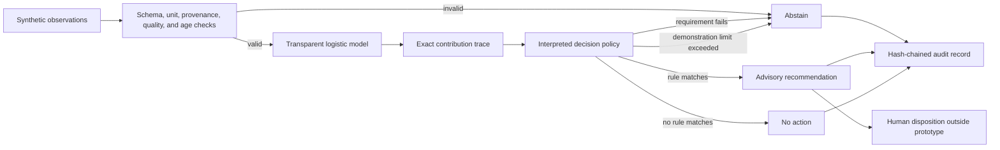
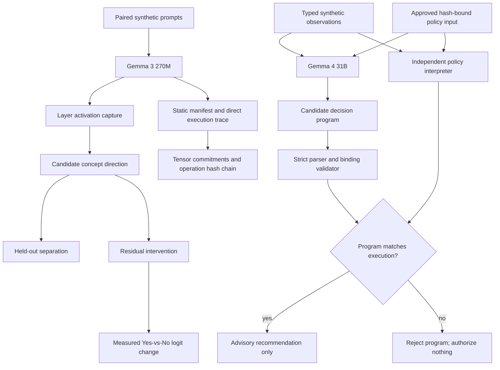

# Bioprocess Decision Runtime

A public, synthetic demonstration of **interpretable-by-construction**, bounded AI-assisted decision logic for a bioprocess scenario.

The project now tests two related objectives:

1. **Investigate internal computation:** capture Gemma residual-stream activations, test candidate concept directions on held-out prompts, and apply controlled residual-stream interventions.
2. **Require executable decisions:** constrain Gemma to a small evidence-bound program whose claims must exactly match independent execution of an approved policy.

The central question is not whether a second model can invent a convincing explanation for a first model. It is whether internal-representation claims can survive causal tests and whether the operational decision can be represented as an executable, inspectable policy whose inputs, mathematical contributions, rules, and limits are preserved in the decision record.

> **Research prototype only.** This repository uses synthetic scenarios and illustrative policy values. It is not validated, qualified, or intended for GMP, clinical, laboratory, manufacturing, process-control, or patient-care use. It does not claim regulatory acceptance or patient-safety assurance.

## What this demonstrates

- A seeded synthetic-data training pipeline with held-out and cross-validation metrics
- Translation of a fitted scikit-learn pipeline into raw-unit executable coefficients
- A small domain-specific policy language with an interpreter
- An inherently transparent logistic model with exact per-input contributions
- Declared intended use and advisory-only authority
- Required units, provenance, quality status, ranges, and observation age
- Explicit abstention on missing, stale, malformed, conflicting, or out-of-envelope evidence
- Rule execution traces that are the decision computation, not post-hoc generated rationales
- Exact replay checks under the same runtime implementation
- A tamper-evident, SHA-256 hash-chained NDJSON audit log
- Scenario-based evaluation suitable for developing operator-training exercises
- Residual-stream activation capture across all 18 layers of Gemma 3 270M
- Held-out linear-separation tests for a candidate low-oxygen language direction
- Residual-stream interventions with measured next-token logit effects
- A strict evidence-bound decision program generated by local Gemma 4 31B
- Independent rejection of invented rules, altered policy hashes, incorrect statuses, and incorrect proposals
- A static Gemma architecture manifest with deterministic logical-value hashes after contiguous CPU canonicalization
- Deterministic greedy token-prefix prediction with full logits commitments
- Hash-chained leaf-module and dispatched ATen operation provenance
- Verification that manual prediction matches a separate `transformers.generate` invocation
- An independently orchestrated eager Gemma forward path using frozen weights and explicit equations
- Fixed-input, zero-tolerance equivalence certificates across 19 model boundaries and vocabulary logits
- Comparison between explicit eager arithmetic and the deployed SDPA attention path
- Architecture-defined coordinate semantics separated from empirical biological interpretations
- Per-layer explicit-attention versus SDPA comparisons using identical Q/K/V tensors and masks for non-softcapped attention; softcapped configurations are rejected because SDPA cannot reproduce the score transform
- Exhaustive reference/eager/deployed checks over caller-declared finite canonical input grids

## What this does not demonstrate

- A validated bioreactor model or control strategy
- Scientifically justified process limits
- Compatibility with DeltaV or any commercial control system
- Autonomous process actuation
- GMP compliance or regulatory acceptance
- Clinical, product-quality, or patient-safety performance
- That transparent models are always more accurate than other approaches
- Complete interpretation of Gemma or identification of a complete causal circuit
- That a linearly separable activation direction has stable human semantics
- That Gemma 3 270M findings transfer to the operational Gemma 4 31B checkpoint
- That an accepted decision program explains every internal cause of Gemma's token selection
- A universal equivalence proof over all token sequences or an independently verified implementation of every primitive CUDA/PyTorch kernel
- Semantic meaning from tensor hashes or operation records alone

## Architecture



The runtime never writes to process equipment. A recommendation has `authority: advisory_only` and requires human review. An abstention also requests review because it indicates missing, conflicting, stale, or out-of-envelope evidence; it does not authorize an action.

The Gemma experiments add two paths without changing that authority boundary:



## Quick start

Requires Python 3.11 or newer. Install the project and its scikit-learn dependency:

```powershell
python -m pip install -e .
python -m bioprocess_runtime scenario low_oxygen
python -m bioprocess_runtime suite
```

The Gemma experiments use optional dependencies. The tested NVIDIA installation is:

```powershell
python -m pip install "torch==2.7.1" --index-url https://download.pytorch.org/whl/cu128
python -m pip install -e ".[gemma,proof]"
```

Download the 536 MB Transformers checkpoint used for activation experiments. The model uses Google's Gemma license and is excluded from Git:

```powershell
python -c "from huggingface_hub import snapshot_download; snapshot_download('unsloth/gemma-3-270m-it', local_dir='.models/gemma-3-270m-it')"
```

Train a transparent logistic model on seeded illustrative synthetic data, translate its standardized coefficients back into declared input units, and emit an executable policy plus evaluation report:

```powershell
python -m bioprocess_runtime train --output-policy artifacts/learned_policy.bpr --report artifacts/training_report.json
python -m bioprocess_runtime scenario low_oxygen --policy artifacts/learned_policy.bpr
```

The training report includes held-out ROC AUC, accuracy, Brier score, five-fold cross-validation results, raw-unit coefficients, and the numerical error introduced when translating the fitted scikit-learn pipeline into the policy language. These metrics characterize only the synthetic generator.

Record all suite decisions and verify the audit chain:

```powershell
python -m bioprocess_runtime suite --audit artifacts/audit.ndjson --output artifacts/evaluation.json
python -m bioprocess_runtime audit-verify artifacts/audit.ndjson
python -m bioprocess_runtime replay artifacts/audit.ndjson <decision-id>
```

Run the tests:

```powershell
python -m unittest discover -s tests -v
```

The editable installation also provides the equivalent `bioprocess-runtime` command:

```powershell
bioprocess-runtime suite
```

## Executable policy

The demonstration policy is in [`policies/oxygen_advisory.bpr`](policies/oxygen_advisory.bpr):

```text
POLICY oxygen_advisory VERSION 1.0.0
INTENDED_USE "Generate advisory agitation recommendations in a synthetic stirred-tank scenario"
MODE ADVISORY

INPUT dissolved_oxygen_pct NUMBER UNIT percent MIN 0 MAX 100 MAX_AGE_SECONDS 30
INPUT agitation_rpm NUMBER UNIT rpm MIN 0 MAX 200 MAX_AGE_SECONDS 30

MODEL oxygen_risk LOGISTIC
BIAS 5.0
WEIGHT dissolved_oxygen_pct -0.12
WEIGHT dissolved_oxygen_slope -1.5
END_MODEL

RULE low_oxygen_advisory
WHEN oxygen_risk >= 0.75
REQUIRE sensor_agreement == true
RECOMMEND agitation_rpm DELTA 5 MAX 120 rpm
ELSE_ABSTAIN "Redundant synthetic sensors disagree; no recommendation is permitted"
END_RULE
```

The interpreter exposes the actual logistic computation:

```text
logit = bias + sum(weight * input)
score = sigmoid(logit)
```

For the built-in `low_oxygen` scenario, the record includes the exact contribution of each input, the threshold comparison, the sensor-agreement requirement, the recommendation-limit check, and the resulting advisory recommendation. No explanation model is involved.

## Built-in scenarios

| Scenario | Expected result | Purpose |
|---|---|---|
| `normal` | `NO_ACTION` | Model score below policy threshold |
| `low_oxygen` | `RECOMMENDATION` | Fully traceable advisory path |
| `sensor_disagreement` | `ABSTAIN` | Required evidence conflicts |
| `recommendation_limit` | `ABSTAIN` | Proposed value exceeds the illustrative envelope |
| `stale_input` | `ABSTAIN` | Evidence exceeds the permitted age |
| `unit_mismatch` | `ABSTAIN` | Input unit does not match its declaration |

These are software-behavior tests, not evidence that the policy is biologically appropriate.

## Objective A: investigate Gemma's internal computation

Run the real activation experiment:

```powershell
python -m bioprocess_runtime gemma-interpret --model-path .models/gemma-3-270m-it --output artifacts/interpretability.json
```

The experiment:

1. Uses six training prompts per class to compute candidate directions across all 18 residual-stream layers.
2. Uses a separate four-per-class validation set to select one layer by ROC AUC and then effect size.
3. Evaluates the selected layer once on a fixed, separately formatted 12-per-class vocabulary and format stress test.
4. Compares test performance with 200 shuffled-label and 200 random-direction null iterations, each of which independently repeats validation-based layer selection.
5. Intervenes on 12 negative test prompts and measures changes in the next-token `Yes`-minus-`No` logit margin.
6. Repeats localization at quarter, middle, and final relative token positions.
7. Separately captures and intervenes on aggregate attention and MLP outputs at the selected layer.
8. Splits the pre-output-projection attention tensor into four head-channel blocks and tests the validation-selected head.
9. Ranks eight of 2,048 MLP intermediate neurons using training data only, then tests them and replaces their activations with negative-training means.

The checked-in result is [`results/gemma3_270m_interpretability_summary.json`](results/gemma3_270m_interpretability_summary.json). Validation selected layer 10 with ROC AUC `1.0`; the larger stress-test ROC AUC was `0.6875`. That exceeded every one of 200 shuffled-label and 200 random-direction null runs after each null repeated layer selection. Both empirical right-tail p-values reached the finite-control minimum of `1/201 = 0.00498`.

Adding the selected residual direction increased the `Yes`-minus-`No` margin on 11 of 12 negative test prompts, with mean change `+0.266` and range `0.0` to `+0.5`. Finer localization was substantially weaker: validation-selected attention head 0 fell to stress-test ROC AUC `0.583`, while the best of eight training-ranked MLP neurons reached `0.649`. Replacing all eight selected MLP activations with negative-training means unexpectedly increased the mean output margin, rather than removing the presumed signal.

The evidence supports a distributed residual-stream association and intervention sensitivity in this authored dataset, but not a stable semantic feature, a localized head/neuron mechanism, or a complete causal circuit. The fixed stress test is not externally independent or formally preregistered. The model runs in `bfloat16`; exact numerical equivalence across hardware, drivers, or library versions is not claimed.

## Operational-semantics prototype

The activation experiments remain part of the evidence, but they are not treated as the complete rationale. The operational-semantics prototype instead records the frozen model's direct input-dependent execution.

Create a static model manifest:

```powershell
python -m bioprocess_runtime gemma-deconstruct --model-path .models/gemma-3-270m-it --output artifacts/architecture_manifest.json
```

The manifest includes:

- Model configuration and tokenizer identity
- Complete module inventory
- Deterministic logical-value hashes, shapes, dtypes, and sizes for every parameter and buffer; hashes use contiguous CPU byte order rather than original storage layout
- Tied-parameter identities
- Runtime, CUDA, device, and library versions
- Explicit mathematical descriptions of the major Gemma operators
- One hash committing to the complete manifest

Predict a finite output prefix while recording every leaf-module execution:

```powershell
python -m bioprocess_runtime gemma-trace --prompt "The oxygen reading is 30 percent and declining. Does this require review? Answer Yes or No." --max-new-tokens 1 --trace-level module --output artifacts/module_trace.json
```

Record dispatched ATen operations instead:

```powershell
python -m bioprocess_runtime gemma-trace --prompt "The oxygen reading is 30 percent and declining. Does this require review? Answer Yes or No." --max-new-tokens 1 --trace-level aten --output artifacts/aten_trace.json
```

Verify a saved operation chain:

```powershell
python -m bioprocess_runtime trace-verify artifacts/aten_trace.json
```

Regenerate the compact checked-in summary from the full artifacts:

```powershell
python -m bioprocess_runtime gemma-semantics-summary --manifest artifacts/architecture_manifest.json --module-trace artifacts/module_trace.json --aten-trace artifacts/aten_trace.json --output results/gemma3_270m_operational_semantics_summary.json
```

For each predicted token, the report contains:

- Exact input bytes and token IDs
- Complete vocabulary-logit tensor hash
- Winning and runner-up token IDs and logits
- Winning margin
- Argmax selection rule
- Output-token commitment
- Every traced module or ATen operation's input and output tensor descriptors
- An ordered SHA-256 chain over all execution records
- Comparison against a separate `transformers.generate` call

The checked-in result is [`results/gemma3_270m_operational_semantics_summary.json`](results/gemma3_270m_operational_semantics_summary.json). For a 30-token oxygen prompt, the prototype predicted token `10784` (`Yes`) with logit `33.0`, versus token `3771` (`No`) with logit `29.0`. The module trace contains 257 verified records; the ATen trace contains 2,511 verified records. Manual greedy prediction exactly matched `transformers.generate`.

This direct recorder establishes what logical tensor values and dispatched operations were observed under one runtime. Full reports remain excluded from Git because the ATen trace is several megabytes even for one token.

### Independent reference and fixed-input equivalence

The reference path does not call Hugging Face embedding, normalization, rotary, attention, decoder-layer, MLP, model, or language-model `forward()` methods. It independently orchestrates the frozen weights using explicit PyTorch equations for:

- Scaled embedding lookup
- RMS normalization
- Global and local RoPE
- Grouped-query key/value repetition
- Causal and sliding-window masks
- Scaled attention, stable float32 softmax, and value aggregation
- Attention output projection and residual paths
- GELU-tanh gated MLP and residual paths
- Final normalization and tied vocabulary projection

Create and verify a fixed-input equivalence certificate:

```powershell
python -m bioprocess_runtime gemma-reference-compare --prompt "The oxygen reading is 30 percent and declining. Does this require review? Answer Yes or No." --absolute-tolerance 0 --output artifacts/reference_equivalence.json
python -m bioprocess_runtime reference-verify artifacts/reference_equivalence.json --model-path .models/gemma-3-270m-it
```

Verification reloads the model and re-executes the recorded input. Without `--model-path`, the command reports integrity checks only and deliberately does not mark the computation verified.

Run separate scalar-equation examples and produce the architecture coordinate registry:

```powershell
python -m bioprocess_runtime operator-conformance --output artifacts/operator_conformance.json
python -m bioprocess_runtime gemma-coordinate-registry --output artifacts/coordinate_registry.json
```

Regenerate the checked result:

```powershell
python -m bioprocess_runtime gemma-reference-summary --certificate artifacts/reference_equivalence.json --conformance artifacts/operator_conformance.json --coordinates artifacts/coordinate_registry.json --output results/gemma3_270m_reference_equivalence_summary.json
```

The checked result is [`results/gemma3_270m_reference_equivalence_summary.json`](results/gemma3_270m_reference_equivalence_summary.json):

- Independent eager orchestration exactly matched all 19 Hugging Face eager boundaries with zero tolerance.
- All vocabulary logits matched exactly; both paths selected the same token.
- The certificate is bound to an in-memory checkpoint-state hash; a fresh model load reproduced the complete certificate exactly.
- The 20-record boundary certificate and the 295-record named reference-execution trace both verified.
- Four fixed-vector scalar-equation checks against both CPU and CUDA implementations had maximum absolute error `5.87e-8`.
- Explicit eager attention and SDPA were compared from identical Q/K/V tensors and masks at all 18 layers; no layer was byte-exact, maximum attention-output error was `0.5`, and the mean of layer mean errors was `0.00354`.
- The deployed SDPA path selected the same token but diverged numerically beginning at layer 0.
- Against the explicit eager reference, SDPA reached maximum hidden-boundary error `448.0`, final-normalized-state error `30.0`, and full-sequence maximum logit error `7.125`.

This establishes exact fixed-input equivalence between two orchestration paths that share PyTorch primitive kernels. It is not a universal proof over every token sequence and does not independently verify CUDA kernel arithmetic. The SDPA divergence demonstrates that attention implementation and numerical reduction behavior are part of the operational rationale even when the selected token remains unchanged.

The coordinate registry assigns exact architecture-defined meanings to axes such as token ID, position, query head, key/value head, MLP neuron, and vocabulary logit. Learned hidden coordinates remain numerically identifiable but do not receive unsupported biological labels.

### Expandable bounded-domain verification

The bounded-domain command exhaustively verifies every state in caller-supplied axes under one canonical prompt template:

```powershell
python -m bioprocess_runtime gemma-bounded-domain --oxygen-values "25,35,45" --slope-values=-1,0,1 --sensor-agreement "false,true" --output artifacts/bounded_domain.json
python -m bioprocess_runtime bounded-domain-verify artifacts/bounded_domain.json --model-path .models/gemma-3-270m-it
python -m bioprocess_runtime bounded-domain-summary artifacts/bounded_domain.json --output results/gemma3_270m_bounded_domain_summary.json
```

The checked 18-state result is [`results/gemma3_270m_bounded_domain_summary.json`](results/gemma3_270m_bounded_domain_summary.json):

- Independent reference and Hugging Face eager logits were byte-exact for all 18 states.
- Reference and eager selected the same token for all 18 states.
- SDPA selected the same token as the reference for all 18 states despite logit errors up to `2.25`.
- Gemma selected token `10784` (`Yes`) for every state in the grid.
- The complete 18-record state chain verified, and a fresh model load reproduced the full certificate exactly.

The axes are expandable, but the proof remains exhaustive only for the explicitly listed values and canonical serialization. It does not cover intermediate values, paraphrases, other templates, or unrestricted natural language unless those states are added to the declared domain.

### Universal symbolic operator proofs

Z3 checks the negation of each declared property and requires `unsat`, establishing that no counterexample exists within the complete stated mathematical domain:

```powershell
python -m bioprocess_runtime formal-proofs --output results/formal_operator_proofs.json
python -m bioprocess_runtime formal-proofs-verify results/formal_operator_proofs.json
```

The checked certificate is [`results/formal_operator_proofs.json`](results/formal_operator_proofs.json). All 21 properties re-verified:

- Six complete finite-domain lemmas cover modular addition, multiplication, a three-term dot product, stable argmax, sliding causal masks, and grouped-query head mapping.
- One algebraic encoding check covers the double-application identity of `rotate_half`.
- Five SMT-LIB IEEE-754 bfloat16 lemmas cover widening/narrowing, multiplication by one, commutativity of valid addition and multiplication, and double negation.
- Three conditional architecture theorems prove complete decoder-layer composition, the layerwise induction step for every integer layer index, and final-normalization/language-head composition whenever every constituent operator is extensionally equal.
- Five exact-real conditional theorems establish abstract softmax normalization and shift invariance, an RMS-normalization bound, a GELU-tanh gating bound, and RoPE pair-norm preservation.
- One theorem checks composition of independently encoded modular primitives.

The solver also produced concrete witnesses disproving two tempting universal assumptions: bfloat16 addition is not associative, and fused multiply-add can differ from separately rounded multiplication and addition. These counterexamples formally explain why reduction order and fusion choices cannot be omitted from a Gemma equivalence claim.

The architecture results close the composition-logic gap conditionally: if every stage is pointwise equivalent, equal hidden states remain equal through each layer and through the final vocabulary projection. They do not establish those premises. A full Gemma theorem still requires proofs for every actual tensor operator, cast, shape rule, constant, mask, transcendental approximation, and deployed implementation. Solver-generated SMT-LIB identifiers and satisfying witness choices are not stable across repeated constructions, so verification requires certificate integrity plus equality of re-executed claims rather than identical regenerated JSON. Each stored `smt2_sha256` commits the original query text but is not compared with the regenerated query hash; the verifier instead rebuilds the formula from controlled source and rechecks its scoped result.

### CUDA launch and binary provenance

The CUDA probe profiles one real Gemma forward pass, hashes the relevant PyTorch distribution binaries, inventories embedded cubins with `cuobjdump`, extracts a compatible cubin containing an observed kernel symbol, and disassembles that image with `nvdisasm`:

```powershell
python -m bioprocess_runtime cuda-provenance --prompt "The oxygen reading is 30 percent and declining. Does this require review? Answer Yes or No." --output artifacts/cuda_provenance_manifest.json
python -m bioprocess_runtime cuda-provenance-verify artifacts/cuda_provenance_manifest.json --verify-local-binaries
python -m bioprocess_runtime cuda-provenance-summary artifacts/cuda_provenance_manifest.json --output results/gemma3_270m_cuda_provenance_summary.json
```

`--kernel` can restrict extraction to a regular expression over observed PyTorch-native symbols. Without it, the probe chooses the highest-launch-count compatible candidate. `--redact` omits device identity, token IDs, and binary hashes when generating a shareable manifest. The checked private-repository summary intentionally retains the synthetic input IDs, GPU model, and distribution-binary hashes as reproducibility evidence; it contains no local paths or credentials and should be regenerated with `--redact` before publication if that environment fingerprint is not intended to be shared.

The checked summary is [`results/gemma3_270m_cuda_provenance_summary.json`](results/gemma3_270m_cuda_provenance_summary.json):

- The profile is bound to the checkpoint-state hash, exact 30 input token IDs, input tensors, output-logit tensor, SDPA configuration, and selected token `10784`.
- 2,069 CUDA events and 35 unique kernel symbols were observed.
- Launch families comprised 18 fused-attention, 1,848 PyTorch-native, 201 vendor-linear-algebra, and 2 memory-copy events.
- `torch_cuda.dll`, cuBLAS, cuBLASLt, and CUDA runtime binary values are committed by SHA-256.
- `torch_cuda.dll` contained 3,877 enumerated embedded images across its recorded architectures.
- The highest-launch-count profiled PyTorch-native symbol with extractable compatible SASS was launched 238 times and was present in `sm_86` image `torch_cuda.727.sm_86.cubin`.
- SHA-256 values cryptographically commit the extracted image and complete `nvdisasm` output; a heuristic fingerprint counted 74,817 instruction lines across 92 opcode forms in the complete image.
- Re-hashing the local distribution binaries matched the manifest.

This records an important provenance step but is not yet instruction-level verification. The RTX 4090 reports compute capability 8.9 while `torch.cuda.get_arch_list()` does not advertise an exact `sm_89` target for this build; the analysis therefore examines a compatible `sm_86` image. The driver has not attested that this exact image was selected for each launch.

### Proposed SASS subset semantics

A separate Z3 certificate defines and rechecks a small bitvector operational semantics:

```powershell
python -m bioprocess_runtime sass-semantics --output results/sass_semantics_proofs.json
python -m bioprocess_runtime sass-semantics-verify results/sass_semantics_proofs.json
```

The checked [`results/sass_semantics_proofs.json`](results/sass_semantics_proofs.json) now verifies 24 scoped properties spanning 27 exact opcode names. Coverage includes modular integer arithmetic and move forms, signed/unsigned predicate comparisons, a reduced-width funnel-shift invariant, abstract IEEE-754 RNE properties for `FADD`, `FMUL`, and `FFMA`, predicate selection, and abstract `NOP`/branch/exit state transitions. The selected extracted image has 54,850 of 74,817 lines (`73.31%`) whose exact opcode name appears in this proposed-semantics registry. Register widths and modifiers beyond each stated obligation, arbitrary LUT values, memory, barriers, warps, reconvergence, complete control flow, and hardware conformance remain excluded. These are proposed equations checked for internal consistency—not NVIDIA-certified semantics and not proof that hardware implements them.

### Driver module-load capture

A CUPTI resource callback is installed before Gemma initializes CUDA. It copies and hashes the cubin value supplied for every subsequent module-load event:

```powershell
python -m bioprocess_runtime cupti-module-capture --prompt "The oxygen reading is 30 percent and declining. Does this require review? Answer Yes or No." --artifact-directory artifacts/cupti_modules --output artifacts/cupti_module_capture.json
python -m bioprocess_runtime cupti-module-verify artifacts/cupti_module_capture.json --artifact-directory artifacts/cupti_modules
python -m bioprocess_runtime cupti-module-summary artifacts/cupti_module_capture.json --cuda-summary results/gemma3_270m_cuda_provenance_summary.json --output results/gemma3_270m_cupti_module_summary.json
```

The checked [`results/gemma3_270m_cupti_module_summary.json`](results/gemma3_270m_cupti_module_summary.json) records 28 module-load events and 28 unique cubin values with no callback errors. All local cubin sizes and hashes verified. The statically extracted and disassembled image hash `16d1c289...f1b2340f` exactly matched CUPTI module ID 20 during the checkpoint/input/output-bound Gemma execution.

This is stronger than inferring runtime use from a distribution binary: it records that the exact disassembled cubin value was presented at a driver module-load callback in the same bound execution.

### Launch-specific profiler attestation

With NVIDIA performance-counter access enabled, the permission probe now succeeds:

```powershell
python -m bioprocess_runtime cuda-nsight-permission --output results/gemma3_270m_nsight_attestation_status.json
```

One exact mangled kernel is collected inside an NVTX-bounded Gemma forward. The target process independently emits a checkpoint/input/output binding, and the resulting report is compared with the matching CUPTI cubin:

```powershell
$kernel = (Get-Content results/gemma3_270m_cuda_provenance_summary.json | ConvertFrom-Json).profiled_symbol_disassembly.profiled_kernel_name
ncu --target-processes all --nvtx --nvtx-include "gemma_bound_forward/" --kernel-name-base mangled --kernel-name $kernel --launch-count 1 --section LaunchStats --export artifacts/gemma_launch_attestation --force-overwrite python -m bioprocess_runtime gemma-nsight-target --prompt "The oxygen reading is 30 percent and declining. Does this require review? Answer Yes or No." --output artifacts/nsight_execution_binding.json
python -m bioprocess_runtime nsight-launch-certificate --report artifacts/gemma_launch_attestation.ncu-rep --binding artifacts/nsight_execution_binding.json --cuda-summary results/gemma3_270m_cuda_provenance_summary.json --cupti-report artifacts/cupti_module_capture.json --cupti-artifact-directory artifacts/cupti_modules --output results/gemma3_270m_nsight_launch_certificate.json
python -m bioprocess_runtime nsight-launch-verify results/gemma3_270m_nsight_launch_certificate.json
```

The checked [`results/gemma3_270m_nsight_launch_certificate.json`](results/gemma3_270m_nsight_launch_certificate.json) passes all 13 bindings:

- The report process ID equals the process that emitted the Gemma execution binding.
- The session records the `gemma_bound_forward` NVTX filter, exact mangled-kernel filter, and one-launch limit.
- Checkpoint, input-token tensor, output-logit tensor, and selected token `10784` match the earlier operational profile.
- The launch used compute capability 8.9, context 1, stream 7, block `(128,1,1)`, and grid `(1,1,1)`.
- Nsight reported 104 SASS instructions for the launch.
- `cuobjdump` reported the same 104-instruction function in CUPTI module 20.
- After normalizing absolute addresses to function offsets, every predicate, opcode, and operand matched; both sequences have canonical hash `acd6a12e...903e627`.

This provides launch-specific instruction-text identity for one PyTorch fill kernel executed inside the bound forward. It is not a proof of SASS semantics or hardware execution correctness. Nsight and CUPTI are both NVIDIA tooling, so this is stronger execution provenance rather than independent hardware verification.

### Complete distinct-kernel launch suite

The same exact-name, NVTX, process, model, input, output, CUPTI-module, and normalized-SASS checks were attempted for every distinct non-copy kernel in the recorded forward. `nsight-capture` writes a hash-bound exact-kernel request before invoking Nsight; this supplies auditable selection evidence when Nsight's session page omits an exceptionally long option value. After collecting the per-symbol reports, build and verify the aggregate:

```powershell
python -m bioprocess_runtime nsight-kernel-suite --report-directory artifacts/nsight_suite --cuda-manifest artifacts/cuda_provenance_manifest.json --cupti-report artifacts/cupti_module_capture.json --cupti-artifact-directory artifacts/cupti_modules --output results/gemma3_270m_nsight_kernel_suite.json
python -m bioprocess_runtime nsight-kernel-suite-verify results/gemma3_270m_nsight_kernel_suite.json --certificate-directory artifacts/nsight_suite --cupti-report artifacts/cupti_module_capture.json
```

The checked [`results/gemma3_270m_nsight_kernel_suite.json`](results/gemma3_270m_nsight_kernel_suite.json) reports:

| Family | Distinct symbols | Recorded launches represented |
|---|---:|---:|
| Fused attention | 1/1 | 18/18 |
| Linear algebra/GEMM | 6/6 | 129/129 |
| RMSNorm and other reductions | 3/3 | 183/183 |
| GELU | 1/1 | 18/18 |
| Elementwise and indexing | 24/24 | 1,719/1,719 |
| **Total** | **35/35** | **2,067/2,067** |

Every distinct symbol received one successful launch certificate. Nsight's session page retained the exact filter value for 33 symbols; the two omitted very long values are instead bound by pre-execution request hashes. The suite includes the 3,584-instruction fused-attention function, major GEMM variants, the 3,024-instruction RMS mean reduction, the 600-instruction GELU function, and elementwise kernels. Across the 35 distinct functions, 30,872 normalized instruction lines were bound to CUPTI-loaded cubins. Exact opcode names for which the project has at least one proposed semantics rule occur on 21,295 lines (`68.98%`); this is syntactic overlap only. In particular, arbitrary `LOP3.LUT` operands are counted even though only LUT values `0x96` and `0xe8` currently have checked identities.

The 100% launch-weighted figure means every symbol responsible for the 2,067 recorded non-copy launches has one representative invocation attested. It does not mean all 2,067 invocations were separately profiled, that equivalent symbols are used on other prompts or shapes, or that any instruction's semantics or hardware execution has been independently proven. Normalization reconciles documented presentation differences between Nsight and `cuobjdump`, including absolute versus relative control targets, operand ordering, `.reuse` annotations, and explicit conversion aliases; negative tests ensure distinct registers, predicates, and control targets remain distinct. Exact ELF symbol sets and single function-section checks prevent prefix or multi-function matches. The exact CUPTI cubin hashes retain the underlying binary commitments.

The aggregate verifier performs arithmetic and integrity checks by itself. Supplying `--certificate-directory` re-verifies every individual certificate and cross-checks its kernel, cubin, SASS hash, and instruction count; supplying `--cupti-report` re-links every cubin hash to the captured module set. `--redact` can remove report, cubin, SASS, and certificate hashes from a shareable suite, while the checked private-repository result intentionally retains them for reproducibility.

### Architecture-to-kernel correspondence

A separate registry maps expected Gemma stage patterns to attested symbols:

```powershell
python -m bioprocess_runtime operator-correspondence --suite results/gemma3_270m_nsight_kernel_suite.json --output results/gemma3_270m_operator_correspondence.json
python -m bioprocess_runtime operator-correspondence-verify results/gemma3_270m_operator_correspondence.json
```

The checked [`results/gemma3_270m_operator_correspondence.json`](results/gemma3_270m_operator_correspondence.json) finds attested symbol patterns for embedding lookup, RMS normalization, rotary embedding, linear projections, fused SDPA, gated GELU MLP, residual addition, and mask/index construction. Every structural pattern is present, but every stage deliberately retains `semantic_equivalence_established: false`, and the aggregate retains `full_operator_semantic_equivalence_established: false`. Symbol occurrence does not identify each repeated invocation's layer, bind launch arguments to exact tensor coordinates, or prove that composed instruction semantics equal the independent Gemma equations.

### Qualified module invocation bindings

Nested NVTX hooks now mark selected modules with deterministic qualified names while retaining their framework input and output tensors until after the forward pass. Deferred records commit each logical tensor value, shape, dtype, stride, storage offset, and a hash of its device pointer without injecting tensor-copy kernels into the marked module range. Nsight's raw page independently reports the active NVTX stack for each selected launch.

A capture request can add one or more `--module-nvtx-pattern` expressions; its launch certificate is then used to build a module certificate:

```powershell
python -m bioprocess_runtime module-invocation-certificate --report artifacts/nsight_suite/module_gemm.ncu-rep --binding artifacts/nsight_suite/module_gemm_binding.json --launch-certificate artifacts/nsight_suite/module_gemm_launch_certificate.json --expected-innermost-module model.layers.0.self_attn.q_proj --output artifacts/nsight_suite/module_gemm_module_certificate.json
python -m bioprocess_runtime module-invocation-verify artifacts/nsight_suite/module_gemm_module_certificate.json
python -m bioprocess_runtime module-invocation-summary-verify results/gemma3_270m_module_invocation_summary.json
```

The checked [`results/gemma3_270m_module_invocation_summary.json`](results/gemma3_270m_module_invocation_summary.json) contains four valid layer-0 bindings:

| Kernel role | Innermost qualified module | Inputs | Outputs |
|---|---|---:|---:|
| Fused attention | `model.layers.0.self_attn` | 5 | 1 |
| Q projection GEMM | `model.layers.0.self_attn.q_proj` | 1 | 1 |
| RMS mean reduction | `model.layers.0.input_layernorm` | 1 | 1 |
| GELU | `model.layers.0.mlp.act_fn` | 1 | 1 |

For the projection and GELU launches, Nsight reports both parent and child module ranges in nesting order. Each certificate verifies the process ID, exact kernel, outer forward range, expected innermost module, every reported module invocation hash, and presence of module-boundary tensor commitments.

This establishes which qualified framework module enclosed each representative launch and commits that module's boundary tensors. It does not decode CUDA parameter memory, prove that a particular device pointer was passed as a kernel argument, expose intermediate tensors inside fused modules, or cover every repeated invocation and layer. Accordingly, the summary retains `full_kernel_argument_binding_established: false`.

### CUPTI launch-parameter commitments

Before capture, a conformance command reads the installed CUDA 12.9/CUPTI headers and selected CUPTI library, verifies the four launch callback IDs, checks driver-domain and entry-site constants, compares generated C struct field order, and validates every x64 ctypes size and offset:

```powershell
python -m bioprocess_runtime cuda-metadata-conformance --output results/cuda_12_9_launch_metadata_conformance.json
python -m bioprocess_runtime cuda-metadata-verify results/cuda_12_9_launch_metadata_conformance.json
```

The checked [`results/cuda_12_9_launch_metadata_conformance.json`](results/cuda_12_9_launch_metadata_conformance.json) passes all six checks and commits the four local header values plus the selected `cupti64_2025.2.1.dll` value. This binds the hand-written ctypes definitions to the tested local metadata; it is not portability proof for another toolkit or ABI.

A CUPTI driver-entry subscriber then captures exact-symbol `cuLaunchKernel` and `cuLaunchKernelEx` calls. `cuFuncGetParamInfo` supplies each parameter's device-layout offset and size, allowing callback-time parameter-byte hashing without guessing the parameter count. Aligned 64-bit windows in each parameter value are hashed as pointer candidates and compared with the active qualified module's boundary-pointer commitments:

```powershell
python -m bioprocess_runtime gemma-launch-arguments --kernel <exact-mangled-name> --prompt "The oxygen reading is 30 percent and declining. Does this require review? Answer Yes or No." --module-nvtx-pattern "model\.layers\.0\.self_attn" --module-nvtx-pattern "model\.layers\.0\.self_attn\.q_proj" --output artifacts/q_proj_launch_arguments.json
python -m bioprocess_runtime launch-argument-summary --artifact "artifacts/q_proj_launch_arguments.json=model.layers.0.self_attn.q_proj" --output results/gemma3_270m_launch_argument_summary.json
python -m bioprocess_runtime launch-argument-summary-verify results/gemma3_270m_launch_argument_summary.json
```

The checked [`results/gemma3_270m_launch_argument_summary.json`](results/gemma3_270m_launch_argument_summary.json) reports:

- The Q-projection GEMM receives one 360-byte packed parameter object. Candidate pointers at byte offset 280 match the committed module input; offsets 296 and 304 match the committed output.
- The fused-attention kernel receives one 264-byte parameter object; offset 0 matches the enclosing attention output. Its Q/K/V intermediates are not module-boundary tensors, so no boundary-input match is claimed.
- The RMS mean-reduction kernel receives one 1,048-byte parameter object; offset 984 matches the enclosing RMSNorm output. Its internal reduction input is not identified with the module input.
- GELU receives parameters of 4, 1, and 16 bytes; aligned candidates in parameter 2 match both its committed input and output.
- All four artifacts verify. Two have module-boundary input matches and all four have output matches.

This is direct equality between pointer-sized values present in driver launch parameters and framework tensor device addresses, represented through matching hashes. It still does not establish the C++ type of each field, distinguish a true pointer from an equal-width coincidental integer without a typed signature, prove read/write direction, bounds, aliasing, or memory access, or decode packed `extra` buffers. The result therefore retains both `typed_kernel_signatures_established: false` and `complete_argument_binding_established: false`. Full artifacts remain ignored; `gemma-launch-arguments --redact` additionally removes model, tensor, packed-parameter, pointer-candidate, and selected-token fingerprints while recomputing all nested integrity hashes.

## Objective B: force Gemma through an executable language

The decision program contains no coefficients or process limits. It can only:

- Bind every declared policy input to an identically named observation.
- Select the already approved model and rule.
- Predict the status that independent policy execution will produce.
- State the exact advisory proposal or state that there is none.

Example: [`examples/low_oxygen.program`](examples/low_oxygen.program)

```text
DECISION_PROGRAM VERSION 1
POLICY oxygen_advisory SHA256 <approved-policy-hash>
BIND agitation_rpm FROM agitation_rpm
BIND dissolved_oxygen_pct FROM dissolved_oxygen_pct
BIND dissolved_oxygen_slope FROM dissolved_oxygen_slope
BIND sensor_agreement FROM sensor_agreement
COMPUTE oxygen_risk
APPLY low_oxygen_advisory
EXPECT RECOMMENDATION
PROPOSE agitation_rpm DELTA 5 rpm
END
```

Evaluate a saved program without an LLM:

```powershell
python -m bioprocess_runtime program-evaluate examples/low_oxygen.program --scenario low_oxygen
```

With a local OpenAI-compatible Gemma API running on the default loopback endpoint:

```powershell
python -m bioprocess_runtime gemma-program --scenario low_oxygen --base-url http://127.0.0.1:5000/v1 --output artifacts/gemma_program.json
python -m bioprocess_runtime gemma-program-suite --base-url http://127.0.0.1:5000/v1 --output artifacts/gemma_program_suite.json
```

Generation is constrained with a dynamically built llama.cpp GBNF grammar. The grammar permits only the exact policy hash, complete identity bindings, approved model and rule names, defined statuses, and syntactically valid proposals. Grammar compliance establishes structure, not correctness.

The checked-in live result is [`results/gemma4_program_suite.json`](results/gemma4_program_suite.json). Gemma 4 produced matching programs for 4 of 6 scenarios. It incorrectly selected the low-oxygen rule for the normal and stale-input cases. The independent interpreter rejected both mismatches and authorized no recommendation from them. Exactly one advisory recommendation was authorized across the suite.

This is the intended boundary: the LLM may propose a structurally valid program, but only independent execution of the approved policy can authorize an advisory result. Program acceptance does not explain every internal cause of Gemma's token selection.

## Audit and replay

Each audit record contains:

- Full observation values and metadata
- Policy name, version, and source-file hash
- Transparent model formula, bias, contributions, logit, and score
- Every validation, rule, and constraint evaluation
- Recommendation authority and human-review requirement
- Previous-record hash and current-record hash

Hash chaining detects partial or in-place modification when a trusted chain head or copy is retained; it does **not** make a local file immutable, authenticate its writer, or prevent someone from rewriting the entire chain. The prototype audit writer is intentionally single-process and single-writer; concurrent appenders are unsupported. Production record controls would require appropriately governed storage, identity, concurrency, retention, and trusted-timestamp architecture.

Replay first verifies the audit chain and refuses to proceed if the supplied policy source does not match the policy hash in the recorded decision. It then re-evaluates the saved observations at the saved evaluation time and requires exact equality with the recorded payload under the same runtime implementation. Cross-version and cross-platform equivalence are not claimed.

## Development principles

1. **Interpretability by construction:** the trace is generated by execution of the decision policy.
2. **Bounded intended use:** the prototype supports one declared synthetic advisory task.
3. **No invented authority:** the runtime cannot actuate equipment.
4. **Fail by abstaining:** invalid evidence does not produce a recommendation.
5. **Separation of responsibilities:** software can enforce approved limits but cannot determine scientifically valid limits by itself.
6. **Claims proportional to evidence:** synthetic software tests are not regulatory or biological validation.
7. **Mechanistic hypotheses require intervention:** activation separability alone is not semantic proof.
8. **Language models cannot define authority:** Gemma may select from an approved program grammar but cannot create governing rules or limits.

## Path toward a research evaluation

A meaningful next study would compare this approach with PID/MPC baselines and a black-box ML baseline in a documented process simulator. Evaluation should measure control performance, constraint violations, abstention behavior, false alarms, operator-review burden, deterministic replay, and investigation time. Process SMEs would need to define scientifically defensible parameters and acceptance criteria.

## References

- [FDA draft guidance: Considerations for the Use of Artificial Intelligence To Support Regulatory Decision-Making for Drug and Biological Products](https://www.hhs.gov/guidance/document/considerations-use-artificial-intelligence-support-regulatory-decision-making-drug-and)
- [FDA: Process Validation—General Principles and Practices](https://www.fda.gov/regulatory-information/search-fda-guidance-documents/process-validation-general-principles-and-practices)
- [NIST AI Risk Management Framework](https://www.nist.gov/itl/ai-risk-management-framework)
- [On the Limits of Sparse Autoencoders: A Theoretical Framework and Reweighted Remedy](https://arxiv.org/abs/2506.15963)
- [The Linear Representation Hypothesis and the Geometry of Large Language Models](https://arxiv.org/abs/2311.03658)
- [Activation Addition: Steering Language Models Without Optimization](https://arxiv.org/abs/2308.10248)
- [Locating and Editing Factual Associations in GPT](https://arxiv.org/abs/2202.05262)
- [Geometric Path Enumeration for Equivalence Verification of Neural Networks](https://doi.org/10.1109/ICTAI52525.2021.00035)
- [DeepProve: Verifiable End-to-End Large Language Model Inference](https://eprint.iacr.org/2026/1112)

These references provide context. Listing them does not imply that the prototype conforms to or has been reviewed under any framework.
