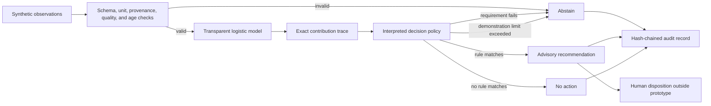
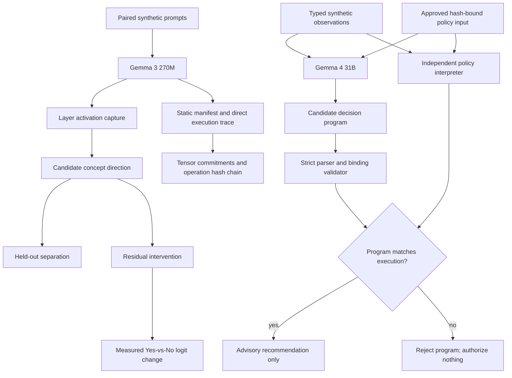

# Bioprocess Decision Runtime

An **independently executable, bit-exact specification of a fixed Gemma 3 270M checkpoint**, with source-bound evidence, predeclared held-out comparisons, replay, and explicit failure — alongside an executable, advisory-only policy language for a synthetic bioprocess scenario.

The question this repository answers is deliberately narrow: for a fixed model, runtime, and declared inputs, can a separate implementation reproduce every declared intermediate boundary and the complete output, record how it did so, and reject a run that disagrees — even when the final token happens to match? The answer here is yes, within the stated scope; one candidate was rejected on exactly that basis and the failure is preserved below.

Two earlier bounded studies are retained for context: capturing and intervening on Gemma residual-stream activations (Objective A), and constraining Gemma to an evidence-bound decision program that must match independent execution of an approved policy (Objective B). Neither claims a semantic explanation of the model; the central question throughout is whether claims survive independent execution and causal tests rather than whether a second model can invent a convincing rationale.

> **Research prototype only.** This repository uses synthetic scenarios and illustrative policy values. It is not validated, qualified, or intended for GMP, clinical, laboratory, manufacturing, process-control, or patient-care use. It does not claim regulatory acceptance or patient-safety assurance.

## Results at a glance

| Item | Result |
|---|---|
| Model | Gemma 3 270M IT, fixed checkpoint, pinned PyTorch 2.7.1+cu128 / Transformers 4.53.3 runtime |
| Independent program | 533 instructions covering all 18 decoder layers, final norm, full 262,144-logit vocabulary projection, argmax |
| Baseline v2 (preserved failure) | Selected token matched native (ID 10784) but 49 of 262,144 logits differed per forward; verifier rejected the run |
| Root cause and fix | Vocabulary projection reduction order; corrected integer-only GEMV specification (`gemma_gemv.py`), validated in isolation before integration |
| Baseline v3 | 3 native forwards, 21 compared boundaries each, zero mismatches; fresh replay passed |
| Predeclared held-outs | 2 raw-token cases frozen before any native execution; both matched at every boundary; replay passed |
| Scope of claim | Bit-exact conformance for the declared checkpoint, runtime and inputs only. Not a proof for other inputs, models or hardware; not semantic explainability or scientific correctness |

## What this demonstrates

- A seeded synthetic-data training pipeline with held-out and cross-validation metrics
- Translation of a fitted scikit-learn pipeline into raw-unit executable coefficients
- A small domain-specific policy language with an interpreter
- An inherently transparent logistic model with exact per-input contributions
- Declared intended use and advisory-only authority
- Required units, provenance, quality status, ranges, and observation age
- Explicit abstention on missing, stale, malformed, conflicting, or out-of-envelope evidence
- Rule execution traces that are the decision computation, not post-hoc generated rationales
- Exact replay checks under the same runtime implementation
- A tamper-evident, SHA-256 hash-chained NDJSON audit log
- Scenario-based evaluation suitable for developing operator-training exercises
- Residual-stream activation capture across all 18 layers of Gemma 3 270M
- Held-out linear-separation tests for a candidate low-oxygen language direction
- Residual-stream interventions with measured next-token logit effects
- A strict evidence-bound decision program generated by local Gemma 4 31B
- Independent rejection of invented rules, altered policy hashes, incorrect statuses, and incorrect proposals
- A static Gemma architecture manifest with deterministic logical-value hashes after contiguous CPU canonicalization
- Deterministic greedy token-prefix prediction with full logits commitments
- Hash-chained leaf-module and dispatched ATen operation provenance
- Verification that manual prediction matches a separate `transformers.generate` invocation
- An independently orchestrated eager Gemma forward path using frozen weights and explicit equations
- Fixed-input, zero-tolerance equivalence certificates across 19 model boundaries and vocabulary logits
- Comparison between explicit eager arithmetic and the deployed SDPA attention path
- Architecture-defined coordinate semantics separated from empirical biological interpretations
- Per-layer explicit-attention versus SDPA comparisons using identical Q/K/V tensors and masks for non-softcapped attention; softcapped configurations are rejected because SDPA cannot reproduce the score transform
- Exhaustive reference/eager/deployed checks over caller-declared finite canonical input grids

## What this does not demonstrate

- A validated bioreactor model or control strategy
- Scientifically justified process limits
- Compatibility with DeltaV or any commercial control system
- Autonomous process actuation
- GMP compliance or regulatory acceptance
- Clinical, product-quality, or patient-safety performance
- That transparent models are always more accurate than other approaches
- Complete interpretation of Gemma or identification of a complete causal circuit
- That a linearly separable activation direction has stable human semantics
- That Gemma 3 270M findings transfer to the operational Gemma 4 31B checkpoint
- That an accepted decision program explains every internal cause of Gemma's token selection
- A universal equivalence proof over all token sequences or an independently verified implementation of every primitive CUDA/PyTorch kernel
- Semantic meaning from tensor hashes or operation records alone

## Local demonstration UI

Run the loopback-only evidence dashboard and synthetic advisory demonstration:

```powershell
.\.venv\Scripts\python -m bioprocess_runtime.demo_ui --port 0
```

Open the local address printed by the command. Port `0` selects an available port; `--port 8765` requests a fixed port if it is free. `--root` can select a repository containing the saved `results/` artifacts and demonstration policy. This uses the Python standard library and locally served HTML/CSS/JavaScript: no frontend installation, external assets, or cloud inference calls.

- **Numerical evidence** displays five allowlisted saved experiments, including the completed full-target held-outs and replay: all 18 decoder layers, 533 program instructions, all vocabulary logits, and token IDs 76113/75027. Per-case restored-prefix counts distinguish uninterrupted work from validated checkpoint continuation. It checks pinned compact plan/summary/replay references, not raw tensors or fresh numerical execution. Missing or altered evidence is not shown as a match; if the full-target package is unavailable, coverage falls back to the older two-layer/partial-stage records. The graph is not unrestricted model or hardware qualification.
- **Synthetic advisory** evaluates one of the six existing synthetic scenarios on request using the unchanged policy engine and fixed scenario clock. It exposes input values, model contributions, rule checks, review requirements, and the decision identity. It does not call Gemma, modify policies, write audit files, or actuate equipment.
- The numerical regression status shown in the dashboard is a saved log observation, separate from UI verification. A missing completion marker is not proof that a process is still running.

The server intentionally exposes no generic file browsing, arbitrary command execution, policy editing, or model-inference endpoint. It binds only to `127.0.0.1`, rejects unexpected Host/Origin headers, and serves only allowlisted data. It is a local research-demo server, not an authenticated production deployment. Run UI tests with `python -m unittest discover -s tests -p test_demo_ui.py -v`. The last complete numerical repository run passed **625 tests**, all six scenarios, compilation and dependency checks. After this saved-evidence UI update, **16 UI/HTTP tests**, JavaScript syntax, six scenarios, compilation and dependency checks passed (`demo_full_target_lightweight_verification.log`, `LIGHTWEIGHT_VERIFICATION_EXIT_CODE=0`); the UI test process explicitly confirmed that PyTorch was not imported. The hardware-intensive full suite was not repeated because the machine has been suffering unexplained shutdowns. Browser visual review remains separate.

### MacBook presentation bundle

Use the small **Mac demo ZIP**, not the 4.6 GB numerical-runtime archive, for a meeting. It contains only the standard-library UI, five pinned evidence packages, the instruction program, synthetic policy, failure example, and the historical 625-test log. No model, lookup tables, PyTorch, Windows virtual environment, or package installation is needed. Python **3.11 or newer** must already be installed on the Mac.

1. Download the Mac demo ZIP from this private repository's releases while signed in, then extract it completely.
2. Double-click **`Launch Demo.command`**. It selects an installed compatible Python, starts a loopback-only server on an available port, and opens your browser.
3. If Finder will not launch the command file, open Terminal in the extracted folder and run:

   ```sh
   sh "Launch Demo.command"
   ```

   Or run `python3 -m bioprocess_runtime.demo_ui --port 0 --open-browser` with a compatible Python. If no compatible interpreter is found, install Python 3.11 or newer and try again; the launcher does not install anything or change system security settings.
4. Keep Terminal open during the presentation. Press **Control+C** there when finished. Rehearse on the actual Mac before the meeting; the portable bundle is tested by extraction, but macOS launch/visual sign-off is not performed on the Windows build machine.

Suggested walkthrough: select **Full-stack held-outs and replay**, show the 18-layer/533-instruction coverage, the two token results and continuation disclosures, then inspect an instruction's declared inputs and outputs. These are saved numerical results, not live Gemma inference. Next show the preserved v2 failure (`results/gemma3_270m_independent_baseline_v2_diagnosis.json`): token agreement was insufficient when 49 logits differed. Finally switch to **Synthetic advisory** and evaluate a scenario; this runs the illustrative policy engine live, not a model or equipment controller. The regression panel reports the original workstation's historical run, not tests performed on the Mac. Screenshots or a short recording from the Mac can serve as a meeting backup.

To build the small bundle on the evidence workstation:

```powershell
.\.venv\Scripts\python tools/package_handoff.py inventory --demo-only
.\.venv\Scripts\python tools/package_handoff.py build --demo-only --output dist/bioprocess-mac-demo-v1.zip
.\.venv\Scripts\python tools/package_handoff.py verify --output dist/bioprocess-mac-demo-v1.zip
```

The UI does not reproduce the validated Windows/NVIDIA numerical runtime on macOS. The demonstration supports a bounded engineering claim about inspectable execution, checks and replay—not universal explainability, scientific correctness, or GMP compliance.

## Local runtime handoff package

The source/runtime ZIP is the handoff format for this MVP. A Python wheel alone does not include the repository-level saved evidence and policy assets. The full local bundle adds the fixed Gemma checkpoint, lookup tables, prerequisite evidence, completed holdout reports and required proof checkpoints; it does not copy `.venv`, unrelated caches, or the entire interrupted-checkpoint history. Model assets remain subject to their own license terms. Building the bundle does not upload anything or run a model.

```powershell
.\.venv\Scripts\python tools/package_handoff.py inventory --runtime
.\.venv\Scripts\python tools/package_handoff.py check-index
.\.venv\Scripts\python tools/package_handoff.py build --runtime --output dist/bioprocess-mvp-runtime-0.1.0.zip
.\.venv\Scripts\python tools/package_handoff.py verify --output dist/bioprocess-mvp-runtime-0.1.0.zip
```

Run `check-index` after staging to verify that Git contains the exact working-file bytes. `.gitattributes` preserves raw JSON bytes because the frozen evidence uses both LF and CRLF; Python sources use LF. The ZIP is uncompressed to keep CPU load low, preserves every included file byte-for-byte, and is published only after all member hashes are checked. The builder refuses existing output files and reports the final archive SHA-256. The current runtime assets occupy approximately 4.6 GB before ZIP overhead.

After extraction, double-click `launch-demo.cmd` on Windows or run `python -m bioprocess_runtime.demo_ui --port 0` from the extracted directory. This opens saved evidence and the synthetic advisory demo, not model inference. `handoff-manifest.json` contains the source commit, per-file hashes and observed environment versions; `handoff-requirements.txt` pins the installed Python distributions, excluding this project and installation tooling.

Fresh numerical execution requires a separately installed matching environment: the tested runtime uses Python 3.11.9, PyTorch 2.7.1+cu128, Transformers 4.53.3, and the recorded NVIDIA/CUDA configuration. A live virtual environment and system driver are not portable archive contents, and dependency wheels are not bundled. On a stable compatible machine, install the matching CUDA-enabled PyTorch distribution, install the pinned requirements from the extracted bundle, then install this source tree with `pip install --no-deps -e .`. Read the recorded runtime fields before attempting a new numerical experiment; incompatible runtimes fail closed. Do not launch fresh inference merely to view the saved demo, especially while the workstation's shutdown issue is unresolved.

## Generic independent execution toward the MVP

`gemma_independent` executes the fixed 533-instruction IR with one layer-independent dispatcher, instead of new per-layer interpreters. It reuses the frozen arithmetic specifications, snapshots fresh checkpoint parameters, handles local/full causal masks and local/global rotary providers, and includes final RMS normalization, last-token slicing, vocabulary projection and exact integer-ordered BF16 argmax. Persistent column-tiled CPU workers also support the one-row vocabulary projection. Traces preserve actual IR IDs, producer links, parameter/provider commitments and FP32 RMS/softmax auxiliaries; raw states can be retained optionally.

The standalone runner has `calibrate`, `predict`, `compare`, `run`, and `verify` operations. `run` freezes the complete prediction before three original-forward comparisons at all reached decoder boundaries and, for the full target, final normalization and all vocabulary logits. This native comparison is not all-internal-state or register coverage. `verify --reexecute` regenerates the prediction and observations. Unsupported arithmetic produces an abstention with the last successful trace prefix, never a PyTorch arithmetic fallback.

```powershell
python -m bioprocess_runtime.gemma_independent_run run --tokens results/gemma3_270m_independent_baseline_tokens.json --global-provider results/gemma3_270m_independent_global_rotary_v3.json --prediction artifacts/my_independent_prediction_v3.json --report artifacts/my_independent_report_v3.json --checkpoint-dir artifacts/my_independent_checkpoints_v3 --allow-vocabulary-candidate --workers 4
```

Outputs must be new paths; never overwrite frozen evidence. `--target hidden.2` can restrict the same engine to a decoder-boundary diagnostic. Vocabulary execution requires `--allow-vocabulary-candidate`: v3 uses the component-tested integer GEMV rule at M1/N262144/K640, but full-path and end-to-end held-out validation remain pending. The preserved v1 global rotary packet is `48572a7a…2b410f1a`; v2 packet `fa1fd893…642f5867` binds the checkpoint-aware source. Their values, frequencies, positions and runtime are identical. Both are fixed-position empirical primitive calibrations from three original module calls on a zero-valued shape carrier, not model activations or hardware proofs.

The original full-path v1 run was interrupted after 439/533 instructions (`i0438`, decoder index 14), with no completed prediction/report and no resumable tensor state. The cause is unknown. The partial log and original declarations remain unchanged. Exact v1 engine/runner bytes are preserved in a verified Git pack under `artifacts/`; `results/gemma3_270m_independent_v1_interruption.json` records the source object IDs and hashes. The previous 30-token baseline is reused, not a fresh holdout. No full-model conformance result is established; predeclared end-to-end holdouts remain pending.

V2 adds data-only JSON checkpoints. A checkpoint directory has an immutable run binding and content-addressed generations, published atomically without overwriting prior checkpoints. A writer lease is released by the OS when the actual process dies. Checkpoints bind the engine/runner, runtime, input tokens, target, snapshot metadata, primitive providers and retention options. Resume validates retained and live tensors against the trace before computing the remaining instructions. A corrupted latest checkpoint is rejected rather than silently replaced with an older one; incomplete temporary files are ignored. No pickle or executable checkpoint payload is accepted.

Checkpoints are saved initially, after LINEAR operations and hidden boundaries, at the configured `--checkpoint-every` interval (default 8), and on successful completion. An interrupted in-flight instruction is recomputed; checkpoints do not preserve partial work inside a matrix operation. If prediction was interrupted before its output file was published, repeat the command with **`--resume`** and the same checkpoint directory and numerical inputs. Output files must still be new. If a complete prediction already exists, use `compare` rather than overwrite it. `verify --reexecute` can use a separate checkpoint directory for its recomputation.

Resume is explicitly disclosed through `checkpoint_resume` and `stored_boundary_predictions_used`; restored prefixes are not freshly rerun in that invocation. Fresh replay compares numerical content and trace commitments separately from operational resume provenance. Checkpoint hashes provide integrity/source binding, not external authenticity or hardware proof. Twenty engine/runner tests and eleven checkpoint tests pass, including actual writer-process termination followed by numerical resume in a fresh process. V2 computed all 533 instructions and saved prediction `a00b0e73…225bd87` plus final checkpoint `8b101c31…3c4eb5`. Native report `3988b351…43bd438` is **mismatched**: all 18 decoder boundaries, `hidden.final`, and `hidden.last` agree exactly, but 49 of 262,144 vocabulary logits differ in each of three forwards (147 aggregate mismatches). The native logits repeat exactly and all three token IDs agree with the predicted ID `10784`; token agreement does not override the logits failure. The saved report recount reproduces exactly. Success-gated replay did not start, and held-out inputs remain unused. See `results/gemma3_270m_independent_baseline_v2_diagnosis.json`. The subsequent isolated GEMV characterization below preserves this failed candidate and leaves the declared end-to-end holdouts untouched. Full repository verification passed **589 tests in 6888.867 seconds (`OK`)**, all six synthetic scenarios, compilation and dependency checks; the original supervisor exited 0 and `gemma_independent_v2_verification.log` records `VERIFICATION_EXIT_CODE=0`. This is implementation regression, not full-model numerical conformance. `results/gemma3_270m_independent_holdout_binding_v2.json` preserves the original holdout cases and explicitly revises only source/provider and continuation-provenance bindings. Existing UI coverage is not promoted by implementation tests.

### Vocabulary projection component follow-up

The isolated original vocabulary projection reproduced the v2 mismatch and selected a cuBLAS `gemvx` kernel, rather than the tensor-core family used by the transferred rule. An exploratory FP32 grid matched the complete baseline with eight strided accumulators and a halving merge. `bioprocess_runtime/gemma_gemv.py` implements that candidate using integer bit operations only: FP32 RNE accumulation/merge followed by BF16 RNE, with explicit rejection outside the declared normal-finite/signed-zero domain.

The integer candidate matched **all 262,144 baseline logits** and four predeclared synthetic primitive cases (512 unique weight rows per case, repeated to the full projection shape). All 15 checked comparisons had zero differences, matching profiled/plain outputs and kernel symbols. Fresh weight snapshots, complete component prediction regeneration and native report replay matched exactly. Six targeted exact-rational/reference tests pass. Evidence: `results/gemma_vocab_validation_protocol_v1.json` and `results/gemma_vocab_validation_summary_v1.json`; raw plans, observations, replay records and bound experiment scripts remain under ignored `artifacts/`.

This reuses the verified baseline final hidden state; it is **not fresh full-stack execution or end-to-end holdout validation**. The archived v2 runner and its failed report remain intact; the working generic runner is now v3 and routes the fixed vocabulary shape through the integer GEMV rule. The exact v2 engine/runner/checkpoint bytes, the GEMV implementation and five experiment scripts are preserved in a verified nine-object archive; `results/gemma_independent_v2_source_archive.json` records the blob IDs and file hashes. The GEMV-addition repository verification passed **595 tests**, all six scenarios, compilation and dependency checks (`gemma_vocab_verification_v1.log`, exit 0). V3 integration then passed **45 targeted tests**, including dispatch without fallback, evidence integrity, domain errors, ledger metadata and old-checkpoint rejection. V3 binds the pinned GEMV component plan/report/replay and runtime, retains explicit candidate opt-in, and revalidates the evidence files before and after CLI operations. V3 calibration is frozen as `362a7db4…bd28c292`, with unchanged rotary values/positions/runtime. The fresh v3 baseline completed all **533 instructions** and matched three native forwards with **zero mismatches** at all 18 decoder outputs, final normalization, last-token slice and all 262,144 logits; selected token ID `10784` agrees. Saved report recount is exact. See `results/gemma3_270m_independent_baseline_comparison_v3.json`. Fresh replay also completed all 533 instructions and reproduced the prediction and native report exactly, with exit 0. Its separate receipt, `results/gemma3_270m_independent_baseline_replay_v3.json`, pins the final replay checkpoint and completion logs; no restored prefix was used. Post-integration repository verification passed **603 tests**, all six scenarios, compilation and dependency checks (`gemma_independent_v3_verification.log`, exit 0). The source-binding revision `results/gemma3_270m_independent_holdout_binding_v3.json` preserves the reserved cases; baseline comparison and replay have now passed, allowing the separately gated held-out runner below to start. Hardware and full-model qualification remain closed.

### Predeclared full-target holdouts

`gemma_independent_holdout` validates the immutable input declaration and v2/v3 binding revisions, current tokenizer assets, all prior-case exclusions, exact pool/case regeneration, pinned passing baseline and completed replay receipt. It leaves the generic v3 engine and arithmetic unchanged. Its source-bound outer writer lease protects the whole batch, while each case has its own numerical checkpoints. Protocols, predictions and reports are published atomically without overwriting prior evidence.

```powershell
python -m bioprocess_runtime.gemma_independent_holdout run --directory artifacts/my_full_target_holdout --workers 4
python -m bioprocess_runtime.gemma_independent_holdout verify --directory artifacts/my_full_target_holdout --workers 4
```

Both complete predictions must be frozen before any of the six held-out native forwards. An abstention preserves both declared case outcomes and blocks every native call. Replay recomputes and freezes both predictions before any replay forward; mismatches are retained rather than refitted. `--resume` requires an existing compatible run and explicitly discloses restored predictions/native reports. A completed aggregate output is never overwritten. `plan` and `compare` can run the stages separately.

The full preflight suite passed 21 tests, then a missing-directory resume regression was added and all 18 gating/CLI tests passed again. The production batch under `artifacts/gemma3_270m_independent_holdout_v3` was interrupted after the first prediction completed and the second reached checkpoint 494. Sources, first prediction and checkpoint integrity were verified unchanged; `results/gemma3_270m_independent_holdout_interruption_v3.json` preserves the interruption record. Prediction recovery completed, and both cases matched all six native forwards with zero mismatches (token IDs `76113` and `75027`). Their report recounts are exact; `results/gemma3_270m_independent_holdout_comparison_v3.json` records the comparison and continuation scope. Replay then stopped after instruction 242 of `distinct_tokens`, with checkpoint 241 intact and matching the original prefix. Replay-only recovery completed successfully: both full predictions matched numerically and all six fresh native replay forwards reproduced their original reports exactly. `gemma_independent_holdout_replay_resume2_v3.log` records `HOLDOUT_REPLAY_EXIT_CODE=0`; replay hash is `1086fb25…230c0840`. Distinct-token replay restored 241 instructions, while repeated-motif replay ran from tokens without a restored prefix. Prior logs and comparison artifacts are preserved. Full repository verification passed **625 tests in 6808.186 seconds (`OK`)**, all six synthetic scenarios, compilation and dependency checks; `gemma_independent_holdout_verification_v3.log` records `VERIFICATION_EXIT_CODE=0`. Both held-out native comparison and replay have passed. The dashboard package, `results/gemma3_270m_full_target_holdout_plan.json` and `results/gemma3_270m_full_target_holdout_summary.json`, was checked against complete saved predictions and raw native boundary values without importing PyTorch or executing a model. These results complete the declared bounded numerical demonstration cases; hardware, unrestricted-domain, language-task and clinical qualification remain closed.

## Architecture



The runtime never writes to process equipment. A recommendation has `authority: advisory_only` and requires human review. An abstention also requests review because it indicates missing, conflicting, stale, or out-of-envelope evidence; it does not authorize an action.

The Gemma experiments add two paths without changing that authority boundary:



## Quick start

Requires Python 3.11 or newer. Install the project and its scikit-learn dependency:

```powershell
python -m pip install -e .
python -m bioprocess_runtime scenario low_oxygen
python -m bioprocess_runtime suite
```

The Gemma experiments use optional dependencies. The tested NVIDIA installation is:

```powershell
python -m pip install "torch==2.7.1" --index-url https://download.pytorch.org/whl/cu128
python -m pip install -e ".[gemma,proof]"
```

Download the 536 MB Transformers checkpoint used for activation experiments. The model uses Google's Gemma license and is excluded from Git:

```powershell
python -c "from huggingface_hub import snapshot_download; snapshot_download('unsloth/gemma-3-270m-it', local_dir='.models/gemma-3-270m-it')"
```

Train a transparent logistic model on seeded illustrative synthetic data, translate its standardized coefficients back into declared input units, and emit an executable policy plus evaluation report:

```powershell
python -m bioprocess_runtime train --output-policy artifacts/learned_policy.bpr --report artifacts/training_report.json
python -m bioprocess_runtime scenario low_oxygen --policy artifacts/learned_policy.bpr
```

The training report includes held-out ROC AUC, accuracy, Brier score, five-fold cross-validation results, raw-unit coefficients, and the numerical error introduced when translating the fitted scikit-learn pipeline into the policy language. These metrics characterize only the synthetic generator.

Record all suite decisions and verify the audit chain:

```powershell
python -m bioprocess_runtime suite --audit artifacts/audit.ndjson --output artifacts/evaluation.json
python -m bioprocess_runtime audit-verify artifacts/audit.ndjson
python -m bioprocess_runtime replay artifacts/audit.ndjson <decision-id>
```

Run the tests:

```powershell
python -m unittest discover -s tests -v
```

The editable installation also provides the equivalent `bioprocess-runtime` command:

```powershell
bioprocess-runtime suite
```

## Executable policy

The demonstration policy is in [`policies/oxygen_advisory.bpr`](policies/oxygen_advisory.bpr):

```text
POLICY oxygen_advisory VERSION 1.0.0
INTENDED_USE "Generate advisory agitation recommendations in a synthetic stirred-tank scenario"
MODE ADVISORY

INPUT dissolved_oxygen_pct NUMBER UNIT percent MIN 0 MAX 100 MAX_AGE_SECONDS 30
INPUT agitation_rpm NUMBER UNIT rpm MIN 0 MAX 200 MAX_AGE_SECONDS 30

MODEL oxygen_risk LOGISTIC
BIAS 5.0
WEIGHT dissolved_oxygen_pct -0.12
WEIGHT dissolved_oxygen_slope -1.5
END_MODEL

RULE low_oxygen_advisory
WHEN oxygen_risk >= 0.75
REQUIRE sensor_agreement == true
RECOMMEND agitation_rpm DELTA 5 MAX 120 rpm
ELSE_ABSTAIN "Redundant synthetic sensors disagree; no recommendation is permitted"
END_RULE
```

The interpreter exposes the actual logistic computation:

```text
logit = bias + sum(weight * input)
score = sigmoid(logit)
```

For the built-in `low_oxygen` scenario, the record includes the exact contribution of each input, the threshold comparison, the sensor-agreement requirement, the recommendation-limit check, and the resulting advisory recommendation. No explanation model is involved.

## Built-in scenarios

| Scenario | Expected result | Purpose |
|---|---|---|
| `normal` | `NO_ACTION` | Model score below policy threshold |
| `low_oxygen` | `RECOMMENDATION` | Fully traceable advisory path |
| `sensor_disagreement` | `ABSTAIN` | Required evidence conflicts |
| `recommendation_limit` | `ABSTAIN` | Proposed value exceeds the illustrative envelope |
| `stale_input` | `ABSTAIN` | Evidence exceeds the permitted age |
| `unit_mismatch` | `ABSTAIN` | Input unit does not match its declaration |

These are software-behavior tests, not evidence that the policy is biologically appropriate.

## Experiment log

The bounded Gemma characterization experiments behind the results above are preserved chronologically in [docs/EXPERIMENT_LOG.md](docs/EXPERIMENT_LOG.md): 53 bounded experiments with scope, method, result and limitation per entry, including failed hypotheses. Nothing below depends on reading the log; the summary numbers are in Results at a glance.
## Objective B: force Gemma through an executable language

The decision program contains no coefficients or process limits. It can only:

- Bind every declared policy input to an identically named observation.
- Select the already approved model and rule.
- Predict the status that independent policy execution will produce.
- State the exact advisory proposal or state that there is none.

Example: [`examples/low_oxygen.program`](examples/low_oxygen.program)

```text
DECISION_PROGRAM VERSION 1
POLICY oxygen_advisory SHA256 <approved-policy-hash>
BIND agitation_rpm FROM agitation_rpm
BIND dissolved_oxygen_pct FROM dissolved_oxygen_pct
BIND dissolved_oxygen_slope FROM dissolved_oxygen_slope
BIND sensor_agreement FROM sensor_agreement
COMPUTE oxygen_risk
APPLY low_oxygen_advisory
EXPECT RECOMMENDATION
PROPOSE agitation_rpm DELTA 5 rpm
END
```

Evaluate a saved program without an LLM:

```powershell
python -m bioprocess_runtime program-evaluate examples/low_oxygen.program --scenario low_oxygen
```

With a local OpenAI-compatible Gemma API running on the default loopback endpoint:

```powershell
python -m bioprocess_runtime gemma-program --scenario low_oxygen --base-url http://127.0.0.1:5000/v1 --output artifacts/gemma_program.json
python -m bioprocess_runtime gemma-program-suite --base-url http://127.0.0.1:5000/v1 --output artifacts/gemma_program_suite.json
```

Generation is constrained with a dynamically built llama.cpp GBNF grammar. The grammar permits only the exact policy hash, complete identity bindings, approved model and rule names, defined statuses, and syntactically valid proposals. Grammar compliance establishes structure, not correctness.

The checked-in live result is [`results/gemma4_program_suite.json`](results/gemma4_program_suite.json). Gemma 4 produced matching programs for 4 of 6 scenarios. It incorrectly selected the low-oxygen rule for the normal and stale-input cases. The independent interpreter rejected both mismatches and authorized no recommendation from them. Exactly one advisory recommendation was authorized across the suite.

This is the intended boundary: the LLM may propose a structurally valid program, but only independent execution of the approved policy can authorize an advisory result. Program acceptance does not explain every internal cause of Gemma's token selection.

## Audit and replay

Each audit record contains:

- Full observation values and metadata
- Policy name, version, and source-file hash
- Transparent model formula, bias, contributions, logit, and score
- Every validation, rule, and constraint evaluation
- Recommendation authority and human-review requirement
- Previous-record hash and current-record hash

Hash chaining detects partial or in-place modification when a trusted chain head or copy is retained; it does **not** make a local file immutable, authenticate its writer, or prevent someone from rewriting the entire chain. The prototype audit writer is intentionally single-process and single-writer; concurrent appenders are unsupported. Production record controls would require appropriately governed storage, identity, concurrency, retention, and trusted-timestamp architecture.

Replay first verifies the audit chain and refuses to proceed if the supplied policy source does not match the policy hash in the recorded decision. It then re-evaluates the saved observations at the saved evaluation time and requires exact equality with the recorded payload under the same runtime implementation. Cross-version and cross-platform equivalence are not claimed.

## Development principles

1. **Interpretability by construction:** the trace is generated by execution of the decision policy.
2. **Bounded intended use:** the prototype supports one declared synthetic advisory task.
3. **No invented authority:** the runtime cannot actuate equipment.
4. **Fail by abstaining:** invalid evidence does not produce a recommendation.
5. **Separation of responsibilities:** software can enforce approved limits but cannot determine scientifically valid limits by itself.
6. **Claims proportional to evidence:** synthetic software tests are not regulatory or biological validation.
7. **Mechanistic hypotheses require intervention:** activation separability alone is not semantic proof.
8. **Language models cannot define authority:** Gemma may select from an approved program grammar but cannot create governing rules or limits.

## Path toward a research evaluation

A meaningful next study would compare this approach with PID/MPC baselines and a black-box ML baseline in a documented process simulator. Evaluation should measure control performance, constraint violations, abstention behavior, false alarms, operator-review burden, deterministic replay, and investigation time. Process SMEs would need to define scientifically defensible parameters and acceptance criteria.

## References

- [FDA draft guidance: Considerations for the Use of Artificial Intelligence To Support Regulatory Decision-Making for Drug and Biological Products](https://www.hhs.gov/guidance/document/considerations-use-artificial-intelligence-support-regulatory-decision-making-drug-and)
- [FDA: Process Validation—General Principles and Practices](https://www.fda.gov/regulatory-information/search-fda-guidance-documents/process-validation-general-principles-and-practices)
- [NIST AI Risk Management Framework](https://www.nist.gov/itl/ai-risk-management-framework)
- [On the Limits of Sparse Autoencoders: A Theoretical Framework and Reweighted Remedy](https://arxiv.org/abs/2506.15963)
- [The Linear Representation Hypothesis and the Geometry of Large Language Models](https://arxiv.org/abs/2311.03658)
- [Activation Addition: Steering Language Models Without Optimization](https://arxiv.org/abs/2308.10248)
- [Locating and Editing Factual Associations in GPT](https://arxiv.org/abs/2202.05262)
- [Geometric Path Enumeration for Equivalence Verification of Neural Networks](https://doi.org/10.1109/ICTAI52525.2021.00035)
- [DeepProve: Verifiable End-to-End Large Language Model Inference](https://eprint.iacr.org/2026/1112)

These references provide context. Listing them does not imply that the prototype conforms to or has been reviewed under any framework.
