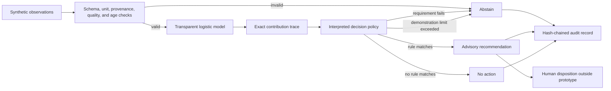
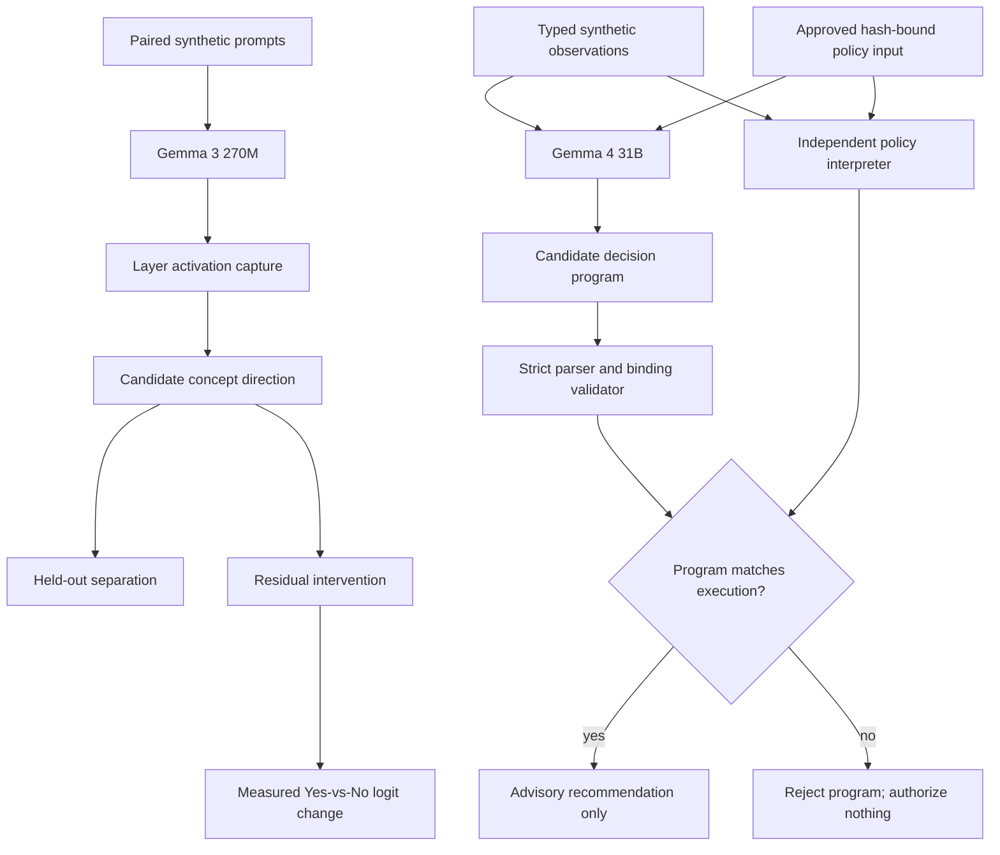

# Bioprocess Decision Runtime

A public, synthetic demonstration of **interpretable-by-construction**, bounded AI-assisted decision logic for a bioprocess scenario.

The project now tests two related objectives:

1. **Investigate internal computation:** capture Gemma residual-stream activations, test candidate concept directions on held-out prompts, and apply controlled residual-stream interventions.
2. **Require executable decisions:** constrain Gemma to a small evidence-bound program whose claims must exactly match independent execution of an approved policy.

The central question is not whether a second model can invent a convincing explanation for a first model. It is whether internal-representation claims can survive causal tests and whether the operational decision can be represented as an executable, inspectable policy whose inputs, mathematical contributions, rules, and limits are preserved in the decision record.

> **Research prototype only.** This repository uses synthetic scenarios and illustrative policy values. It is not validated, qualified, or intended for GMP, clinical, laboratory, manufacturing, process-control, or patient-care use. It does not claim regulatory acceptance or patient-safety assurance.

## What this demonstrates

- A seeded synthetic-data training pipeline with held-out and cross-validation metrics
- Translation of a fitted scikit-learn pipeline into raw-unit executable coefficients
- A small domain-specific policy language with an interpreter
- An inherently transparent logistic model with exact per-input contributions
- Declared intended use and advisory-only authority
- Required units, provenance, quality status, ranges, and observation age
- Explicit abstention on missing, stale, malformed, conflicting, or out-of-envelope evidence
- Rule execution traces that are the decision computation, not post-hoc generated rationales
- Exact replay checks under the same runtime implementation
- A tamper-evident, SHA-256 hash-chained NDJSON audit log
- Scenario-based evaluation suitable for developing operator-training exercises
- Residual-stream activation capture across all 18 layers of Gemma 3 270M
- Held-out linear-separation tests for a candidate low-oxygen language direction
- Residual-stream interventions with measured next-token logit effects
- A strict evidence-bound decision program generated by local Gemma 4 31B
- Independent rejection of invented rules, altered policy hashes, incorrect statuses, and incorrect proposals

## What this does not demonstrate

- A validated bioreactor model or control strategy
- Scientifically justified process limits
- Compatibility with DeltaV or any commercial control system
- Autonomous process actuation
- GMP compliance or regulatory acceptance
- Clinical, product-quality, or patient-safety performance
- That transparent models are always more accurate than other approaches
- Complete interpretation of Gemma or identification of a complete causal circuit
- That a linearly separable activation direction has stable human semantics
- That Gemma 3 270M findings transfer to the operational Gemma 4 31B checkpoint
- That an accepted decision program explains every internal cause of Gemma's token selection

## Architecture



The runtime never writes to process equipment. A recommendation has `authority: advisory_only` and requires human review. An abstention also requests review because it indicates missing, conflicting, stale, or out-of-envelope evidence; it does not authorize an action.

The Gemma experiments add two paths without changing that authority boundary:



## Quick start

Requires Python 3.11 or newer. Install the project and its scikit-learn dependency:

```powershell
python -m pip install -e .
python -m bioprocess_runtime scenario low_oxygen
python -m bioprocess_runtime suite
```

The Gemma experiments use optional dependencies. The tested NVIDIA installation is:

```powershell
python -m pip install "torch==2.7.1" --index-url https://download.pytorch.org/whl/cu128
python -m pip install -e ".[gemma]"
```

Download the 536 MB Transformers checkpoint used for activation experiments. The model uses Google's Gemma license and is excluded from Git:

```powershell
python -c "from huggingface_hub import snapshot_download; snapshot_download('unsloth/gemma-3-270m-it', local_dir='.models/gemma-3-270m-it')"
```

Train a transparent logistic model on seeded illustrative synthetic data, translate its standardized coefficients back into declared input units, and emit an executable policy plus evaluation report:

```powershell
python -m bioprocess_runtime train --output-policy artifacts/learned_policy.bpr --report artifacts/training_report.json
python -m bioprocess_runtime scenario low_oxygen --policy artifacts/learned_policy.bpr
```

The training report includes held-out ROC AUC, accuracy, Brier score, five-fold cross-validation results, raw-unit coefficients, and the numerical error introduced when translating the fitted scikit-learn pipeline into the policy language. These metrics characterize only the synthetic generator.

Record all suite decisions and verify the audit chain:

```powershell
python -m bioprocess_runtime suite --audit artifacts/audit.ndjson --output artifacts/evaluation.json
python -m bioprocess_runtime audit-verify artifacts/audit.ndjson
python -m bioprocess_runtime replay artifacts/audit.ndjson <decision-id>
```

Run the tests:

```powershell
python -m unittest discover -s tests -v
```

The editable installation also provides the equivalent `bioprocess-runtime` command:

```powershell
bioprocess-runtime suite
```

## Executable policy

The demonstration policy is in [`policies/oxygen_advisory.bpr`](policies/oxygen_advisory.bpr):

```text
POLICY oxygen_advisory VERSION 1.0.0
INTENDED_USE "Generate advisory agitation recommendations in a synthetic stirred-tank scenario"
MODE ADVISORY

INPUT dissolved_oxygen_pct NUMBER UNIT percent MIN 0 MAX 100 MAX_AGE_SECONDS 30
INPUT agitation_rpm NUMBER UNIT rpm MIN 0 MAX 200 MAX_AGE_SECONDS 30

MODEL oxygen_risk LOGISTIC
BIAS 5.0
WEIGHT dissolved_oxygen_pct -0.12
WEIGHT dissolved_oxygen_slope -1.5
END_MODEL

RULE low_oxygen_advisory
WHEN oxygen_risk >= 0.75
REQUIRE sensor_agreement == true
RECOMMEND agitation_rpm DELTA 5 MAX 120 rpm
ELSE_ABSTAIN "Redundant synthetic sensors disagree; no recommendation is permitted"
END_RULE
```

The interpreter exposes the actual logistic computation:

```text
logit = bias + sum(weight * input)
score = sigmoid(logit)
```

For the built-in `low_oxygen` scenario, the record includes the exact contribution of each input, the threshold comparison, the sensor-agreement requirement, the recommendation-limit check, and the resulting advisory recommendation. No explanation model is involved.

## Built-in scenarios

| Scenario | Expected result | Purpose |
|---|---|---|
| `normal` | `NO_ACTION` | Model score below policy threshold |
| `low_oxygen` | `RECOMMENDATION` | Fully traceable advisory path |
| `sensor_disagreement` | `ABSTAIN` | Required evidence conflicts |
| `recommendation_limit` | `ABSTAIN` | Proposed value exceeds the illustrative envelope |
| `stale_input` | `ABSTAIN` | Evidence exceeds the permitted age |
| `unit_mismatch` | `ABSTAIN` | Input unit does not match its declaration |

These are software-behavior tests, not evidence that the policy is biologically appropriate.

## Objective A: investigate Gemma's internal computation

Run the real activation experiment:

```powershell
python -m bioprocess_runtime gemma-interpret --model-path .models/gemma-3-270m-it --output artifacts/interpretability.json
```

The experiment:

1. Captures the final-prompt-token residual stream after every one of Gemma 3 270M's 18 decoder layers.
2. Computes a unit-length candidate direction from the mean difference between six low-oxygen and six normal-oxygen prompts.
3. Projects eight held-out prompts onto that direction and reports ROC AUC and effect size at every layer.
4. Adds the measured direction to a negative prompt's residual stream at one layer at a time.
5. Measures the resulting change in the next-token `Yes`-minus-`No` logit margin.

The checked-in result is [`results/gemma3_270m_interpretability_summary.json`](results/gemma3_270m_interpretability_summary.json). The strongest observed separation was at layer 10: held-out ROC AUC `1.0` and effect size `1.835`. Adding that direction increased the `Yes`-minus-`No` logit margin on all four held-out negative prompts, with mean change `+0.40625` and range `+0.25` to `+0.75`.

This does **not** mean layer 10 contains a proven low-oxygen concept. The eight held-out prompts share an authored prompt family, and the direction may encode lexical or formatting correlations. The intervention establishes model sensitivity to that measured direction, not a complete causal circuit or stable biological semantics. The model runs in `bfloat16`; exact numerical equivalence across hardware, drivers, or library versions is not claimed. The full experiment records all layer results and limitations.

## Objective B: force Gemma through an executable language

The decision program contains no coefficients or process limits. It can only:

- Bind every declared policy input to an identically named observation.
- Select the already approved model and rule.
- Predict the status that independent policy execution will produce.
- State the exact advisory proposal or state that there is none.

Example: [`examples/low_oxygen.program`](examples/low_oxygen.program)

```text
DECISION_PROGRAM VERSION 1
POLICY oxygen_advisory SHA256 <approved-policy-hash>
BIND agitation_rpm FROM agitation_rpm
BIND dissolved_oxygen_pct FROM dissolved_oxygen_pct
BIND dissolved_oxygen_slope FROM dissolved_oxygen_slope
BIND sensor_agreement FROM sensor_agreement
COMPUTE oxygen_risk
APPLY low_oxygen_advisory
EXPECT RECOMMENDATION
PROPOSE agitation_rpm DELTA 5 rpm
END
```

Evaluate a saved program without an LLM:

```powershell
python -m bioprocess_runtime program-evaluate examples/low_oxygen.program --scenario low_oxygen
```

On this machine, the existing Gemma 4 31B profile exposes a local API at port 5000:

```powershell
powershell -NoProfile -ExecutionPolicy Bypass -File D:\ailm\stack_entrypoint.ps1 start -Profile gemma31b -TimeoutSeconds 240
python -m bioprocess_runtime gemma-program --scenario low_oxygen --output artifacts/gemma_program.json
python -m bioprocess_runtime gemma-program-suite --output artifacts/gemma_program_suite.json
powershell -NoProfile -ExecutionPolicy Bypass -File D:\ailm\stack_entrypoint.ps1 stop -Profile gemma31b
```

Generation is constrained with a dynamically built llama.cpp GBNF grammar. The grammar permits only the exact policy hash, complete identity bindings, approved model and rule names, defined statuses, and syntactically valid proposals. Grammar compliance establishes structure, not correctness.

The checked-in live result is [`results/gemma4_program_suite.json`](results/gemma4_program_suite.json). Gemma 4 produced matching programs for 4 of 6 scenarios. It incorrectly selected the low-oxygen rule for the normal and stale-input cases. The independent interpreter rejected both mismatches and authorized no recommendation from them. Exactly one advisory recommendation was authorized across the suite.

This is the intended boundary: the LLM may propose a structurally valid program, but only independent execution of the approved policy can authorize an advisory result. Program acceptance does not explain every internal cause of Gemma's token selection.

## Audit and replay

Each audit record contains:

- Full observation values and metadata
- Policy name, version, and source-file hash
- Transparent model formula, bias, contributions, logit, and score
- Every validation, rule, and constraint evaluation
- Recommendation authority and human-review requirement
- Previous-record hash and current-record hash

Hash chaining detects partial or in-place modification when a trusted chain head or copy is retained; it does **not** make a local file immutable, authenticate its writer, or prevent someone from rewriting the entire chain. The prototype audit writer is intentionally single-process and single-writer; concurrent appenders are unsupported. Production record controls would require appropriately governed storage, identity, concurrency, retention, and trusted-timestamp architecture.

Replay first verifies the audit chain and refuses to proceed if the supplied policy source does not match the policy hash in the recorded decision. It then re-evaluates the saved observations at the saved evaluation time and requires exact equality with the recorded payload under the same runtime implementation. Cross-version and cross-platform equivalence are not claimed.

## Development principles

1. **Interpretability by construction:** the trace is generated by execution of the decision policy.
2. **Bounded intended use:** the prototype supports one declared synthetic advisory task.
3. **No invented authority:** the runtime cannot actuate equipment.
4. **Fail by abstaining:** invalid evidence does not produce a recommendation.
5. **Separation of responsibilities:** software can enforce approved limits but cannot determine scientifically valid limits by itself.
6. **Claims proportional to evidence:** synthetic software tests are not regulatory or biological validation.
7. **Mechanistic hypotheses require intervention:** activation separability alone is not semantic proof.
8. **Language models cannot define authority:** Gemma may select from an approved program grammar but cannot create governing rules or limits.

## Path toward a research evaluation

A meaningful next study would compare this approach with PID/MPC baselines and a black-box ML baseline in a documented process simulator. Evaluation should measure control performance, constraint violations, abstention behavior, false alarms, operator-review burden, deterministic replay, and investigation time. Process SMEs would need to define scientifically defensible parameters and acceptance criteria.

## References

- [FDA draft guidance: Considerations for the Use of Artificial Intelligence To Support Regulatory Decision-Making for Drug and Biological Products](https://www.hhs.gov/guidance/document/considerations-use-artificial-intelligence-support-regulatory-decision-making-drug-and)
- [FDA: Process Validation—General Principles and Practices](https://www.fda.gov/regulatory-information/search-fda-guidance-documents/process-validation-general-principles-and-practices)
- [NIST AI Risk Management Framework](https://www.nist.gov/itl/ai-risk-management-framework)
- [On the Limits of Sparse Autoencoders: A Theoretical Framework and Reweighted Remedy](https://arxiv.org/abs/2506.15963)
- [The Linear Representation Hypothesis and the Geometry of Large Language Models](https://arxiv.org/abs/2311.03658)
- [Activation Addition: Steering Language Models Without Optimization](https://arxiv.org/abs/2308.10248)
- [Locating and Editing Factual Associations in GPT](https://arxiv.org/abs/2202.05262)

These references provide context. Listing them does not imply that the prototype conforms to or has been reviewed under any framework.
