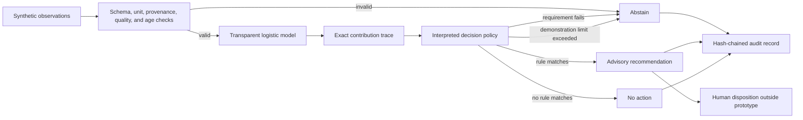

# Bioprocess Decision Runtime

A public, synthetic demonstration of **interpretable-by-construction**, bounded AI-assisted decision logic for a bioprocess scenario.

The central question is not whether a second model can invent a convincing explanation for a first model. It is whether the production decision itself can be represented as an executable, inspectable policy whose inputs, mathematical contributions, rules, and limits are preserved in the decision record.

> **Research prototype only.** This repository uses synthetic scenarios and illustrative policy values. It is not validated, qualified, or intended for GMP, clinical, laboratory, manufacturing, process-control, or patient-care use. It does not claim regulatory acceptance or patient-safety assurance.

## What this demonstrates

- A seeded synthetic-data training pipeline with held-out and cross-validation metrics
- Translation of a fitted scikit-learn pipeline into raw-unit executable coefficients
- A small domain-specific policy language with an interpreter
- An inherently transparent logistic model with exact per-input contributions
- Declared intended use and advisory-only authority
- Required units, provenance, quality status, ranges, and observation age
- Explicit abstention on missing, stale, malformed, conflicting, or out-of-envelope evidence
- Rule execution traces that are the decision computation, not post-hoc generated rationales
- Exact replay checks under the same runtime implementation
- A tamper-evident, SHA-256 hash-chained NDJSON audit log
- Scenario-based evaluation suitable for developing operator-training exercises

## What this does not demonstrate

- A validated bioreactor model or control strategy
- Scientifically justified process limits
- Compatibility with DeltaV or any commercial control system
- Autonomous process actuation
- GMP compliance or regulatory acceptance
- Clinical, product-quality, or patient-safety performance
- That transparent models are always more accurate than other approaches

## Architecture



The runtime never writes to process equipment. A recommendation has `authority: advisory_only` and requires human review. An abstention also requests review because it indicates missing, conflicting, stale, or out-of-envelope evidence; it does not authorize an action.

## Quick start

Requires Python 3.11 or newer. Install the project and its scikit-learn dependency:

```powershell
python -m pip install -e .
python -m bioprocess_runtime scenario low_oxygen
python -m bioprocess_runtime suite
```

Train a transparent logistic model on seeded illustrative synthetic data, translate its standardized coefficients back into declared input units, and emit an executable policy plus evaluation report:

```powershell
python -m bioprocess_runtime train --output-policy artifacts/learned_policy.bpr --report artifacts/training_report.json
python -m bioprocess_runtime scenario low_oxygen --policy artifacts/learned_policy.bpr
```

The training report includes held-out ROC AUC, accuracy, Brier score, five-fold cross-validation results, raw-unit coefficients, and the numerical error introduced when translating the fitted scikit-learn pipeline into the policy language. These metrics characterize only the synthetic generator.

Record all suite decisions and verify the audit chain:

```powershell
python -m bioprocess_runtime suite --audit artifacts/audit.ndjson --output artifacts/evaluation.json
python -m bioprocess_runtime audit-verify artifacts/audit.ndjson
python -m bioprocess_runtime replay artifacts/audit.ndjson <decision-id>
```

Run the tests:

```powershell
python -m unittest discover -s tests -v
```

The editable installation also provides the equivalent `bioprocess-runtime` command:

```powershell
bioprocess-runtime suite
```

## Executable policy

The demonstration policy is in [`policies/oxygen_advisory.bpr`](policies/oxygen_advisory.bpr):

```text
POLICY oxygen_advisory VERSION 1.0.0
INTENDED_USE "Generate advisory agitation recommendations in a synthetic stirred-tank scenario"
MODE ADVISORY

INPUT dissolved_oxygen_pct NUMBER UNIT percent MIN 0 MAX 100 MAX_AGE_SECONDS 30
INPUT agitation_rpm NUMBER UNIT rpm MIN 0 MAX 200 MAX_AGE_SECONDS 30

MODEL oxygen_risk LOGISTIC
BIAS 5.0
WEIGHT dissolved_oxygen_pct -0.12
WEIGHT dissolved_oxygen_slope -1.5
END_MODEL

RULE low_oxygen_advisory
WHEN oxygen_risk >= 0.75
REQUIRE sensor_agreement == true
RECOMMEND agitation_rpm DELTA 5 MAX 120 rpm
ELSE_ABSTAIN "Redundant synthetic sensors disagree; no recommendation is permitted"
END_RULE
```

The interpreter exposes the actual logistic computation:

```text
logit = bias + sum(weight * input)
score = sigmoid(logit)
```

For the built-in `low_oxygen` scenario, the record includes the exact contribution of each input, the threshold comparison, the sensor-agreement requirement, the recommendation-limit check, and the resulting advisory recommendation. No explanation model is involved.

## Built-in scenarios

| Scenario | Expected result | Purpose |
|---|---|---|
| `normal` | `NO_ACTION` | Model score below policy threshold |
| `low_oxygen` | `RECOMMENDATION` | Fully traceable advisory path |
| `sensor_disagreement` | `ABSTAIN` | Required evidence conflicts |
| `recommendation_limit` | `ABSTAIN` | Proposed value exceeds the illustrative envelope |
| `stale_input` | `ABSTAIN` | Evidence exceeds the permitted age |
| `unit_mismatch` | `ABSTAIN` | Input unit does not match its declaration |

These are software-behavior tests, not evidence that the policy is biologically appropriate.

## Audit and replay

Each audit record contains:

- Full observation values and metadata
- Policy name, version, and source-file hash
- Transparent model formula, bias, contributions, logit, and score
- Every validation, rule, and constraint evaluation
- Recommendation authority and human-review requirement
- Previous-record hash and current-record hash

Hash chaining detects partial or in-place modification when a trusted chain head or copy is retained; it does **not** make a local file immutable, authenticate its writer, or prevent someone from rewriting the entire chain. The prototype audit writer is intentionally single-process and single-writer; concurrent appenders are unsupported. Production record controls would require appropriately governed storage, identity, concurrency, retention, and trusted-timestamp architecture.

Replay first verifies the audit chain and refuses to proceed if the supplied policy source does not match the policy hash in the recorded decision. It then re-evaluates the saved observations at the saved evaluation time and requires exact equality with the recorded payload under the same runtime implementation. Cross-version and cross-platform equivalence are not claimed.

## Development principles

1. **Interpretability by construction:** the trace is generated by execution of the decision policy.
2. **Bounded intended use:** the prototype supports one declared synthetic advisory task.
3. **No invented authority:** the runtime cannot actuate equipment.
4. **Fail by abstaining:** invalid evidence does not produce a recommendation.
5. **Separation of responsibilities:** software can enforce approved limits but cannot determine scientifically valid limits by itself.
6. **Claims proportional to evidence:** synthetic software tests are not regulatory or biological validation.

## Path toward a research evaluation

A meaningful next study would compare this approach with PID/MPC baselines and a black-box ML baseline in a documented process simulator. Evaluation should measure control performance, constraint violations, abstention behavior, false alarms, operator-review burden, deterministic replay, and investigation time. Process SMEs would need to define scientifically defensible parameters and acceptance criteria.

## References

- [FDA draft guidance: Considerations for the Use of Artificial Intelligence To Support Regulatory Decision-Making for Drug and Biological Products](https://www.hhs.gov/guidance/document/considerations-use-artificial-intelligence-support-regulatory-decision-making-drug-and)
- [FDA: Process Validation—General Principles and Practices](https://www.fda.gov/regulatory-information/search-fda-guidance-documents/process-validation-general-principles-and-practices)
- [NIST AI Risk Management Framework](https://www.nist.gov/itl/ai-risk-management-framework)
- [On the Limits of Sparse Autoencoders: A Theoretical Framework and Reweighted Remedy](https://arxiv.org/abs/2506.15963)

These references provide context. Listing them does not imply that the prototype conforms to or has been reviewed under any framework.
