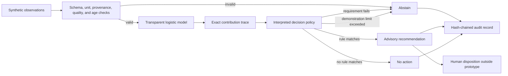
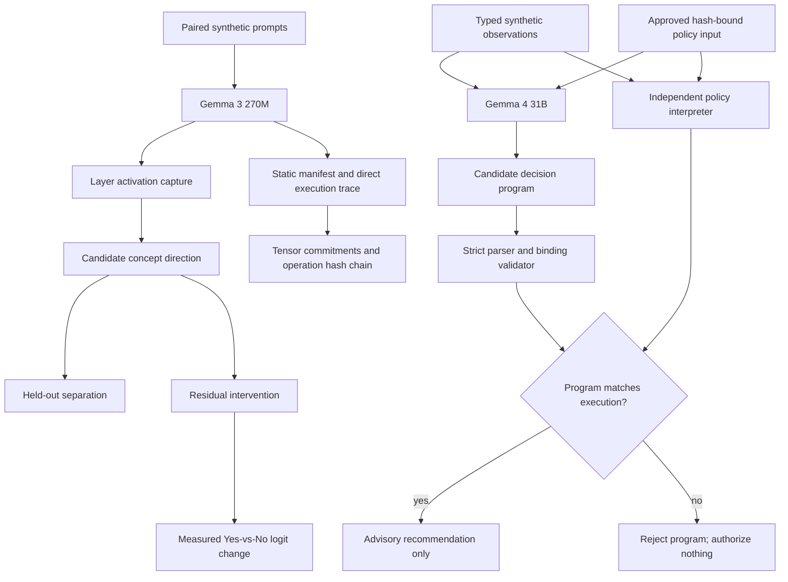

# Bioprocess Decision Runtime

A public, synthetic demonstration of **interpretable-by-construction**, bounded AI-assisted decision logic for a bioprocess scenario.

The project now tests two related objectives:

1. **Investigate internal computation:** capture Gemma residual-stream activations, test candidate concept directions on held-out prompts, and apply controlled residual-stream interventions.
2. **Require executable decisions:** constrain Gemma to a small evidence-bound program whose claims must exactly match independent execution of an approved policy.

The central question is not whether a second model can invent a convincing explanation for a first model. It is whether internal-representation claims can survive causal tests and whether the operational decision can be represented as an executable, inspectable policy whose inputs, mathematical contributions, rules, and limits are preserved in the decision record.

> **Research prototype only.** This repository uses synthetic scenarios and illustrative policy values. It is not validated, qualified, or intended for GMP, clinical, laboratory, manufacturing, process-control, or patient-care use. It does not claim regulatory acceptance or patient-safety assurance.

## What this demonstrates

- A seeded synthetic-data training pipeline with held-out and cross-validation metrics
- Translation of a fitted scikit-learn pipeline into raw-unit executable coefficients
- A small domain-specific policy language with an interpreter
- An inherently transparent logistic model with exact per-input contributions
- Declared intended use and advisory-only authority
- Required units, provenance, quality status, ranges, and observation age
- Explicit abstention on missing, stale, malformed, conflicting, or out-of-envelope evidence
- Rule execution traces that are the decision computation, not post-hoc generated rationales
- Exact replay checks under the same runtime implementation
- A tamper-evident, SHA-256 hash-chained NDJSON audit log
- Scenario-based evaluation suitable for developing operator-training exercises
- Residual-stream activation capture across all 18 layers of Gemma 3 270M
- Held-out linear-separation tests for a candidate low-oxygen language direction
- Residual-stream interventions with measured next-token logit effects
- A strict evidence-bound decision program generated by local Gemma 4 31B
- Independent rejection of invented rules, altered policy hashes, incorrect statuses, and incorrect proposals
- A static Gemma architecture manifest with deterministic logical-value hashes after contiguous CPU canonicalization
- Deterministic greedy token-prefix prediction with full logits commitments
- Hash-chained leaf-module and dispatched ATen operation provenance
- Verification that manual prediction matches a separate `transformers.generate` invocation
- An independently orchestrated eager Gemma forward path using frozen weights and explicit equations
- Fixed-input, zero-tolerance equivalence certificates across 19 model boundaries and vocabulary logits
- Comparison between explicit eager arithmetic and the deployed SDPA attention path
- Architecture-defined coordinate semantics separated from empirical biological interpretations
- Per-layer explicit-attention versus SDPA comparisons using identical Q/K/V tensors and masks for non-softcapped attention; softcapped configurations are rejected because SDPA cannot reproduce the score transform
- Exhaustive reference/eager/deployed checks over caller-declared finite canonical input grids

## What this does not demonstrate

- A validated bioreactor model or control strategy
- Scientifically justified process limits
- Compatibility with DeltaV or any commercial control system
- Autonomous process actuation
- GMP compliance or regulatory acceptance
- Clinical, product-quality, or patient-safety performance
- That transparent models are always more accurate than other approaches
- Complete interpretation of Gemma or identification of a complete causal circuit
- That a linearly separable activation direction has stable human semantics
- That Gemma 3 270M findings transfer to the operational Gemma 4 31B checkpoint
- That an accepted decision program explains every internal cause of Gemma's token selection
- A universal equivalence proof over all token sequences or an independently verified implementation of every primitive CUDA/PyTorch kernel
- Semantic meaning from tensor hashes or operation records alone

## Local demonstration UI

Run the loopback-only evidence dashboard and synthetic advisory demonstration:

```powershell
.\.venv\Scripts\python -m bioprocess_runtime.demo_ui --port 0
```

Open the local address printed by the command. Port `0` selects an available port; `--port 8765` requests a fixed port if it is free. `--root` can select a repository containing the saved `results/` artifacts and demonstration policy. This uses the Python standard library and locally served HTML/CSS/JavaScript: no frontend installation, external assets, or cloud inference calls.

- **Numerical evidence** displays five allowlisted saved experiments, including the completed full-target held-outs and replay: all 18 decoder layers, 533 program instructions, all vocabulary logits, and token IDs 76113/75027. Per-case restored-prefix counts distinguish uninterrupted work from validated checkpoint continuation. It checks pinned compact plan/summary/replay references, not raw tensors or fresh numerical execution. Missing or altered evidence is not shown as a match; if the full-target package is unavailable, coverage falls back to the older two-layer/partial-stage records. The graph is not unrestricted model or hardware qualification.
- **Synthetic advisory** evaluates one of the six existing synthetic scenarios on request using the unchanged policy engine and fixed scenario clock. It exposes input values, model contributions, rule checks, review requirements, and the decision identity. It does not call Gemma, modify policies, write audit files, or actuate equipment.
- The numerical regression status shown in the dashboard is a saved log observation, separate from UI verification. A missing completion marker is not proof that a process is still running.

The server intentionally exposes no generic file browsing, arbitrary command execution, policy editing, or model-inference endpoint. It binds only to `127.0.0.1`, rejects unexpected Host/Origin headers, and serves only allowlisted data. It is a local research-demo server, not an authenticated production deployment. Run UI tests with `python -m unittest discover -s tests -p test_demo_ui.py -v`. The last complete numerical repository run passed **625 tests**, all six scenarios, compilation and dependency checks. After this saved-evidence UI update, **16 UI/HTTP tests**, JavaScript syntax, six scenarios, compilation and dependency checks passed (`demo_full_target_lightweight_verification.log`, `LIGHTWEIGHT_VERIFICATION_EXIT_CODE=0`); the UI test process explicitly confirmed that PyTorch was not imported. The hardware-intensive full suite was not repeated because the machine has been suffering unexplained shutdowns. Browser visual review remains separate.

### MacBook presentation bundle

Use the small **Mac demo ZIP**, not the 4.6 GB numerical-runtime archive, for a meeting. It contains only the standard-library UI, five pinned evidence packages, the instruction program, synthetic policy, failure example, and the historical 625-test log. No model, lookup tables, PyTorch, Windows virtual environment, or package installation is needed. Python **3.11 or newer** must already be installed on the Mac.

1. Download the Mac demo ZIP from this private repository's releases while signed in, then extract it completely.
2. Double-click **`Launch Demo.command`**. It selects an installed compatible Python, starts a loopback-only server on an available port, and opens your browser.
3. If Finder will not launch the command file, open Terminal in the extracted folder and run:

   ```sh
   sh "Launch Demo.command"
   ```

   Or run `python3 -m bioprocess_runtime.demo_ui --port 0 --open-browser` with a compatible Python. If no compatible interpreter is found, install Python 3.11 or newer and try again; the launcher does not install anything or change system security settings.
4. Keep Terminal open during the presentation. Press **Control+C** there when finished. Rehearse on the actual Mac before the meeting; the portable bundle is tested by extraction, but macOS launch/visual sign-off is not performed on the Windows build machine.

Suggested walkthrough: select **Full-stack held-outs and replay**, show the 18-layer/533-instruction coverage, the two token results and continuation disclosures, then inspect an instruction's declared inputs and outputs. These are saved numerical results, not live Gemma inference. Next show the preserved v2 failure (`results/gemma3_270m_independent_baseline_v2_diagnosis.json`): token agreement was insufficient when 49 logits differed. Finally switch to **Synthetic advisory** and evaluate a scenario; this runs the illustrative policy engine live, not a model or equipment controller. The regression panel reports the original workstation's historical run, not tests performed on the Mac. Screenshots or a short recording from the Mac can serve as a meeting backup.

To build the small bundle on the evidence workstation:

```powershell
.\.venv\Scripts\python tools/package_handoff.py inventory --demo-only
.\.venv\Scripts\python tools/package_handoff.py build --demo-only --output dist/bioprocess-mac-demo-v1.zip
.\.venv\Scripts\python tools/package_handoff.py verify --output dist/bioprocess-mac-demo-v1.zip
```

The UI does not reproduce the validated Windows/NVIDIA numerical runtime on macOS. The demonstration supports a bounded engineering claim about inspectable execution, checks and replay—not universal explainability, scientific correctness, or GMP compliance.

## Local runtime handoff package

The source/runtime ZIP is the handoff format for this MVP. A Python wheel alone does not include the repository-level saved evidence and policy assets. The full local bundle adds the fixed Gemma checkpoint, lookup tables, prerequisite evidence, completed holdout reports and required proof checkpoints; it does not copy `.venv`, unrelated caches, or the entire interrupted-checkpoint history. Model assets remain subject to their own license terms. Building the bundle does not upload anything or run a model.

```powershell
.\.venv\Scripts\python tools/package_handoff.py inventory --runtime
.\.venv\Scripts\python tools/package_handoff.py check-index
.\.venv\Scripts\python tools/package_handoff.py build --runtime --output dist/bioprocess-mvp-runtime-0.1.0.zip
.\.venv\Scripts\python tools/package_handoff.py verify --output dist/bioprocess-mvp-runtime-0.1.0.zip
```

Run `check-index` after staging to verify that Git contains the exact working-file bytes. `.gitattributes` preserves raw JSON bytes because the frozen evidence uses both LF and CRLF; Python sources use LF. The ZIP is uncompressed to keep CPU load low, preserves every included file byte-for-byte, and is published only after all member hashes are checked. The builder refuses existing output files and reports the final archive SHA-256. The current runtime assets occupy approximately 4.6 GB before ZIP overhead.

After extraction, double-click `launch-demo.cmd` on Windows or run `python -m bioprocess_runtime.demo_ui --port 0` from the extracted directory. This opens saved evidence and the synthetic advisory demo, not model inference. `handoff-manifest.json` contains the source commit, per-file hashes and observed environment versions; `handoff-requirements.txt` pins the installed Python distributions, excluding this project and installation tooling.

Fresh numerical execution requires a separately installed matching environment: the tested runtime uses Python 3.11.9, PyTorch 2.7.1+cu128, Transformers 4.53.3, and the recorded NVIDIA/CUDA configuration. A live virtual environment and system driver are not portable archive contents, and dependency wheels are not bundled. On a stable compatible machine, install the matching CUDA-enabled PyTorch distribution, install the pinned requirements from the extracted bundle, then install this source tree with `pip install --no-deps -e .`. Read the recorded runtime fields before attempting a new numerical experiment; incompatible runtimes fail closed. Do not launch fresh inference merely to view the saved demo, especially while the workstation's shutdown issue is unresolved.

## Generic independent execution toward the MVP

`gemma_independent` executes the fixed 533-instruction IR with one layer-independent dispatcher, instead of new per-layer interpreters. It reuses the frozen arithmetic specifications, snapshots fresh checkpoint parameters, handles local/full causal masks and local/global rotary providers, and includes final RMS normalization, last-token slicing, vocabulary projection and exact integer-ordered BF16 argmax. Persistent column-tiled CPU workers also support the one-row vocabulary projection. Traces preserve actual IR IDs, producer links, parameter/provider commitments and FP32 RMS/softmax auxiliaries; raw states can be retained optionally.

The standalone runner has `calibrate`, `predict`, `compare`, `run`, and `verify` operations. `run` freezes the complete prediction before three original-forward comparisons at all reached decoder boundaries and, for the full target, final normalization and all vocabulary logits. This native comparison is not all-internal-state or register coverage. `verify --reexecute` regenerates the prediction and observations. Unsupported arithmetic produces an abstention with the last successful trace prefix, never a PyTorch arithmetic fallback.

```powershell
python -m bioprocess_runtime.gemma_independent_run run --tokens results/gemma3_270m_independent_baseline_tokens.json --global-provider results/gemma3_270m_independent_global_rotary_v3.json --prediction artifacts/my_independent_prediction_v3.json --report artifacts/my_independent_report_v3.json --checkpoint-dir artifacts/my_independent_checkpoints_v3 --allow-vocabulary-candidate --workers 4
```

Outputs must be new paths; never overwrite frozen evidence. `--target hidden.2` can restrict the same engine to a decoder-boundary diagnostic. Vocabulary execution requires `--allow-vocabulary-candidate`: v3 uses the component-tested integer GEMV rule at M1/N262144/K640, but full-path and end-to-end held-out validation remain pending. The preserved v1 global rotary packet is `48572a7a…2b410f1a`; v2 packet `fa1fd893…642f5867` binds the checkpoint-aware source. Their values, frequencies, positions and runtime are identical. Both are fixed-position empirical primitive calibrations from three original module calls on a zero-valued shape carrier, not model activations or hardware proofs.

The original full-path v1 run was interrupted after 439/533 instructions (`i0438`, decoder index 14), with no completed prediction/report and no resumable tensor state. The cause is unknown. The partial log and original declarations remain unchanged. Exact v1 engine/runner bytes are preserved in a verified Git pack under `artifacts/`; `results/gemma3_270m_independent_v1_interruption.json` records the source object IDs and hashes. The previous 30-token baseline is reused, not a fresh holdout. No full-model conformance result is established; predeclared end-to-end holdouts remain pending.

V2 adds data-only JSON checkpoints. A checkpoint directory has an immutable run binding and content-addressed generations, published atomically without overwriting prior checkpoints. A writer lease is released by the OS when the actual process dies. Checkpoints bind the engine/runner, runtime, input tokens, target, snapshot metadata, primitive providers and retention options. Resume validates retained and live tensors against the trace before computing the remaining instructions. A corrupted latest checkpoint is rejected rather than silently replaced with an older one; incomplete temporary files are ignored. No pickle or executable checkpoint payload is accepted.

Checkpoints are saved initially, after LINEAR operations and hidden boundaries, at the configured `--checkpoint-every` interval (default 8), and on successful completion. An interrupted in-flight instruction is recomputed; checkpoints do not preserve partial work inside a matrix operation. If prediction was interrupted before its output file was published, repeat the command with **`--resume`** and the same checkpoint directory and numerical inputs. Output files must still be new. If a complete prediction already exists, use `compare` rather than overwrite it. `verify --reexecute` can use a separate checkpoint directory for its recomputation.

Resume is explicitly disclosed through `checkpoint_resume` and `stored_boundary_predictions_used`; restored prefixes are not freshly rerun in that invocation. Fresh replay compares numerical content and trace commitments separately from operational resume provenance. Checkpoint hashes provide integrity/source binding, not external authenticity or hardware proof. Twenty engine/runner tests and eleven checkpoint tests pass, including actual writer-process termination followed by numerical resume in a fresh process. V2 computed all 533 instructions and saved prediction `a00b0e73…225bd87` plus final checkpoint `8b101c31…3c4eb5`. Native report `3988b351…43bd438` is **mismatched**: all 18 decoder boundaries, `hidden.final`, and `hidden.last` agree exactly, but 49 of 262,144 vocabulary logits differ in each of three forwards (147 aggregate mismatches). The native logits repeat exactly and all three token IDs agree with the predicted ID `10784`; token agreement does not override the logits failure. The saved report recount reproduces exactly. Success-gated replay did not start, and held-out inputs remain unused. See `results/gemma3_270m_independent_baseline_v2_diagnosis.json`. The subsequent isolated GEMV characterization below preserves this failed candidate and leaves the declared end-to-end holdouts untouched. Full repository verification passed **589 tests in 6888.867 seconds (`OK`)**, all six synthetic scenarios, compilation and dependency checks; the original supervisor exited 0 and `gemma_independent_v2_verification.log` records `VERIFICATION_EXIT_CODE=0`. This is implementation regression, not full-model numerical conformance. `results/gemma3_270m_independent_holdout_binding_v2.json` preserves the original holdout cases and explicitly revises only source/provider and continuation-provenance bindings. Existing UI coverage is not promoted by implementation tests.

### Vocabulary projection component follow-up

The isolated original vocabulary projection reproduced the v2 mismatch and selected a cuBLAS `gemvx` kernel, rather than the tensor-core family used by the transferred rule. An exploratory FP32 grid matched the complete baseline with eight strided accumulators and a halving merge. `bioprocess_runtime/gemma_gemv.py` implements that candidate using integer bit operations only: FP32 RNE accumulation/merge followed by BF16 RNE, with explicit rejection outside the declared normal-finite/signed-zero domain.

The integer candidate matched **all 262,144 baseline logits** and four predeclared synthetic primitive cases (512 unique weight rows per case, repeated to the full projection shape). All 15 checked comparisons had zero differences, matching profiled/plain outputs and kernel symbols. Fresh weight snapshots, complete component prediction regeneration and native report replay matched exactly. Six targeted exact-rational/reference tests pass. Evidence: `results/gemma_vocab_validation_protocol_v1.json` and `results/gemma_vocab_validation_summary_v1.json`; raw plans, observations, replay records and bound experiment scripts remain under ignored `artifacts/`.

This reuses the verified baseline final hidden state; it is **not fresh full-stack execution or end-to-end holdout validation**. The archived v2 runner and its failed report remain intact; the working generic runner is now v3 and routes the fixed vocabulary shape through the integer GEMV rule. The exact v2 engine/runner/checkpoint bytes, the GEMV implementation and five experiment scripts are preserved in a verified nine-object archive; `results/gemma_independent_v2_source_archive.json` records the blob IDs and file hashes. The GEMV-addition repository verification passed **595 tests**, all six scenarios, compilation and dependency checks (`gemma_vocab_verification_v1.log`, exit 0). V3 integration then passed **45 targeted tests**, including dispatch without fallback, evidence integrity, domain errors, ledger metadata and old-checkpoint rejection. V3 binds the pinned GEMV component plan/report/replay and runtime, retains explicit candidate opt-in, and revalidates the evidence files before and after CLI operations. V3 calibration is frozen as `362a7db4…bd28c292`, with unchanged rotary values/positions/runtime. The fresh v3 baseline completed all **533 instructions** and matched three native forwards with **zero mismatches** at all 18 decoder outputs, final normalization, last-token slice and all 262,144 logits; selected token ID `10784` agrees. Saved report recount is exact. See `results/gemma3_270m_independent_baseline_comparison_v3.json`. Fresh replay also completed all 533 instructions and reproduced the prediction and native report exactly, with exit 0. Its separate receipt, `results/gemma3_270m_independent_baseline_replay_v3.json`, pins the final replay checkpoint and completion logs; no restored prefix was used. Post-integration repository verification passed **603 tests**, all six scenarios, compilation and dependency checks (`gemma_independent_v3_verification.log`, exit 0). The source-binding revision `results/gemma3_270m_independent_holdout_binding_v3.json` preserves the reserved cases; baseline comparison and replay have now passed, allowing the separately gated held-out runner below to start. Hardware and full-model qualification remain closed.

### Predeclared full-target holdouts

`gemma_independent_holdout` validates the immutable input declaration and v2/v3 binding revisions, current tokenizer assets, all prior-case exclusions, exact pool/case regeneration, pinned passing baseline and completed replay receipt. It leaves the generic v3 engine and arithmetic unchanged. Its source-bound outer writer lease protects the whole batch, while each case has its own numerical checkpoints. Protocols, predictions and reports are published atomically without overwriting prior evidence.

```powershell
python -m bioprocess_runtime.gemma_independent_holdout run --directory artifacts/my_full_target_holdout --workers 4
python -m bioprocess_runtime.gemma_independent_holdout verify --directory artifacts/my_full_target_holdout --workers 4
```

Both complete predictions must be frozen before any of the six held-out native forwards. An abstention preserves both declared case outcomes and blocks every native call. Replay recomputes and freezes both predictions before any replay forward; mismatches are retained rather than refitted. `--resume` requires an existing compatible run and explicitly discloses restored predictions/native reports. A completed aggregate output is never overwritten. `plan` and `compare` can run the stages separately.

The full preflight suite passed 21 tests, then a missing-directory resume regression was added and all 18 gating/CLI tests passed again. The production batch under `artifacts/gemma3_270m_independent_holdout_v3` was interrupted after the first prediction completed and the second reached checkpoint 494. Sources, first prediction and checkpoint integrity were verified unchanged; `results/gemma3_270m_independent_holdout_interruption_v3.json` preserves the interruption record. Prediction recovery completed, and both cases matched all six native forwards with zero mismatches (token IDs `76113` and `75027`). Their report recounts are exact; `results/gemma3_270m_independent_holdout_comparison_v3.json` records the comparison and continuation scope. Replay then stopped after instruction 242 of `distinct_tokens`, with checkpoint 241 intact and matching the original prefix. Replay-only recovery completed successfully: both full predictions matched numerically and all six fresh native replay forwards reproduced their original reports exactly. `gemma_independent_holdout_replay_resume2_v3.log` records `HOLDOUT_REPLAY_EXIT_CODE=0`; replay hash is `1086fb25…230c0840`. Distinct-token replay restored 241 instructions, while repeated-motif replay ran from tokens without a restored prefix. Prior logs and comparison artifacts are preserved. Full repository verification passed **625 tests in 6808.186 seconds (`OK`)**, all six synthetic scenarios, compilation and dependency checks; `gemma_independent_holdout_verification_v3.log` records `VERIFICATION_EXIT_CODE=0`. Both held-out native comparison and replay have passed. The dashboard package, `results/gemma3_270m_full_target_holdout_plan.json` and `results/gemma3_270m_full_target_holdout_summary.json`, was checked against complete saved predictions and raw native boundary values without importing PyTorch or executing a model. These results complete the declared bounded numerical demonstration cases; hardware, unrestricted-domain, language-task and clinical qualification remain closed.

## Architecture



The runtime never writes to process equipment. A recommendation has `authority: advisory_only` and requires human review. An abstention also requests review because it indicates missing, conflicting, stale, or out-of-envelope evidence; it does not authorize an action.

The Gemma experiments add two paths without changing that authority boundary:



## Quick start

Requires Python 3.11 or newer. Install the project and its scikit-learn dependency:

```powershell
python -m pip install -e .
python -m bioprocess_runtime scenario low_oxygen
python -m bioprocess_runtime suite
```

The Gemma experiments use optional dependencies. The tested NVIDIA installation is:

```powershell
python -m pip install "torch==2.7.1" --index-url https://download.pytorch.org/whl/cu128
python -m pip install -e ".[gemma,proof]"
```

Download the 536 MB Transformers checkpoint used for activation experiments. The model uses Google's Gemma license and is excluded from Git:

```powershell
python -c "from huggingface_hub import snapshot_download; snapshot_download('unsloth/gemma-3-270m-it', local_dir='.models/gemma-3-270m-it')"
```

Train a transparent logistic model on seeded illustrative synthetic data, translate its standardized coefficients back into declared input units, and emit an executable policy plus evaluation report:

```powershell
python -m bioprocess_runtime train --output-policy artifacts/learned_policy.bpr --report artifacts/training_report.json
python -m bioprocess_runtime scenario low_oxygen --policy artifacts/learned_policy.bpr
```

The training report includes held-out ROC AUC, accuracy, Brier score, five-fold cross-validation results, raw-unit coefficients, and the numerical error introduced when translating the fitted scikit-learn pipeline into the policy language. These metrics characterize only the synthetic generator.

Record all suite decisions and verify the audit chain:

```powershell
python -m bioprocess_runtime suite --audit artifacts/audit.ndjson --output artifacts/evaluation.json
python -m bioprocess_runtime audit-verify artifacts/audit.ndjson
python -m bioprocess_runtime replay artifacts/audit.ndjson <decision-id>
```

Run the tests:

```powershell
python -m unittest discover -s tests -v
```

The editable installation also provides the equivalent `bioprocess-runtime` command:

```powershell
bioprocess-runtime suite
```

## Executable policy

The demonstration policy is in [`policies/oxygen_advisory.bpr`](policies/oxygen_advisory.bpr):

```text
POLICY oxygen_advisory VERSION 1.0.0
INTENDED_USE "Generate advisory agitation recommendations in a synthetic stirred-tank scenario"
MODE ADVISORY

INPUT dissolved_oxygen_pct NUMBER UNIT percent MIN 0 MAX 100 MAX_AGE_SECONDS 30
INPUT agitation_rpm NUMBER UNIT rpm MIN 0 MAX 200 MAX_AGE_SECONDS 30

MODEL oxygen_risk LOGISTIC
BIAS 5.0
WEIGHT dissolved_oxygen_pct -0.12
WEIGHT dissolved_oxygen_slope -1.5
END_MODEL

RULE low_oxygen_advisory
WHEN oxygen_risk >= 0.75
REQUIRE sensor_agreement == true
RECOMMEND agitation_rpm DELTA 5 MAX 120 rpm
ELSE_ABSTAIN "Redundant synthetic sensors disagree; no recommendation is permitted"
END_RULE
```

The interpreter exposes the actual logistic computation:

```text
logit = bias + sum(weight * input)
score = sigmoid(logit)
```

For the built-in `low_oxygen` scenario, the record includes the exact contribution of each input, the threshold comparison, the sensor-agreement requirement, the recommendation-limit check, and the resulting advisory recommendation. No explanation model is involved.

## Built-in scenarios

| Scenario | Expected result | Purpose |
|---|---|---|
| `normal` | `NO_ACTION` | Model score below policy threshold |
| `low_oxygen` | `RECOMMENDATION` | Fully traceable advisory path |
| `sensor_disagreement` | `ABSTAIN` | Required evidence conflicts |
| `recommendation_limit` | `ABSTAIN` | Proposed value exceeds the illustrative envelope |
| `stale_input` | `ABSTAIN` | Evidence exceeds the permitted age |
| `unit_mismatch` | `ABSTAIN` | Input unit does not match its declaration |

These are software-behavior tests, not evidence that the policy is biologically appropriate.

## Objective A: investigate Gemma's internal computation

Run the real activation experiment:

```powershell
python -m bioprocess_runtime gemma-interpret --model-path .models/gemma-3-270m-it --output artifacts/interpretability.json
```

The experiment:

1. Uses six training prompts per class to compute candidate directions across all 18 residual-stream layers.
2. Uses a separate four-per-class validation set to select one layer by ROC AUC and then effect size.
3. Evaluates the selected layer once on a fixed, separately formatted 12-per-class vocabulary and format stress test.
4. Compares test performance with 200 shuffled-label and 200 random-direction null iterations, each of which independently repeats validation-based layer selection.
5. Intervenes on 12 negative test prompts and measures changes in the next-token `Yes`-minus-`No` logit margin.
6. Repeats localization at quarter, middle, and final relative token positions.
7. Separately captures and intervenes on aggregate attention and MLP outputs at the selected layer.
8. Splits the pre-output-projection attention tensor into four head-channel blocks and tests the validation-selected head.
9. Ranks eight of 2,048 MLP intermediate neurons using training data only, then tests them and replaces their activations with negative-training means.

The checked-in result is [`results/gemma3_270m_interpretability_summary.json`](results/gemma3_270m_interpretability_summary.json). Validation selected layer 10 with ROC AUC `1.0`; the larger stress-test ROC AUC was `0.6875`. That exceeded every one of 200 shuffled-label and 200 random-direction null runs after each null repeated layer selection. Both empirical right-tail p-values reached the finite-control minimum of `1/201 = 0.00498`.

Adding the selected residual direction increased the `Yes`-minus-`No` margin on 11 of 12 negative test prompts, with mean change `+0.266` and range `0.0` to `+0.5`. Finer localization was substantially weaker: validation-selected attention head 0 fell to stress-test ROC AUC `0.583`, while the best of eight training-ranked MLP neurons reached `0.649`. Replacing all eight selected MLP activations with negative-training means unexpectedly increased the mean output margin, rather than removing the presumed signal.

The evidence supports a distributed residual-stream association and intervention sensitivity in this authored dataset, but not a stable semantic feature, a localized head/neuron mechanism, or a complete causal circuit. The fixed stress test is not externally independent or formally preregistered. The model runs in `bfloat16`; exact numerical equivalence across hardware, drivers, or library versions is not claimed.

## Operational-semantics prototype

The activation experiments remain part of the evidence, but they are not treated as the complete rationale. The operational-semantics prototype instead records the frozen model's direct input-dependent execution.

Create a static model manifest:

```powershell
python -m bioprocess_runtime gemma-deconstruct --model-path .models/gemma-3-270m-it --output artifacts/architecture_manifest.json
```

The manifest includes:

- Model configuration and tokenizer identity
- Complete module inventory
- Deterministic logical-value hashes, shapes, dtypes, and sizes for every parameter and buffer; hashes use contiguous CPU byte order rather than original storage layout
- Tied-parameter identities
- Runtime, CUDA, device, and library versions
- Explicit mathematical descriptions of the major Gemma operators
- One hash committing to the complete manifest

Predict a finite output prefix while recording every leaf-module execution:

```powershell
python -m bioprocess_runtime gemma-trace --prompt "The oxygen reading is 30 percent and declining. Does this require review? Answer Yes or No." --max-new-tokens 1 --trace-level module --output artifacts/module_trace.json
```

Record dispatched ATen operations instead:

```powershell
python -m bioprocess_runtime gemma-trace --prompt "The oxygen reading is 30 percent and declining. Does this require review? Answer Yes or No." --max-new-tokens 1 --trace-level aten --output artifacts/aten_trace.json
```

Verify a saved operation chain:

```powershell
python -m bioprocess_runtime trace-verify artifacts/aten_trace.json
```

Regenerate the compact checked-in summary from the full artifacts:

```powershell
python -m bioprocess_runtime gemma-semantics-summary --manifest artifacts/architecture_manifest.json --module-trace artifacts/module_trace.json --aten-trace artifacts/aten_trace.json --output results/gemma3_270m_operational_semantics_summary.json
```

For each predicted token, the report contains:

- Exact input bytes and token IDs
- Complete vocabulary-logit tensor hash
- Winning and runner-up token IDs and logits
- Winning margin
- Argmax selection rule
- Output-token commitment
- Every traced module or ATen operation's input and output tensor descriptors
- An ordered SHA-256 chain over all execution records
- Comparison against a separate `transformers.generate` call

The checked-in result is [`results/gemma3_270m_operational_semantics_summary.json`](results/gemma3_270m_operational_semantics_summary.json). For a 30-token oxygen prompt, the prototype predicted token `10784` (`Yes`) with logit `33.0`, versus token `3771` (`No`) with logit `29.0`. The module trace contains 257 verified records; the ATen trace contains 2,511 verified records. Manual greedy prediction exactly matched `transformers.generate`.

This direct recorder establishes what logical tensor values and dispatched operations were observed under one runtime. Full reports remain excluded from Git because the ATen trace is several megabytes even for one token.

### Independent reference and fixed-input equivalence

The reference path does not call Hugging Face embedding, normalization, rotary, attention, decoder-layer, MLP, model, or language-model `forward()` methods. It independently orchestrates the frozen weights using explicit PyTorch equations for:

- Scaled embedding lookup
- RMS normalization
- Global and local RoPE
- Grouped-query key/value repetition
- Causal and sliding-window masks
- Scaled attention, stable float32 softmax, and value aggregation
- Attention output projection and residual paths
- GELU-tanh gated MLP and residual paths
- Final normalization and tied vocabulary projection

Create and verify a fixed-input equivalence certificate:

```powershell
python -m bioprocess_runtime gemma-reference-compare --prompt "The oxygen reading is 30 percent and declining. Does this require review? Answer Yes or No." --absolute-tolerance 0 --output artifacts/reference_equivalence.json
python -m bioprocess_runtime reference-verify artifacts/reference_equivalence.json --model-path .models/gemma-3-270m-it
```

Verification reloads the model and re-executes the recorded input. Without `--model-path`, the command reports integrity checks only and deliberately does not mark the computation verified.

Run separate scalar-equation examples and produce the architecture coordinate registry:

```powershell
python -m bioprocess_runtime operator-conformance --output artifacts/operator_conformance.json
python -m bioprocess_runtime gemma-coordinate-registry --output artifacts/coordinate_registry.json
```

Regenerate the checked result:

```powershell
python -m bioprocess_runtime gemma-reference-summary --certificate artifacts/reference_equivalence.json --conformance artifacts/operator_conformance.json --coordinates artifacts/coordinate_registry.json --output results/gemma3_270m_reference_equivalence_summary.json
```

The checked result is [`results/gemma3_270m_reference_equivalence_summary.json`](results/gemma3_270m_reference_equivalence_summary.json):

- Independent eager orchestration exactly matched all 19 Hugging Face eager boundaries with zero tolerance.
- All vocabulary logits matched exactly; both paths selected the same token.
- The certificate is bound to an in-memory checkpoint-state hash; a fresh model load reproduced the complete certificate exactly.
- The 20-record boundary certificate and the 295-record named reference-execution trace both verified.
- Four fixed-vector scalar-equation checks against both CPU and CUDA implementations had maximum absolute error `5.87e-8`.
- Explicit eager attention and SDPA were compared from identical Q/K/V tensors and masks at all 18 layers; no layer was byte-exact, maximum attention-output error was `0.5`, and the mean of layer mean errors was `0.00354`.
- The deployed SDPA path selected the same token but diverged numerically beginning at layer 0.
- Against the explicit eager reference, SDPA reached maximum hidden-boundary error `448.0`, final-normalized-state error `30.0`, and full-sequence maximum logit error `7.125`.

This establishes exact fixed-input equivalence between two orchestration paths that share PyTorch primitive kernels. It is not a universal proof over every token sequence and does not independently verify CUDA kernel arithmetic. The SDPA divergence demonstrates that attention implementation and numerical reduction behavior are part of the operational rationale even when the selected token remains unchanged.

The coordinate registry assigns exact architecture-defined meanings to axes such as token ID, position, query head, key/value head, MLP neuron, and vocabulary logit. Learned hidden coordinates remain numerically identifiable but do not receive unsupported biological labels.

### Typed Gemma execution program and predictive interpreter

The architecture manifest now compiles into a canonical typed IR with no opaque model-level attention, decoder, or MLP operation. For Gemma 3 270M, the checked program contains 533 ordered primitive instructions, 554 named tensors, and 240 frozen parameter or buffer commitments across all 18 layers. Every instruction binds a declared equation, inputs, outputs, parameter references, layer, attributes, and instruction hash. The verifier rejects missing producers, duplicate tensors, unknown primitives, incomplete layer coverage, altered instruction hashes, and manifest-binding changes.

```powershell
python -m bioprocess_runtime gemma-ir-compile --manifest artifacts/gemma270m_architecture_manifest.json --output results/gemma3_270m_execution_ir.json
python -m bioprocess_runtime gemma-ir-verify results/gemma3_270m_execution_ir.json --manifest artifacts/gemma270m_architecture_manifest.json
python -m bioprocess_runtime gemma-ir-rationale results/gemma3_270m_execution_ir.json --output results/gemma3_270m_selected_token_rationale.json
python -m bioprocess_runtime gemma-ir-rationale-verify results/gemma3_270m_execution_ir.json results/gemma3_270m_selected_token_rationale.json
```

The structural rationale is a complete backward dependency slice from `selected_token_id` through all 533 instructions to `input_ids` and the frozen tensor commitments. It is not yet a numerical causal-sufficiency claim.

The independent dispatcher interprets the IR without calling Gemma `forward()`, predicts the last-token logits, and only then invokes pinned Hugging Face eager execution for comparison:

```powershell
python -m bioprocess_runtime gemma-ir-predict results/gemma3_270m_execution_ir.json --model-path .models/gemma-3-270m-it --prompt "The oxygen reading is 30 percent and declining. Does this require review? Answer Yes or No." --output artifacts/gemma3_270m_ir_execution_certificate.json
python -m bioprocess_runtime gemma-ir-execution-verify results/gemma3_270m_execution_ir.json artifacts/gemma3_270m_ir_execution_certificate.json --model-path .models/gemma-3-270m-it
python -m bioprocess_runtime gemma-ir-execution-summary results/gemma3_270m_execution_ir.json artifacts/gemma3_270m_ir_execution_certificate.json --output results/gemma3_270m_ir_execution_summary.json
python -m bioprocess_runtime gemma-ir-execution-summary-verify results/gemma3_270m_execution_ir.json results/gemma3_270m_ir_execution_summary.json --certificate artifacts/gemma3_270m_ir_execution_certificate.json
```

For the checked 30-token prompt, the IR interpreter covered all 533 instructions and predicted Hugging Face eager logits bit-for-bit, including the selected token. The full local certificate binds the model-state hash, literal input token IDs, final logits and selected-token descriptors to a hash-chained descriptor for every IR instruction output. A fresh model load reproduced the complete certificate exactly; verification without `--model-path` performs integrity checks only. The checked compact result omits full execution records. Its numerical selection proof identifies token 10784 at bfloat16 logit 33.5, runner-up token 3771 at 29.625, and a strict float32 margin of 3.875 after checking every competitor. This establishes one fixed-input canonical-eager prediction, not SDPA or fused-kernel correspondence. The IR still marks bit-level primitive qualification false because its numerical dispatcher currently shares PyTorch primitive implementations with the comparator.

Eight non-arithmetic primitives now have 610 independently replayed bounded conformance cases against pure-Python coordinate and selection oracles. The qualification gate separates them from 11 reached floating-point primitives and keeps both global exactness activation and bit-exact numerical qualification false:

```powershell
python -m bioprocess_runtime gemma-ir-primitive-qualification --output results/gemma3_270m_ir_primitive_qualification.json
python -m bioprocess_runtime gemma-ir-primitive-qualification-verify results/gemma3_270m_ir_primitive_qualification.json
python -m bioprocess_runtime gemma-bfloat16-semantics --output results/gemma3_270m_bfloat16_semantics.json
python -m bioprocess_runtime gemma-bfloat16-semantics-verify results/gemma3_270m_bfloat16_semantics.json
python -m bioprocess_runtime gemma-reduction-characterization --output results/gemma3_270m_reduction_characterization.json
python -m bioprocess_runtime gemma-reduction-characterization-verify results/gemma3_270m_reduction_characterization.json
python -m bioprocess_runtime gemma-reduction-backend --program results/gemma3_270m_execution_ir.json --reduction results/gemma3_270m_reduction_characterization.json --nsight-suite results/gemma3_270m_nsight_kernel_suite.json --output results/gemma3_270m_reduction_backend_binding.json
python -m bioprocess_runtime gemma-reduction-backend-verify --program results/gemma3_270m_execution_ir.json --reduction results/gemma3_270m_reduction_characterization.json --nsight-suite results/gemma3_270m_nsight_kernel_suite.json results/gemma3_270m_reduction_backend_binding.json
python -m bioprocess_runtime gemma-wmma-probe --program results/gemma3_270m_execution_ir.json --reduction results/gemma3_270m_reduction_characterization.json --nsight-suite results/gemma3_270m_nsight_kernel_suite.json --backend results/gemma3_270m_reduction_backend_binding.json --output results/gemma3_270m_wmma_probe.json
python -m bioprocess_runtime gemma-wmma-probe-verify --program results/gemma3_270m_execution_ir.json --reduction results/gemma3_270m_reduction_characterization.json --nsight-suite results/gemma3_270m_nsight_kernel_suite.json --backend results/gemma3_270m_reduction_backend_binding.json results/gemma3_270m_wmma_probe.json --reexecute
python -m bioprocess_runtime gemma-wmma-accumulator-probe --program results/gemma3_270m_execution_ir.json --reduction results/gemma3_270m_reduction_characterization.json --nsight-suite results/gemma3_270m_nsight_kernel_suite.json --backend results/gemma3_270m_reduction_backend_binding.json --output results/gemma3_270m_wmma_accumulator_probe.json
python -m bioprocess_runtime gemma-wmma-accumulator-probe-verify --program results/gemma3_270m_execution_ir.json --reduction results/gemma3_270m_reduction_characterization.json --nsight-suite results/gemma3_270m_nsight_kernel_suite.json --backend results/gemma3_270m_reduction_backend_binding.json results/gemma3_270m_wmma_accumulator_probe.json --reexecute
python -m bioprocess_runtime gemma-wmma-magnitude-probe --program results/gemma3_270m_execution_ir.json --reduction results/gemma3_270m_reduction_characterization.json --nsight-suite results/gemma3_270m_nsight_kernel_suite.json --backend results/gemma3_270m_reduction_backend_binding.json --output results/gemma3_270m_wmma_magnitude_probe.json
python -m bioprocess_runtime gemma-wmma-magnitude-probe-verify --program results/gemma3_270m_execution_ir.json --reduction results/gemma3_270m_reduction_characterization.json --nsight-suite results/gemma3_270m_nsight_kernel_suite.json --backend results/gemma3_270m_reduction_backend_binding.json results/gemma3_270m_wmma_magnitude_probe.json --reexecute
python -m bioprocess_runtime gemma-wmma-candidate-search --program results/gemma3_270m_execution_ir.json --reduction results/gemma3_270m_reduction_characterization.json --nsight-suite results/gemma3_270m_nsight_kernel_suite.json --backend results/gemma3_270m_reduction_backend_binding.json --position-probe results/gemma3_270m_wmma_probe.json --accumulator-probe results/gemma3_270m_wmma_accumulator_probe.json --magnitude-probe results/gemma3_270m_wmma_magnitude_probe.json --output results/gemma3_270m_wmma_candidate_search.json
python -m bioprocess_runtime gemma-wmma-candidate-search-verify --program results/gemma3_270m_execution_ir.json --reduction results/gemma3_270m_reduction_characterization.json --nsight-suite results/gemma3_270m_nsight_kernel_suite.json --backend results/gemma3_270m_reduction_backend_binding.json --position-probe results/gemma3_270m_wmma_probe.json --accumulator-probe results/gemma3_270m_wmma_accumulator_probe.json --magnitude-probe results/gemma3_270m_wmma_magnitude_probe.json results/gemma3_270m_wmma_candidate_search.json
python -m bioprocess_runtime gemma-ir-primitive-gate results/gemma3_270m_execution_ir.json results/gemma3_270m_ir_primitive_qualification.json results/gemma3_270m_bfloat16_semantics.json results/gemma3_270m_reduction_characterization.json results/gemma3_270m_reduction_backend_binding.json results/gemma3_270m_nsight_kernel_suite.json results/gemma3_270m_wmma_probe.json results/gemma3_270m_wmma_accumulator_probe.json results/gemma3_270m_wmma_magnitude_probe.json results/gemma3_270m_wmma_candidate_search.json --output results/gemma3_270m_ir_primitive_gate.json
python -m bioprocess_runtime gemma-ir-primitive-gate-verify results/gemma3_270m_execution_ir.json results/gemma3_270m_ir_primitive_qualification.json results/gemma3_270m_bfloat16_semantics.json results/gemma3_270m_reduction_characterization.json results/gemma3_270m_reduction_backend_binding.json results/gemma3_270m_nsight_kernel_suite.json results/gemma3_270m_wmma_probe.json results/gemma3_270m_wmma_accumulator_probe.json results/gemma3_270m_wmma_magnitude_probe.json results/gemma3_270m_wmma_candidate_search.json results/gemma3_270m_ir_primitive_gate.json
```

The tested primitives are `ARANGE`, `ARGMAX`, `CAUSAL_MASK`, `EMBEDDING`, `REPEAT_KV`, both head reshape/transposes, and last-token slicing. These tests establish exact conformance over their declared finite cases, not unrestricted-domain proofs.

Finite-input bfloat16 `ADD`, `MUL`, and `SCALE` now have an independent software specification: decode each IEEE-754 bfloat16 bit pattern to an exact dyadic rational, perform exact addition or multiplication, then encode once using round-to-nearest, ties-to-even. All 65,280 finite patterns round-trip through decode/encode, and 1,188 representative operations—including bfloat16 tensor-scalar and exactly representable Python-scalar `SCALE` paths—match both CPU and CUDA result bits. NaN/infinity inputs, complete pairwise truth tables, reductions, transcendental operations, and hardware-instruction behavior remain outside this certificate. The certificate records platform, PyTorch/CUDA versions, GPU name, and compute capability; verification re-executes in the current environment and requires an exact regenerated certificate. The gate records these three opcodes as independently specified and bounded-conformant but correctly leaves all 11 reached floating-point opcodes without unrestricted qualification.

Reduction characterization compares `LINEAR`, `MATMUL_QK`, and `MATMUL_AV` over 81 CPU/CUDA records and inner dimensions through 2,048 against five explicit candidates: exact rational sum followed by one bfloat16 rounding, sequential float32 accumulation, pairwise float32 accumulation, block-16 float32 accumulation, and sequential bfloat16 accumulation. Seventy-five records distinguish at least two candidates, but no candidate matches every observed result. The certificate therefore identifies order sensitivity without selecting a reduction profile; reduction-order, tensor-core, and hardware-instruction semantics remain false.

Controlled matrices matching the sequence-30 Gemma projection and explicit-eager attention shapes were then profiled with cancellation, grouped-cancellation, and deterministic pseudo-random vectors. All 18 linear-shape records launch exact kernel symbols already present in the deployed Nsight suite: CUTLASS `s161616` WMMA variants, the Ampere `s16816` down-projection kernel, split-K reduction, and the vocabulary GEMV kernel. Across the three vectors, no candidate remains a unique common match for any role; most roles have no common candidate at all, while AV retains two non-unique candidates. This rejects the apparent single-vector pairwise match and requires tile-aware WMMA/split-K schedules. The explicit-eager QK/AV symbols are absent from the deployed fused-attention suite, controlled values are not recorded model tensors, and per-invocation argument binding remains false.

A 1,024-row query-projection probe then placed the same exact rational sum (`2.0`, bfloat16 `0x4000`) at different K16 fragments, lane offsets, and operand permutations while preserving the exact `16x16_128x1` kernel identity. The kernel returned only `0x0000` (965 probes) or `0x3f80` (59 probes), never the exact sum. All 480 within-fragment permutations at lane zero returned zero; shifting the fixed sequence retained one only at lane start five in every one of 40 K16 fragments. Cross-fragment coverage is limited to 24 probes. Integrity verification checks structure and hashes; `--reexecute` reruns the CUDA acquisition and rejects self-consistent forged outputs. This proves operand-position sensitivity for the controlled program and sharply constrains the accumulator map, but it does not yet identify WMMA or hardware semantics.

A second four-launch probe exhausts all 3,360 ordered placements of one `+2^30`, one `-2^30`, and one `+1` across three distinct lanes of one K16 fragment. Every exact result is `1.0`; the kernel returns zero 2,912 times and one 448 times. Retention follows one rule for all 3,360 triplets: both large terms must occupy lanes 0–7 and the small term must occupy lanes 8–15. This is consistent with a lower-half-then-upper-half candidate order and rejects position invariance, but it does not establish the complete numeric behavior within either half, accumulator equivalence classes, or hardware semantics.

A third 1,024-row probe crosses eight lower/upper/split placements with 64 positive and 64 negative finite bfloat16 magnitudes. When both large terms cancel in lanes 0–7 and the small term is in either tested upper lane, all 128 magnitudes survive bit-exactly. Each of the other six placements preserves only 16 values, returns signed or unsigned zero for 108, and produces four other rounded outputs (`0x4280`, `0x4470`, `0xc280`, and `0xc470`); exact recovery begins at sampled exponent field 138 after all sampled fields through 136 fail. Only 188 of 512 positive/negative pairs are sign symmetric. These are observed thresholds on the declared magnitude grid, not general magnitude or hardware semantics.

A deterministic search compares 64 shared-exponent K8 transition profiles: precision widths 16–31, toward-zero or nearest-even quantization, and both half orders. Exactly one profile matches all 5,384 within-fragment records: 25-bit shared-exponent quantization toward zero, processing lanes 0–7 before lanes 8–15, followed by one bfloat16 RNE encoding. It matches 1,000 four-term records, all 3,360 triplets, and all 1,024 magnitude records with no mismatch frontier. Uniqueness applies only to this declared search space and evidence set; cross-fragment probes, arbitrary tensors, CUTLASS implementation correspondence, and hardware semantics remain unresolved, so complete numeric-transition and global qualification flags remain false.

### Frozen-candidate dense K16 holdout

The 25-bit toward-zero, lower-before-upper candidate was fixed before new CUDA acquisition. A separate plan records all inputs and predicted bits for 1,024 deterministic dense K16 vectors: 256 narrow-range, 256 wide-range, 256 paired-cancellation, and 256 rounding-boundary cases. The plan was saved before running the comparator. All 1,024 predictions matched in three profiled repetitions, and a separate CUDA replay reproduced the report. No candidate parameter was refitted.

```powershell
python -m bioprocess_runtime gemma-k16-holdout-plan results/gemma3_270m_wmma_candidate_search.json --output results/gemma3_270m_k16_holdout_plan.json
python -m bioprocess_runtime gemma-k16-holdout-run results/gemma3_270m_wmma_candidate_search.json results/gemma3_270m_k16_holdout_plan.json --output results/gemma3_270m_k16_holdout.json
python -m bioprocess_runtime gemma-k16-holdout-verify results/gemma3_270m_wmma_candidate_search.json results/gemma3_270m_k16_holdout_plan.json results/gemma3_270m_k16_holdout.json --reexecute
```

Acquisition preserves mismatches and returns nonzero when the candidate fails. Verification distinguishes valid evidence from candidate conformance: a faithfully recorded failed prediction is still valid evidence. Without `--reexecute`, verification checks integrity and reconstructs the plan, not GPU execution. Hashes are content commitments, not signatures or independently timestamped preregistration. Replay requires identical report content, including recorded runtime settings; environment changes can fail replay even when output bits agree. Acquisition records settings without changing them, and a mismatch does not by itself identify whether arithmetic, backend selection, or environment caused it.

This standalone holdout is not promoted into the qualification gate. It covers finite normal bfloat16 weights in the first K16 block of a controlled `[30,640]` by `[1024,640]` projection, with all-one inputs and a zero incoming accumulator. Other K blocks are zero. It does not validate arbitrary products, nonzero incoming accumulators, cross-fragment composition, signed-zero preservation, exceptional values, or other backends. Kernel names are recorded as observations; this command does not re-attest cubins or SASS. Recorded environment fields are not a complete pin of driver versions, cuBLAS algorithms, workspace configuration, or every backend setting.

### Serial K8 composition holdout: failed hypothesis

A separate prospective plan tests a new composition assumption without changing the local K16 candidate: at each of 80 ascending K8 steps of K640 (including zero-only groups), quantize the incoming accumulator and lane values toward zero on the 25-bit shared-exponent grid, sum those quantized terms exactly, and carry that rational sum into the next step. Apply bfloat16 RNE at the end. There is no additional float32 conversion between steps in this hypothesis. Four deterministic families each contribute 256 cases; the saved plan commits the generator, every input-vector hash, and every prediction before CUDA acquisition. Full generated K640 matrices are not stored in Git.

```powershell
python -m bioprocess_runtime gemma-composition-holdout-plan results/gemma3_270m_wmma_candidate_search.json --output results/gemma3_270m_composition_holdout_plan.json
python -m bioprocess_runtime gemma-composition-holdout-run results/gemma3_270m_wmma_candidate_search.json results/gemma3_270m_composition_holdout_plan.json --output results/gemma3_270m_composition_holdout.json
python -m bioprocess_runtime gemma-composition-holdout-verify results/gemma3_270m_wmma_candidate_search.json results/gemma3_270m_composition_holdout_plan.json results/gemma3_270m_composition_holdout.json --reexecute
```

The recorded acquisition returns exit code 1: adjacent carry and dense K640 each matched 256/256, distant cancellation matched 212/256, and K128-boundary cases matched 241/256. The same 59 cases failed in each of three repetitions (177 mismatch records). A separate replay reproduced the failed report exactly. Kernel names and observed outputs were stable across repetitions. Integrity verification returns success for this faithful failure record, not for candidate conformance.

This rejects the serial exact-rational carry hypothesis on the declared inputs. It does not invalidate the isolated K16 holdout, nor establish the actual intermediate rounding or reduction order. All inputs remain ones, and internal accumulators are not observed or injected: earlier active blocks only induce a nonzero partial sum under the hypothesis. Tests at these shapes cannot attribute a mismatch to a specific MMA instruction, split-K step, or library algorithm. No qualification gate is activated and the predictions are not refitted.

### Float32 carry revision: development fit and fresh holdout

The failed composition cases were then used as development data, not reused as validation. Four variants add float32 conversion after K8 or K16 with nearest-even or toward-zero rounding. The independent software conversion uses exact rational values and IEEE float32 encoding. On the old 1,024 cases, nearest-even after K8 or K16 still failed 32 cases per repetition; toward-zero after K16 failed 10. Only toward-zero after every K8 matched all development records. These results do not uniquely identify the hardware's arithmetic.

```powershell
python -m bioprocess_runtime gemma-carry-diagnosis results/gemma3_270m_wmma_candidate_search.json results/gemma3_270m_composition_holdout_plan.json results/gemma3_270m_composition_holdout.json --output results/gemma3_270m_carry_diagnosis.json
python -m bioprocess_runtime gemma-carry-diagnosis results/gemma3_270m_wmma_candidate_search.json results/gemma3_270m_composition_holdout_plan.json results/gemma3_270m_composition_holdout.json --diagnosis results/gemma3_270m_carry_diagnosis.json
python -m bioprocess_runtime gemma-carry-revision-plan results/gemma3_270m_wmma_candidate_search.json results/gemma3_270m_carry_diagnosis.json --output results/gemma3_270m_carry_revision_plan.json
python -m bioprocess_runtime gemma-carry-revision-run results/gemma3_270m_wmma_candidate_search.json results/gemma3_270m_carry_diagnosis.json results/gemma3_270m_carry_revision_plan.json --output results/gemma3_270m_carry_revision_holdout.json
python -m bioprocess_runtime gemma-carry-revision-verify results/gemma3_270m_wmma_candidate_search.json results/gemma3_270m_carry_diagnosis.json results/gemma3_270m_carry_revision_plan.json results/gemma3_270m_carry_revision_holdout.json --reexecute
```

That revision was frozen before acquisition of a new seed from the same four-family generator. The 1,024 new vector hashes are disjoint from development inputs; all predicted bits matched in three CUDA repetitions and a separate replay. Predictions and input hashes were persisted before the new acquisition. This is same-generator held-out conformance, not external replication or an unrestricted proof. Plan construction checks the diagnosis's integrity; the diagnosis command separately recomputes its development fits.

The original failed plan/report are retained unchanged. The carry revision remains a separate hypothesis, tested with all-one inputs and finite nonexceptional carry states; it does not qualify arbitrary multiplication, signed-zero propagation, float32 overflow, other matrix shapes, or other devices. No existing primitive gate or execution policy was promoted.

### Non-unit products and additional shapes: failed transfer

A new prospective plan keeps the per-K8 carry revision fixed and introduces exact rational products of two bfloat16 operands before shared-exponent quantization. It tests 128 output columns at each controlled shape: query `[30,640] × [1024,640]`, key/value `[30,640] × [256,640]`, and MLP-down `[30,2048] × [640,2048]`. Other weight rows are zero-filled to retain full shapes. Input rows repeat a non-unit vector whose adjacent K entries are paired; this is not an unrestricted matrix test. Four families (32 cases per shape each) cover narrow/wide dense values, paired cancellation, and boundary cancellation. Adjacent paired inputs make paired products cancel before one weight is perturbed; that pair then contributes `input × (new_weight − old_weight)`. The boundary family plants two exactly opposing large products on either side of a boundary. The oracle is restricted to complete K16 blocks and finite carry states, not arbitrary K8 tails.

```powershell
python -m bioprocess_runtime gemma-product-holdout-plan results/gemma3_270m_wmma_candidate_search.json results/gemma3_270m_carry_diagnosis.json --output results/gemma3_270m_product_holdout_plan.json
python -m bioprocess_runtime gemma-product-holdout-run results/gemma3_270m_wmma_candidate_search.json results/gemma3_270m_carry_diagnosis.json results/gemma3_270m_product_holdout_plan.json --output results/gemma3_270m_product_holdout.json
python -m bioprocess_runtime gemma-product-holdout-verify results/gemma3_270m_wmma_candidate_search.json results/gemma3_270m_carry_diagnosis.json results/gemma3_270m_product_holdout_plan.json results/gemma3_270m_product_holdout.json --reexecute
```

Predictions and operand hashes were saved before GPU acquisition. Query matched 123/128 cases, key/value 71/128, and MLP-down 89/128 in each of three repetitions. The same 101 shape/case pairs failed every time (303 mismatch records); separate CUDA replay reproduced the report. Acquisition returns nonzero while preserving the evidence. Integrity verification can pass for this faithfully recorded failure. Kernel names were stable within each shape, but this does not establish binary or algorithm identity.

The candidate was not refitted. These failures reject transfer to the declared non-unit-product/shape cases; they do not isolate product arithmetic from reduction order, carry behavior, or shape-specific backend choices. Previous successful all-one holdouts and the original failed composition report remain unchanged. No qualification gate was activated.

### Matched-product controls: shape versus operand rescaling

A controlled follow-up reuses the 128 prior query vectors; it is development diagnosis, not fresh holdout validation. Exact Fraction checks establish identical ordered products across query, key/value, and MLP-down configurations, ignoring trailing zero products added to reach K2048. Each shape is also tested with inputs multiplied by two and weights divided by two using exact finite-normal bfloat16 exponent edits. Both factorizations have identical exact products and candidate predictions. Full projection shapes are retained with untested weight rows zero-filled; only the first 128 columns are compared.

```powershell
python -m bioprocess_runtime gemma-matched-products-plan results/gemma3_270m_wmma_candidate_search.json results/gemma3_270m_carry_diagnosis.json --output results/gemma3_270m_matched_products_plan.json
python -m bioprocess_runtime gemma-matched-products-run results/gemma3_270m_wmma_candidate_search.json results/gemma3_270m_carry_diagnosis.json results/gemma3_270m_matched_products_plan.json --output results/gemma3_270m_matched_products.json
python -m bioprocess_runtime gemma-matched-products-verify results/gemma3_270m_wmma_candidate_search.json results/gemma3_270m_carry_diagnosis.json results/gemma3_270m_matched_products_plan.json results/gemma3_270m_matched_products.json --reexecute
```

The plan was saved before acquiring six configurations with three repetitions each. Rescaling changes no tested output bits for any shape. Changing output width from 1024 to 256 changes 68/128 outputs per repetition under both factorizations. The MLP-down shape with longer zero-padded K changes 42/128 compared with query; this comparison changes both output width and inner dimension, so it does not isolate either one. Recorded kernel-name sequences differ between shapes and match across rescalings. Query records a single CUTLASS WMMA `16x16_128x1` launch; key/value records WMMA `32x32_64x1` plus `splitKreduce`, while MLP-down records Ampere `s16816` plus `splitKreduce`. These names do not specify split boundaries, intermediate rounding, binary identity, or complete backend semantics. Replay reproduces all comparisons. The candidate still fails this controlled comparison; no fitting or gate promotion occurred. The observations support a shape/backend effect on these products, not a unique internal reduction explanation or universal rescaling invariance.

### Adaptive query counterexample reduction

A frozen development-only deletion protocol reduces the five original query failures at columns 69, 75, 98, 103, and 119. Each case is tested independently with the original background weights and full `[30,640] × [1024,640]` shape. Each trial's mask, input hash, and candidate prediction is journaled before CUDA. A deletion is accepted only when three identical observed outputs disagree with the unchanged candidate, recorded kernels/environment match baseline, and the other 127 tested columns remain unchanged. Chunk widths descend from 320 to 1; singleton passes repeat until no accepted deletion or a 256-trial-per-case cap.

```powershell
python -m bioprocess_runtime gemma-query-reduction-plan results/gemma3_270m_wmma_candidate_search.json results/gemma3_270m_carry_diagnosis.json results/gemma3_270m_product_holdout_plan.json results/gemma3_270m_product_holdout.json --output results/gemma3_270m_query_reduction_plan.json
python -m bioprocess_runtime gemma-query-reduction-run results/gemma3_270m_wmma_candidate_search.json results/gemma3_270m_carry_diagnosis.json results/gemma3_270m_product_holdout_plan.json results/gemma3_270m_product_holdout.json results/gemma3_270m_query_reduction_plan.json --journal artifacts/query_reduction_journal.json --output results/gemma3_270m_query_reduction.json
python -m bioprocess_runtime gemma-query-reduction-verify results/gemma3_270m_wmma_candidate_search.json results/gemma3_270m_carry_diagnosis.json results/gemma3_270m_product_holdout_plan.json results/gemma3_270m_product_holdout.json results/gemma3_270m_query_reduction_plan.json results/gemma3_270m_query_reduction.json --reexecute
```

All 224 recorded trials replayed exactly. Final cases retain 3, 3, 11, 6, and 5 nonzero products respectively; no case exhausted its budget. Each is irreducible under the tested single-term deletions, not proven cardinality-minimal. The diagnostic command's successful exit denotes completed evidence collection, not candidate conformance. These adaptively selected failures are not fresh validation.

The two three-product cases are especially narrow:

| Original column | Product positions | Exact products | Candidate | CUDA |
|---|---|---|---|---|
| 69 | 15, 154, 155 | `4585/16384`, `623616`, `-623616` | `1/4` | `17/64` |
| 75 | 23, 152, 153 | `6273/65536`, `-113160`, `113160` | `3/32` | `49/512` |

Both place a small incoming value before a later large cancelling pair. In each pair the normalized product exponent exceeds the sum of operand exponents by one. Aligning against that operand-exponent sum would give a quantum half the candidate's quantum and explains these two residuals; this is a lead for a separate arithmetic hypothesis, not established tensor-core semantics. No candidate change or qualification promotion was made.

### Operand-exponent alignment: development fit and fresh holdout

A separate oracle now chooses each K8 alignment exponent from the maximum of nonzero operand-exponent sums and the normalized incoming accumulator exponent, rather than normalized product exponents. Its quantum is `2^(E-24)`. Exact products and the incoming accumulator are quantized toward zero at that quantum, summed, and converted to float32 toward zero after every K8. Final conversion remains bfloat16 RNE. The original normalized-product candidate is unchanged.

The new rule matches all recorded repetitions of the 128 original query cases, 224 adaptive deletion trials, and five final reductions. Those sets overlap and are development evidence, not independent validation. Diagnosis integrity can be checked by fully recomputing from its source reports:

```powershell
python -m bioprocess_runtime gemma-operand-alignment-diagnosis results/gemma3_270m_wmma_candidate_search.json results/gemma3_270m_carry_diagnosis.json results/gemma3_270m_product_holdout_plan.json results/gemma3_270m_product_holdout.json results/gemma3_270m_query_reduction_plan.json results/gemma3_270m_query_reduction.json --diagnosis results/gemma3_270m_operand_alignment_diagnosis.json
python -m bioprocess_runtime gemma-operand-alignment-plan results/gemma3_270m_operand_alignment_diagnosis.json results/gemma3_270m_product_holdout.json --output results/gemma3_270m_operand_alignment_plan.json
python -m bioprocess_runtime gemma-operand-alignment-run results/gemma3_270m_operand_alignment_diagnosis.json results/gemma3_270m_product_holdout.json results/gemma3_270m_operand_alignment_plan.json --output results/gemma3_270m_operand_alignment_holdout.json
python -m bioprocess_runtime gemma-operand-alignment-verify results/gemma3_270m_operand_alignment_diagnosis.json results/gemma3_270m_product_holdout.json results/gemma3_270m_operand_alignment_plan.json results/gemma3_270m_operand_alignment_holdout.json --reexecute
```

The plan and all predictions were saved before CUDA acquisition. Eight new seeds supply 1,024 cases (256 per existing product family) at the full query shape, with 128 tested columns per seed, repeated input rows/paired adjacent K entries, and other weight rows zero-filled. Left-vector hash exclusions make these input pairs disjoint from prior product, query-deletion, matched-rescaling, and all-one experiments. This remains same-generator validation, not unrestricted matrix coverage.

All 1,024 predictions matched in each of three repetitions, and separate CUDA replay reproduced the report exactly. Recorded query kernel names and environment also matched the frozen source expectations; bit agreement outside that recorded scope is reported separately. Plan construction checks the diagnosis's integrity only; the diagnosis command above recomputes its development fit.

No parameters changed after the holdout was acquired. Subnormal operands are rejected, signed-zero propagation and exceptional values remain unqualified, and float32 carry overflow is unsupported. Other shapes, split-K reduction, actual model tensors, backend binary identity, and unrestricted hardware semantics are not established. No existing primitive or global qualification gate was promoted.

### Full-width query holdout with distinct input rows

A further prospective experiment keeps the operand-alignment oracle fixed but removes repeated input rows and zero-only weight-row padding. All 30 input rows are distinct and generated entry-by-entry rather than in equal adjacent pairs. All 1,024 weight rows contain nonzero values. Four output rows (0, 7, 15, 29) are selected in advance, covering both row tiles; all 1,024 columns of those rows are predicted. This is 4,096 compared outputs, not complete `[30,1024]` output equivalence.

The 1,024 weight rows comprise four families of 256: narrow dense, wide dense, paired product cancellation anchored to input row 0 (one weight perturbed), and boundary product cancellation anchored to row 0. The other selected input rows produce different products with those same weights; the planted cancellations are not claimed for them. New input-row hashes are distinct from the prior committed input-row hashes.

```powershell
python -m bioprocess_runtime gemma-wide-query-plan results/gemma3_270m_operand_alignment_plan.json results/gemma3_270m_operand_alignment_holdout.json --output results/gemma3_270m_wide_query_plan.json
python -m bioprocess_runtime gemma-wide-query-run results/gemma3_270m_operand_alignment_plan.json results/gemma3_270m_operand_alignment_holdout.json results/gemma3_270m_wide_query_plan.json --output results/gemma3_270m_wide_query_holdout.json
python -m bioprocess_runtime gemma-wide-query-verify results/gemma3_270m_operand_alignment_plan.json results/gemma3_270m_operand_alignment_holdout.json results/gemma3_270m_wide_query_plan.json results/gemma3_270m_wide_query_holdout.json --reexecute
```

All predictions and matrix commitments were saved before CUDA. Each selected row matched all 1,024 outputs in all three repetitions; separate replay reproduced the full recorded report exactly. Recorded source kernel names and environment matched. The 26 unselected output rows, other shapes, split-K, actual model tensors, exceptional inputs, and unrestricted hardware semantics remain outside this evidence. Source-plan/report checking is integrity-only; use the preceding alignment verification command for source recomputation/replay. No candidate refitting or qualification promotion occurred.

### Split-K development comparison and merge discrimination

Split-K is modeled separately from the unsplit query projection. A declared 80-profile development search covers contiguous K64-multiple partition widths from 64 through 640, float32 or bfloat16-RNE partial storage, and exact, sequential-float32-RNE, pairwise-float32-RNE, or sequential-bfloat16-RNE merging. Each partition starts with zero carry and uses the existing operand-alignment arithmetic. The query oracle's final bfloat16 result is unchanged; a shared helper exposes its float32 accumulator for these explicit hypotheses.

On 128 original key/value cases and 128 matched-product key/value cases, three profiles fit every recorded repetition. All use K64 partitions and bfloat16-RNE partials, but exact, sequential-FP32, and pairwise-FP32 merging cannot be distinguished by those development cases. These are proposed boundaries and intermediate values, not observations of a CUDA workspace.

```powershell
python -m bioprocess_runtime gemma-split-k-diagnosis results/gemma3_270m_wmma_candidate_search.json results/gemma3_270m_carry_diagnosis.json results/gemma3_270m_product_holdout_plan.json results/gemma3_270m_product_holdout.json results/gemma3_270m_matched_products_plan.json results/gemma3_270m_matched_products.json --diagnosis results/gemma3_270m_split_k_diagnosis.json
python -m bioprocess_runtime gemma-split-merge-plan results/gemma3_270m_split_k_diagnosis.json --output results/gemma3_270m_split_merge_plan.json
python -m bioprocess_runtime gemma-split-merge-run results/gemma3_270m_split_k_diagnosis.json results/gemma3_270m_split_merge_plan.json --output results/gemma3_270m_split_merge_holdout.json
python -m bioprocess_runtime gemma-split-merge-verify results/gemma3_270m_split_k_diagnosis.json results/gemma3_270m_split_merge_plan.json results/gemma3_270m_split_merge_holdout.json --reexecute
```

All three finalists and 256 fresh discriminating cases were frozen before CUDA. Inputs are constant bfloat16 `2.0`; weights place four exactly representable products in four distinct hypothetical K64 partitions, with randomized local positions. Candidate-only selection retains cases where all three merge rules predict different output bits; no CUDA output is used in selection. These input pairs are disjoint from the non-unit development cohorts by left-vector hash. The controlled shape remains `[30,640] × [256,640]`, with all 256 weight rows active and repeated input rows.

Sequential float32 RNE matched all 256 cases in each of three repetitions. Exact and pairwise-float32 merging each failed all 256 cases per repetition. Separate CUDA replay reproduced the report exactly, with matching recorded source kernels/environment. Sequential merging is the sole survivor within the frozen set, not a unique hardware explanation. The sparse construction discriminates merge behavior but does not independently validate partial-storage rounding; fresh dense non-unit cases are still needed for the composed candidate. No post-acquisition refitting, observation of actual split boundaries/partials, or qualification promotion occurred.

### Fresh dense validation of the composed split-K candidate

The K64 / bfloat16-RNE partial / sequential-FP32-RNE candidate was frozen for a new key/value-shaped experiment. Thirty distinct non-unit input rows are generated from a new seed. All 256 weight rows are active: 64 per dense-narrow, dense-wide, row-0 paired-cancellation, and row-0 boundary-cancellation family. Stratified column selection retains all four K128 boundary locations. Input-row hashes are checked against prior experiment inputs.

```powershell
python -m bioprocess_runtime gemma-dense-split-plan results/gemma3_270m_split_k_diagnosis.json results/gemma3_270m_split_merge_plan.json results/gemma3_270m_split_merge_holdout.json --output results/gemma3_270m_dense_split_plan.json
python -m bioprocess_runtime gemma-dense-split-run results/gemma3_270m_split_k_diagnosis.json results/gemma3_270m_split_merge_plan.json results/gemma3_270m_split_merge_holdout.json results/gemma3_270m_dense_split_plan.json --output results/gemma3_270m_dense_split_holdout.json
python -m bioprocess_runtime gemma-dense-split-verify results/gemma3_270m_split_k_diagnosis.json results/gemma3_270m_split_merge_plan.json results/gemma3_270m_split_merge_holdout.json results/gemma3_270m_dense_split_plan.json results/gemma3_270m_dense_split_holdout.json --reexecute
```

Predictions for all 256 columns of rows 0, 7, 15, and 29 (1,024 outputs) were saved before CUDA acquisition. Every prediction matched each of three repetitions and separate exact replay, with matching recorded source kernels/environment. The candidate was not refitted. This tests the composed numerical pipeline beyond the sparse merge discriminator, but does not observe actual partial storage or split boundaries. Other output rows, shapes, exceptional values, and actual model tensors remain outside this certificate; qualification gates remain false.

The next MVP integration boundary is the actual first-layer `layer.0.attention.normalized` tensor and its hash-bound Q/K/V weights. Query and key/value projections can then be compared using their separate numerical oracles before executing the original projection modules. Embedding, scaling, and input RMS normalization remain shared-framework computations until separately specified and tested; this integration must not be labeled complete first-layer or full-model independence.

### Actual-model first-layer Q/K/V projection slice

The projection workflow now binds the local checkpoint to every IR parameter/buffer commitment and uses the saved 30-token input fixture. A dependency slice computes `layer.0.attention.normalized` using the existing shared PyTorch embedding, scaling, and input-RMS operations. Independent exact-rational projection routines then predict complete Q/K/V outputs: 30,720 query values and 7,680 values each for key and value. The plan commits the prefix witness, normalized input, weights, instruction IDs, numerical profiles, arithmetic-source hashes, and all predicted tensor hashes before original projection computation.

```powershell
python -m bioprocess_runtime gemma-projection-slice-plan results/gemma3_270m_execution_ir.json results/gemma3_270m_ir_execution_summary.json results/gemma3_270m_wide_query_holdout.json results/gemma3_270m_dense_split_holdout.json --model-path .models/gemma-3-270m-it --bundle artifacts/gemma3_270m_projection_slice_predictions.json --output results/gemma3_270m_projection_slice_plan.json
python -m bioprocess_runtime gemma-projection-slice-run results/gemma3_270m_execution_ir.json results/gemma3_270m_ir_execution_summary.json results/gemma3_270m_wide_query_holdout.json results/gemma3_270m_dense_split_holdout.json results/gemma3_270m_projection_slice_plan.json --model-path .models/gemma-3-270m-it --bundle artifacts/gemma3_270m_projection_slice_predictions.json --output artifacts/gemma3_270m_projection_slice_report.json --summary results/gemma3_270m_projection_slice_summary.json
python -m bioprocess_runtime gemma-projection-slice-verify results/gemma3_270m_execution_ir.json results/gemma3_270m_ir_execution_summary.json results/gemma3_270m_wide_query_holdout.json results/gemma3_270m_dense_split_holdout.json results/gemma3_270m_projection_slice_plan.json artifacts/gemma3_270m_projection_slice_report.json --model-path .models/gemma-3-270m-it --bundle artifacts/gemma3_270m_projection_slice_predictions.json --summary results/gemma3_270m_projection_slice_summary.json --reexecute
```

The local model is loaded in bfloat16/eager evaluation mode without changing global deterministic or cuBLAS-workspace settings; the actual settings are recorded. Acquisition stops an original eager forward at the first query pre-hook, before its projection computation, and checks that captured input against the IR prefix. The original Q/K/V modules are then profiled standalone on those captured logical input values. This is not a complete original-model forward comparison. All 46,080 predicted values matched all three projection repetitions; prefix, recorded kernel names, and environment also matched. A fresh model load independently recomputed the predictions and reproduced the report exactly.

Tensor-rich prediction and observation files remain under ignored `artifacts/`; only the compact plan and summary belong under `results/`. The run command prints only the compact summary, not raw observation tensors. Integrity-only verification checks commitments and recorded comparisons; `--reexecute` additionally recalculates the numerical predictions and reruns the CUDA module comparisons. Source controlled-evidence reports are referenced by commitment and require their own verification commands for replay.

This is fixed-input transfer to actual checkpoint tensors, not a held-out-prompt study. The shared prefix remains unqualified, and query/key head normalization, RoPE, attention, output projection, MLP, and the rest of the model remain outside this slice. It does not qualify a complete first layer, full-model independence, backend binaries, or hardware semantics; all corresponding gates remain false.

### Actual first-layer RMS characterization

The next slice compares six independent finite-arithmetic candidates for input normalization and query/key head normalization. Embedding lookup and bfloat16 scaling are reconstructed without invoking the embedding module, then checked against the prior IR prefix commitment. Query/key inputs come from the hash-bound projection bundle. All predictions are saved before the original normalization modules are acquired. This reuses the fixed model/input fixture; it is not fresh-prompt validation.

The mean candidates are: an aligned vector-of-four, 32-lane reduction derived from the installed `Reduce.cuh`; sequential float32 RNE; and exact sum followed by float32 RNE. The source-derived schedule uses four strided accumulators per lane, sequential lane-local combination, ascending-offset warp reduction, and a float32 reciprocal-length factor. The installed header hashes are recorded; source correspondence is not linked-binary attestation. The mean-factor implementation was checked against [PyTorch v2.7.1 ReduceMomentKernel.cu](https://raw.githubusercontent.com/pytorch/pytorch/v2.7.1/aten/src/ATen/native/cuda/ReduceMomentKernel.cu).

Each mean candidate is paired with either correctly rounded float32 reciprocal square root or correctly rounded float32 square root followed by correctly rounded reciprocal. Root rounding is computed with exact rational comparisons, not a call to the GPU root primitive. The original modules are observed through `TorchDispatchMode` at mean output and reciprocal-square-root input/output; the profiler's CUDA activity list includes the observer's readback copies and is not a hardware instruction trace.

```powershell
python -m bioprocess_runtime gemma-rms-slice-plan results/gemma3_270m_execution_ir.json results/gemma3_270m_projection_slice_plan.json artifacts/gemma3_270m_projection_slice_predictions.json results/gemma3_270m_projection_slice_summary.json --model-path .models/gemma-3-270m-it --bundle artifacts/gemma3_270m_rms_slice_predictions.json --output results/gemma3_270m_rms_slice_plan.json
python -m bioprocess_runtime gemma-rms-slice-run results/gemma3_270m_execution_ir.json results/gemma3_270m_projection_slice_plan.json artifacts/gemma3_270m_projection_slice_predictions.json results/gemma3_270m_projection_slice_summary.json results/gemma3_270m_rms_slice_plan.json --model-path .models/gemma-3-270m-it --bundle artifacts/gemma3_270m_rms_slice_predictions.json --output artifacts/gemma3_270m_rms_slice_report.json --summary results/gemma3_270m_rms_slice_summary.json
python -m bioprocess_runtime gemma-rms-slice-verify results/gemma3_270m_execution_ir.json results/gemma3_270m_projection_slice_plan.json artifacts/gemma3_270m_projection_slice_predictions.json results/gemma3_270m_projection_slice_summary.json results/gemma3_270m_rms_slice_plan.json artifacts/gemma3_270m_rms_slice_report.json --model-path .models/gemma-3-270m-it --bundle artifacts/gemma3_270m_rms_slice_predictions.json --summary results/gemma3_270m_rms_slice_summary.json --reexecute
```

The source-derived reduction matched all 180 mean values and denominators per repetition. Correctly rounded reciprocal square root disagreed at 8/30 input-normalization scalar positions, 30/120 query-head positions, and 5/30 key-head positions. Nevertheless, this candidate matched all 57,600 final bfloat16 output values in every repetition. Four candidates match the final outputs, but none matches every captured float32 stage. Output agreement therefore does not qualify the internal numerical account.

The full failed comparison was preserved and replayed exactly, including independent prediction recomputation. Untraced original-module outputs and untraced reproductions of the three recorded ATen stages also matched the captured values for these inputs; no observer effect was detected in those checked quantities. The acquisition command returns nonzero for the unresolved stage discrepancies; integrity/replay verification can pass for faithful failure evidence. Actual split/root hardware implementations are not inferred from source geometry alone, no candidate was refitted, and no qualification gate was promoted. Tensor-rich predictions and observations remain in ignored `artifacts/`; `results/` holds only compact plans and summaries. The next unresolved target is the float32 reciprocal-square-root behavior, not the already matching observed mean stage.

### Explicit runtime-bound reciprocal-square-root lookup

The MVP uses an explicit empirical lookup specification rather than claiming to reconstruct NVIDIA's native arithmetic. The table covers every float32 encoding in `[1,4)`: 16,777,216 entries stored as 64 MiB of little-endian uint32 output bits. Three native acquisitions must agree before the base table is usable. Its manifest binds the table bytes, kernel names, software/runtime fields, NVIDIA driver version, and a hash of the GPU identifier. The binary table stays under ignored `artifacts/`. The base-output sanity range deliberately allows exponent fields 125–127, including a native approximation just below 0.5; it does not assume mathematically exact rounding. This range also keeps every declared exponent adjustment within positive normal outputs.

For a positive normal float32 input, let `E` be its exponent field and `F` its fraction field. The numerical program is:

```text
exponent = E - 127
index = (exponent & 1) * 2^23 + F
output_bits = table[index] - floor(exponent / 2) * 2^23
```

This scaling relation was not assumed: CPU-generated prediction hashes were persisted before traversing every positive normal float32 encoding on CUDA. All 2,130,706,432 values matched, and a separate exhaustive CUDA replay reproduced the report exactly. Of these, 16,777,216 are the base acquisition domain and 2,113,929,216 are non-base values. Validation uses aligned contiguous 1,048,576-element launches. This is exhaustive value-domain conformance for the recorded launch schedule/runtime, not unrestricted tensor-layout or hardware-internal qualification.

```powershell
python -m bioprocess_runtime gemma-rsqrt-table-plan results/gemma3_270m_rms_slice_summary.json --output results/gemma3_270m_rsqrt_table_plan.json
python -m bioprocess_runtime gemma-rsqrt-table-build results/gemma3_270m_rsqrt_table_plan.json --table artifacts/gemma3_270m_rsqrt_table.bin --audit-dir artifacts/rsqrt_mismatches --output results/gemma3_270m_rsqrt_table_manifest.json
python -m bioprocess_runtime gemma-rsqrt-domain-plan results/gemma3_270m_rsqrt_table_plan.json results/gemma3_270m_rsqrt_table_manifest.json --table artifacts/gemma3_270m_rsqrt_table.bin --output results/gemma3_270m_rsqrt_domain_plan.json
python -m bioprocess_runtime gemma-rsqrt-domain-run results/gemma3_270m_rsqrt_table_plan.json results/gemma3_270m_rsqrt_table_manifest.json results/gemma3_270m_rsqrt_domain_plan.json --table artifacts/gemma3_270m_rsqrt_table.bin --audit-dir artifacts/rsqrt_mismatches --journal artifacts/rsqrt_domain_progress.json --output results/gemma3_270m_rsqrt_domain_report.json
python -m bioprocess_runtime gemma-rsqrt-domain-verify results/gemma3_270m_rsqrt_table_plan.json results/gemma3_270m_rsqrt_table_manifest.json results/gemma3_270m_rsqrt_domain_plan.json results/gemma3_270m_rsqrt_domain_report.json --table artifacts/gemma3_270m_rsqrt_table.bin --audit-dir artifacts/rsqrt_mismatches --reexecute
```

Outputs are created exclusively: these commands refuse to overwrite existing evidence. Use verification/replay or new filenames for another acquisition. Any mismatching chunk is retained in full as a content-addressed binary payload, not discarded or summarized by only a few examples. Without a validated domain report, `CheckedRsqrtLookup` accepts only the two base exponent fields. It rejects zero, negative, subnormal, infinity/NaN encodings, uncovered exponents, and a different declared target runtime. Integrity-only checks validate artifact consistency; live replay is a separate verification mode.

The lookup also closes all 43 previously recorded rsqrt discrepancies in the actual RMS case. A separate lookup-based RMS prediction reproduces all stored mean/denominator/root stages and all 57,600 bfloat16 outputs. Native rsqrt replay at the three original small RMS layouts matches in three repetitions. This reuses the fixed RMS dataset and replays its scalar root layouts; it does not claim a new complete-model forward or fresh-prompt validation.

```powershell
python -m bioprocess_runtime gemma-rsqrt-rms-plan results/gemma3_270m_rsqrt_table_plan.json results/gemma3_270m_rsqrt_table_manifest.json results/gemma3_270m_rsqrt_domain_plan.json results/gemma3_270m_rsqrt_domain_report.json --table artifacts/gemma3_270m_rsqrt_table.bin --audit-dir artifacts/rsqrt_mismatches --bundle artifacts/gemma3_270m_rsqrt_rms_predictions.json --output results/gemma3_270m_rsqrt_rms_plan.json
python -m bioprocess_runtime gemma-rsqrt-rms-run results/gemma3_270m_rsqrt_table_plan.json results/gemma3_270m_rsqrt_table_manifest.json results/gemma3_270m_rsqrt_domain_plan.json results/gemma3_270m_rsqrt_domain_report.json results/gemma3_270m_rsqrt_rms_plan.json --table artifacts/gemma3_270m_rsqrt_table.bin --audit-dir artifacts/rsqrt_mismatches --bundle artifacts/gemma3_270m_rsqrt_rms_predictions.json --output results/gemma3_270m_rsqrt_rms_report.json
python -m bioprocess_runtime gemma-rsqrt-rms-verify results/gemma3_270m_rsqrt_table_plan.json results/gemma3_270m_rsqrt_table_manifest.json results/gemma3_270m_rsqrt_domain_plan.json results/gemma3_270m_rsqrt_domain_report.json results/gemma3_270m_rsqrt_rms_plan.json results/gemma3_270m_rsqrt_rms_report.json --table artifacts/gemma3_270m_rsqrt_table.bin --audit-dir artifacts/rsqrt_mismatches --bundle artifacts/gemma3_270m_rsqrt_rms_predictions.json --reexecute
```

The RMS commands default to the existing IR, RMS plan, ignored prediction bundle, and original RMS report; explicit `--program`, `--rms-plan`, `--rms-bundle`, and `--rms-report` options select alternatives. The failed RNE-based candidates and their evidence remain unchanged. No native-arithmetic, full-layer, or global qualification gate is promoted.

### Connected independent first-layer attention entry

The `gemma_attention_entry` executor now connects 11 typed-IR instructions into one numerical path: embedding coordinate load, finite bfloat16 scaling, input RMS with the explicit rsqrt lookup, independent Q/K/V projections, head-coordinate reshapes, and query/key RMS normalization. No framework floating-point arithmetic is used in this selected dependency slice. PyTorch is used for parameter-byte access and tensor descriptors; the rsqrt primitive remains an explicitly empirical, runtime-bound specification.

The plan commits every selected instruction, provider, output hash, RMS scalar-stage hash, lookup evidence, model binding, and runtime before the original comparison. The tensor-rich bundle holds the complete intermediate bit arrays; it remains under ignored `artifacts/`.

```powershell
python -m bioprocess_runtime gemma-attention-entry-plan results/gemma3_270m_execution_ir.json results/gemma3_270m_ir_execution_summary.json --bundle artifacts/gemma3_270m_attention_entry_predictions.json --output results/gemma3_270m_attention_entry_plan.json
python -m bioprocess_runtime gemma-attention-entry-run results/gemma3_270m_execution_ir.json results/gemma3_270m_ir_execution_summary.json results/gemma3_270m_attention_entry_plan.json --bundle artifacts/gemma3_270m_attention_entry_predictions.json --output artifacts/gemma3_270m_attention_entry_report.json --summary results/gemma3_270m_attention_entry_summary.json
python -m bioprocess_runtime gemma-attention-entry-verify results/gemma3_270m_execution_ir.json results/gemma3_270m_ir_execution_summary.json results/gemma3_270m_attention_entry_plan.json artifacts/gemma3_270m_attention_entry_report.json --bundle artifacts/gemma3_270m_attention_entry_predictions.json --summary results/gemma3_270m_attention_entry_summary.json --reexecute
```

The lookup table, manifest/domain evidence, audit directory, and local model path default to the preceding checked artifacts; explicit options select alternatives. Output files must be new. The run command writes the tensor-rich report privately and prints a compact summary. Verification is integrity-only unless `--reexecute` is supplied, which reloads the model, independently recomputes the connected path, and reruns the original forward-prefix comparison.

Unlike the earlier standalone projection comparison, the comparator is the original model forward, observed at seven module boundaries and stopped in the first key-normalization output hook before RoPE rotation. All seven observed boundaries match, as do the complete normalized Q, normalized K, and V-head targets (46,080 values) in three repetitions. V heads are explicitly a coordinate reinterpretation of the captured original V-projection output; their derived hashes are recorded separately. Fresh-load independent recomputation and original-prefix replay reproduce the report exactly.

This is the connected pre-RoPE dependency slice for the fixed 30-token case, not all operations that the original forward may perform before the stop: original rotary-table/mask preparation is not independently compared here. RoPE rotation, attention scores/softmax/value aggregation, output projection, MLP, and the rest of the model remain outside this certificate. Native-arithmetic, hardware, complete-layer, and global qualification gates remain false.

### Connected RoPE slice with an explicit rotary table

`gemma_rotary_slice` extends the selected path to 14 IR nodes and the original eager-attention inputs. It freezes a local rotary-table specification for the bound checkpoint's 128 float32 inverse frequencies and positions 0–29 (3,840 position/frequency pairs, duplicated across the two rotary halves). This is an empirical table definition, not a reconstruction of CUDA sine/cosine arithmetic or support for unseen positions.

The table plan predicts float32 angles using independent finite-FP32 multiplication before acquisition. Each of three stored repetitions includes one warm-up call, one profiled/traced module call, and one untraced output control. Captured float32 trigonometric arguments match the predictions; independent BF16 casts match the returned tables; untraced controls agree. Complete native table replay also matches. Full float32 stages and table values remain in ignored `artifacts/`; the compact manifest records hashes and CUDA event names, not instruction-level hardware proof.

```powershell
python -m bioprocess_runtime gemma-rotary-table-plan results/gemma3_270m_execution_ir.json --output results/gemma3_270m_rotary_table_plan.json
python -m bioprocess_runtime gemma-rotary-table-run results/gemma3_270m_execution_ir.json --bundle artifacts/gemma3_270m_rotary_table.json --output results/gemma3_270m_rotary_table_manifest.json
python -m bioprocess_runtime gemma-rotary-table-verify results/gemma3_270m_execution_ir.json --reexecute
python -m bioprocess_runtime gemma-rotary-plan results/gemma3_270m_execution_ir.json --bundle artifacts/gemma3_270m_rotary_slice_predictions_v2.json --output results/gemma3_270m_rotary_slice_plan_v2.json
python -m bioprocess_runtime gemma-rotary-run results/gemma3_270m_execution_ir.json --bundle artifacts/gemma3_270m_rotary_slice_predictions_v2.json --output artifacts/gemma3_270m_rotary_slice_report.json --summary results/gemma3_270m_rotary_slice_summary.json
python -m bioprocess_runtime gemma-rotary-verify results/gemma3_270m_execution_ir.json --bundle artifacts/gemma3_270m_rotary_slice_predictions_v2.json --report artifacts/gemma3_270m_rotary_slice_report.json --summary results/gemma3_270m_rotary_slice_summary.json --reexecute
```

The connected prediction freshly executes the independent pre-RoPE path, then applies the table with explicit BF16 multiply/multiply/add rounding and half-vector sign/coordinate mapping. The witness is ordered by dependencies; it is not a native instruction timeline. A temporary eager-attention boundary wrapper captures the original rotated Q/K and actual V-head tensors and stops before any attention arithmetic. Run this instrumentation in its dedicated CLI process, not concurrently on a shared model. Other model instances delegate to the original attention function, and the wrapper/hooks are restored on exit.

All 38,400 rotated Q/K values and all 46,080 attention-input target values match three original-forward repetitions. The original forward's local cosine/sine tables match the compiled specification as well. Fresh-load independent recomputation and original attention-input replay reproduce the complete report exactly. The initial slice plan `6318784a…40d8e55c3` was rejected before original acquisition because a source edit during prediction shifted `inspect` source locations and invalidated its code commitment. It remains preserved. A start/end source-consistency guard now blocks this condition. Replacement plan `ccab2e17…37bc51d8` contains the identical prediction bundle (`03fc5e04…35c87`): no numerical refitting occurred. New output paths are mandatory; the default slice plan points to this valid `v2` revision.

Without `--reexecute`, slice verification recomputes the BF16 rotation and checks artifact integrity but does not rerun the independent prefix or CUDA comparator. It must not be described as a live end-to-end replay. Global rotary tables, unseen positions/checkpoints/runtimes, attention scores, masks, softmax, value aggregation, output projection, and MLP are not qualified by this slice. Native-trigonometric, hardware, first-layer, and global qualification gates remain false.

### First-layer attention scores, scaling, and masking

`gemma_attention_scores` freezes a K256 operand-aligned dot-product candidate for all 3,600 scores in Q `[1,4,30,256]` × repeated/transposed K, then predicts separate BF16 scaling by 1/16 and addition of the causal mask. For this 30-token, all-unpadded case the declared 512-token sliding window leaves the same allowed coordinates as the causal triangle. Future positions receive BF16 minimum finite `0xFF7F`.

This experiment reuses the hash-verified serialized RoPE boundary; it does not independently recompute the earlier 14-node prefix. The candidate profile is unchanged, with no assumption that its prior projection results qualified this new batched-GEMM shape. The score plan pins source evidence, instruction bindings, predictions, runtime, and the entire score module's source bytes. Do not edit loaded source during prediction/acquisition/replay; byte-level changes require a new plan.

```powershell
python -m bioprocess_runtime gemma-attention-scores-plan results/gemma3_270m_execution_ir.json --bundle artifacts/gemma3_270m_attention_scores_predictions.json --output results/gemma3_270m_attention_scores_plan.json
python -m bioprocess_runtime gemma-attention-scores-run results/gemma3_270m_execution_ir.json --bundle artifacts/gemma3_270m_attention_scores_predictions.json --output artifacts/gemma3_270m_attention_scores_report.json --summary results/gemma3_270m_attention_scores_summary.json
python -m bioprocess_runtime gemma-attention-scores-verify results/gemma3_270m_execution_ir.json --bundle artifacts/gemma3_270m_attention_scores_predictions.json --report artifacts/gemma3_270m_attention_scores_report.json --summary results/gemma3_270m_attention_scores_summary.json --reexecute
```

The comparator runs the original forward and original eager-attention function, captures its batched GEMM, scale, and mask stages, and stops before native softmax executes. Dedicated-process instrumentation records the true GEMM operands, shapes, strides, and CUDA events. A separate original-forward control captures the final masked tensor without the ATen stage tracer; it does not independently observe the unscaled/scaled intermediates. Local scale/mask checks conditioned on observed inputs are diagnostic checks, not replacements for frozen end-to-end score predictions.

All 3,600 raw, scaled, and masked scores match in every one of three repetitions. The causal mask, source Q/K/V, repeated/transposed GEMM operands, untraced masked-output controls, and FP32 softmax-input casts also match. Fresh score-prediction recomputation and original-forward replay reproduce the full report exactly. The recorded kernel is `_ZN7cutlass7Kernel2I67cutlass_80_wmma_tensorop_bf16_s161616gemm_bf16_32x32_32x1_tn_align2EEvNT_6ParamsE`, with left strides `[256,1024,1]` and right strides `[0,1,256]`. This is fixed-input conformance and kernel provenance, not general batched-GEMM or instruction-level qualification.

Verification without `--reexecute` checks integrity and recomputes scale/mask rules, but does not recompute the K256 dot products or launch CUDA. `--reexecute` recomputes those score predictions and the original forward; it still reuses the earlier independent prefix boundary. The full observations, cast values, and any mismatches stay under ignored `artifacts/`; compact summaries remain under `results/`. Matching masked values cannot hide an unscaled-score discrepancy. Softmax, value aggregation, the remaining layer/model, and global qualification stay out of scope.

### Softmax characterization: preserved FP32 exponential mismatch

`gemma_softmax_slice` freezes a source-derived warp32 candidate for 120 rows of 30 float32 values from the verified score boundary. The pinned `PersistentSoftmax.cuh` schedule uses XOR offsets 16, 8, 4, 2, 1, two rows per warp, and two negative-infinity padding lanes. The independent candidate uses finite-FP32 subtraction, exponential enclosures with unique FP32-RNE encodings, per-lane FP32-RNE addition, FP32-RNE division, and a final BF16-RNE cast. Decimal exponential evaluation uses an explicit context and an enclosing interval; a proven underflow bound handles sufficiently negative inputs. No CUDA exponential observation is used to form these predictions.

```powershell
python -m bioprocess_runtime gemma-softmax-plan results/gemma3_270m_execution_ir.json --bundle artifacts/gemma3_270m_softmax_predictions.json --output results/gemma3_270m_softmax_plan.json
python -m bioprocess_runtime gemma-softmax-run results/gemma3_270m_execution_ir.json --bundle artifacts/gemma3_270m_softmax_predictions.json --output artifacts/gemma3_270m_softmax_report.json --summary results/gemma3_270m_softmax_summary.json
python -m bioprocess_runtime gemma-softmax-verify results/gemma3_270m_execution_ir.json --bundle artifacts/gemma3_270m_softmax_predictions.json --report artifacts/gemma3_270m_softmax_report.json --summary results/gemma3_270m_softmax_summary.json --reexecute
```

The original forward is intercepted after native softmax and the actual BF16 probability cast, before value aggregation. It captures the persistent `softmax_warp_forward<float,float,float,5,false,false>` kernel and runs a separate forward control without the ATen dispatcher observer. Inputs, output controls, and the native BF16 cast agree across all three repetitions. However, **630/3,600 FP32 probabilities differ in each repetition** while all BF16 outputs match. The acquisition writes this failed evidence and returns exit code 1; successful evidence verification/replay still returns zero. The candidate remains rejected.

A separate staged ATen diagnostic agrees with the candidate's maxima and shifted inputs but differs at 573 exponential positions and 480 denominator positions. Its FP32 probabilities reproduce the fused native result exactly. A conditional regression check using those staged ATen exponential values with independent XOR reduction and FP32-RNE division also reproduces every native probability. This localizes a remaining exponential-specification boundary; it is not a frozen independent softmax prediction, a reconstruction of native exponential arithmetic, or an observation of the fused kernel's internal registers.

Plan `e20b4739…390dfdd53`, failed report `5b9864c8…8b8bfce3`, and summary `cb139fd9…5928c2c` are preserved without refitting. Independent candidate recomputation and fresh original-forward replay reproduce the failure exactly. Verification without `--reexecute` recomputes the candidate and checks stored evidence, but does not launch CUDA. Both modes reuse the earlier independently verified prefix/score boundaries. Full tensors, staged diagnostics, and all mismatch payloads remain under ignored `artifacts/`. Value aggregation and all full-layer/hardware/global qualification gates remain disabled pending an explicit, independently validated exponential specification.

### Explicit exponential specification and FP32 softmax closure

`gemma_exp_lookup` defines a separate empirical exponential mapping rather than changing the failed correctly-rounded-exponential candidate. Development boundary probes preceded the frozen domain plan. The specification covers **2,139,095,040 negative-sign finite float32 encodings** (including negative zero and negative subnormals), plus positive zero and negative infinity. Positive nonzero values, positive infinity, NaNs, and mismatched target runtimes reject.

The middle region, negative inputs with magnitudes in `[2^-30,128)`, contains 310,378,496 table entries. The immutable little-endian uint32 table is 1,241,513,984 bytes (1.15625 GiB) and stays under ignored `artifacts/`. The proposed near-zero output-one and far-negative output-zero regions are enabled only after complete validation. The three-repetition acquisition checks every supported encoding in aligned contiguous 1,048,576-element launches, with separate two-element checks for positive zero and negative infinity. First table observations define the empirical entries; subsequent observations test repeatability. Every stored observation includes a warm-up/profiling call schedule, output hash, kernel names, and mismatch count. Interrupted acquisitions remain unusable without a complete manifest; atomic journals record progress every sixteen chunks, and mismatch payloads are retained by content hash.

```powershell
python -m bioprocess_runtime gemma-exp-plan --output results/gemma3_270m_exp_plan.json
python -m bioprocess_runtime gemma-exp-run --output results/gemma3_270m_exp_manifest.json
python -m bioprocess_runtime gemma-exp-verify --reexecute --replay-output results/gemma3_270m_exp_replay.json
python -m bioprocess_runtime gemma-softmax-lookup-plan results/gemma3_270m_execution_ir.json --bundle artifacts/gemma3_270m_softmax_lookup_predictions.json --output results/gemma3_270m_softmax_lookup_plan.json
python -m bioprocess_runtime gemma-softmax-lookup-run results/gemma3_270m_execution_ir.json --bundle artifacts/gemma3_270m_softmax_lookup_predictions.json --output artifacts/gemma3_270m_softmax_lookup_report.json --summary results/gemma3_270m_softmax_lookup_summary.json
python -m bioprocess_runtime gemma-softmax-lookup-verify results/gemma3_270m_execution_ir.json --bundle artifacts/gemma3_270m_softmax_lookup_predictions.json --report artifacts/gemma3_270m_softmax_lookup_report.json --summary results/gemma3_270m_softmax_lookup_summary.json --reexecute
```

All declared encodings match the mapping, and a separate full-domain replay matches. Table SHA `c67aaf75…b0d121b4`, manifest `54c478e9…cf5c6cc4`, replay `fb2aa20c…63973ca`. This is exhaustive value-domain conformance for the recorded runtime and launch schedule, not unrestricted layouts or NVIDIA arithmetic reconstruction. Provider construction verifies complete coverage, repetitions, content hashes, audit payloads when present, and runtime binding, then uses an immutable in-memory table snapshot.

`gemma_softmax_lookup` freezes a new softmax plan with only the exponential provider changed. Max/subtract, XOR reduction, division, and BF16 conversion remain explicit independent arithmetic. **All 3,600 FP32 probabilities and all BF16 probabilities match three original-forward repetitions**, and every staged ATen diagnostic value matches the new candidate. Fresh independent lookup-softmax recomputation and original-forward replay reproduce the full report exactly. The earlier failed RNE-exp plan/report remain unchanged and nested native observations reproduce their original report hash.

Lookup-softmax plan `09eaa33d…b295f58c6`, report `917e7dfe…c0bd0e57`, summary `4a7eb2ef…b40c8c95`. Integrity-only verification recomputes lookup softmax but does not launch CUDA; exponential `--reexecute` replays the full primitive domain, while lookup-softmax `--reexecute` replays the fixed model case. Earlier independent prefix/score artifacts are still reused, not freshly recomputed. Fused internal registers, native exponential reconstruction, unrestricted model inputs, hardware correspondence, and complete first-layer/global qualification remain unestablished. Value aggregation has not yet executed in this comparator.

### Value aggregation and output-projection boundary

`gemma_attention_output` freezes complete value-aggregation and output-projection predictions from verified serialized BF16 probabilities and V heads. The aggregation candidate explicitly pads each K30 dot with two positive-zero pairs to use the prior K32 operand-aligned arithmetic; this is a tested numerical hypothesis, not a claim about hardware padding. Head coordinates are independently transposed/reshaped to `[1,30,1024]`. A separate K1024 serial-carry application predicts the `[1,30,640]` output projection from checkpoint-bound weight bits.

```powershell
python -m bioprocess_runtime gemma-attention-output-plan results/gemma3_270m_execution_ir.json --bundle artifacts/gemma3_270m_attention_output_predictions.json --output results/gemma3_270m_attention_output_plan.json
python -m bioprocess_runtime gemma-attention-output-run results/gemma3_270m_execution_ir.json --bundle artifacts/gemma3_270m_attention_output_predictions.json --output artifacts/gemma3_270m_attention_output_report.json --summary results/gemma3_270m_attention_output_summary.json
python -m bioprocess_runtime gemma-attention-output-verify results/gemma3_270m_execution_ir.json --bundle artifacts/gemma3_270m_attention_output_predictions.json --report artifacts/gemma3_270m_attention_output_report.json --summary results/gemma3_270m_attention_output_summary.json --reexecute
```

All **30,720 aggregation values** and all concatenated values match three original-forward repetitions. The actual probability/V operands, head-coordinate transforms, and paired untraced forward controls agree. The aggregation kernel is `cutlass_80_wmma_tensorop_bf16_s161616gemm_bf16_32x32_32x1_nn_align2`. The comparator stops at the original `o_proj` module output, before post-attention normalization or residual/MLP execution.

The serial-carry output-projection candidate fails at **6,013/19,200 values per repetition**. Its original input matches the prediction exactly, isolating this discrepancy to the projection rather than upstream aggregation. The actual projection uses `cutlass_80_wmma_tensorop_bf16_s161616gemm_bf16_16x16_64x1_tn_align8` plus a cuBLASLt `splitKreduce_kernel`. Plan `8ed91b0c…02899ab1`, report `c3c2bb3a…6255a374`, and summary `59cd7128…77469101` are retained; independent recomputation and original-forward replay reproduce the failure exactly.

### Development-only split-K output-projection transfer

A separate `gemma_output_split` experiment transfers the earlier K64/BF16-partial/sequential-FP32-RNE recipe to K1024, with sixteen explicit partials. The original K640 API and its scope guards are unchanged. This candidate was selected after observing the split-K kernel on this same case, so it is **development evidence, not a fresh holdout**. Its arithmetic parameters were not fitted to the new outputs.

```powershell
python -m bioprocess_runtime gemma-attention-output-split-plan results/gemma3_270m_execution_ir.json --bundle artifacts/gemma3_270m_output_split_predictions.json --output results/gemma3_270m_output_split_plan.json
python -m bioprocess_runtime gemma-attention-output-split-run results/gemma3_270m_execution_ir.json --bundle artifacts/gemma3_270m_output_split_predictions.json --output artifacts/gemma3_270m_output_split_report.json --summary results/gemma3_270m_output_split_summary.json
python -m bioprocess_runtime gemma-attention-output-split-verify results/gemma3_270m_execution_ir.json --bundle artifacts/gemma3_270m_output_split_predictions.json --report artifacts/gemma3_270m_output_split_report.json --summary results/gemma3_270m_output_split_summary.json --reexecute
```

This transfer also fails: **7,446/19,200 projected values differ per repetition**. Plan `98a7fb9b…2087d1f21`, report `47f311a8…80da7f3d`, and summary `59c80e4a…bcdc14cfa` reproduce exactly on recomputation/replay. The native report remains identical to the first experiment. Neither the kernel's K64 tile name nor the earlier K640 evidence establishes the actual K1024 partition sizes or merge behavior; both candidates remain rejected.

Both workflows require new output files and retain every mismatch under ignored `artifacts/`. Integrity-only verification checks hashes, source/weight bindings, and coordinate relations, not all numerical dot products; `--reexecute` recomputes the declared numerical predictions and reruns the original model prefix. Earlier independently verified boundaries are reused. Full-layer/hardware/global gates remain false. Next work must characterize the output projection's actual split/merge behavior before continuing into post-attention normalization, residuals, and MLP.

### Controlled K1024 split/merge discrimination and survivor regression

`gemma_k1024_probes` freezes 128 candidates: contiguous partition widths 64–1024 in steps of 64, BF16-RNE or FP32 partials, and exact/sequential-FP32/pairwise-FP32/sequential-BF16 merge rules. It generates 256 synthetic vectors in four families (boundary cancellation, merge order, dense regions, and fragment carry), then selects 128 using only candidate predictions with fixed family quotas. The selected probes separate 8,024 of 8,128 candidate pairs and retain 77 prediction-equivalence classes. Selection is not based on observed CUDA outputs.

The controlled workload uses matrix dimensions `[30,1024] × [640,1024]`, with one non-unit power-of-two input row repeated 30 times and nonzero weight vectors for all 640 output columns. Each of 128 selected weight vectors occupies five columns. All 19,200 matrix outputs are compared, but repeated coordinates are consistency controls, not independent test cases. Input/weight geometry, runtime, and CUDA kernel names are checked against the recorded projection shape.

```powershell
python -m bioprocess_runtime gemma-k1024-probes-plan --bundle artifacts/gemma3_270m_k1024_probes_inputs.json --output results/gemma3_270m_k1024_probes_plan.json
python -m bioprocess_runtime gemma-k1024-probes-run --bundle artifacts/gemma3_270m_k1024_probes_inputs.json --output artifacts/gemma3_270m_k1024_probes_report.json --summary results/gemma3_270m_k1024_probes_summary.json
python -m bioprocess_runtime gemma-k1024-probes-verify --bundle artifacts/gemma3_270m_k1024_probes_inputs.json --report artifacts/gemma3_270m_k1024_probes_report.json --summary results/gemma3_270m_k1024_probes_summary.json --reexecute
python -m bioprocess_runtime gemma-attention-output-survivor-plan results/gemma3_270m_execution_ir.json --bundle artifacts/gemma3_270m_output_survivor_predictions.json --output results/gemma3_270m_output_survivor_plan.json
python -m bioprocess_runtime gemma-attention-output-survivor-run results/gemma3_270m_execution_ir.json --bundle artifacts/gemma3_270m_output_survivor_predictions.json --output artifacts/gemma3_270m_output_survivor_report.json --summary results/gemma3_270m_output_survivor_summary.json
python -m bioprocess_runtime gemma-attention-output-survivor-verify results/gemma3_270m_execution_ir.json --bundle artifacts/gemma3_270m_output_survivor_predictions.json --report artifacts/gemma3_270m_output_survivor_report.json --summary results/gemma3_270m_output_survivor_summary.json --reexecute
```

**K128 partitions, BF16-RNE partials, sequential FP32-RNE merge** are the sole survivor of the frozen controlled grid. Every controlled value matches in three repetitions; duplicate coordinates, runtime, and original-shape WMMA/splitKreduce kernel names match. Complete regeneration of the candidate pool, predictions, selection, and CUDA replay reproduces plan `afda69c6…1e73f7c4`, report `4088df75…e8649870`, and summary `4d90a126…71de21b4` exactly. This is a unique candidate within the declared grid, not an observation or proof of hardware partitions or intermediate storage.

`gemma_output_survivor` applies that unchanged survivor to the previously observed model case. All **19,200 projected values** now match three original-forward repetitions, with aggregation and concatenation still exact. Plan `42c35a08…da11b272`, report `a3c32695…511fdc15f`, and summary `710f53de…8d7b07057` reproduce exactly under numerical recomputation and model-case replay. The earlier serial/K64 failures and their native observations remain unchanged. This is a development regression, **not a fresh model holdout**.

Default verification checks integrity, source bindings, coordinate/discrimination accounting, and report consistency; it does not independently recompute every candidate or rerun CUDA. `--reexecute` performs the declared prediction regeneration and native replay. Tensor-rich inputs, model weights, outputs, and reconstructable mismatch evidence stay under ignored `artifacts/`. Earlier verified prefix boundaries remain reused. Complete-layer/global and hardware-partition gates remain false. The following holdout tests dense/non-repeated operands separately, without promoting hardware or unrestricted-input claims.

### Dense, non-repeated K128 holdout

`gemma_k128_dense` tests the frozen K128/BF16-partial/sequential-FP32-RNE survivor on one new dense workload. The generator emits 30 distinct input rows and 640 distinct weight vectors, all fully populated with finite-normal, non-unit BF16 coefficients. The first 320 weight vectors are ordinary dense cases. The other 320 use cancellation anchored to different input rows, with one perturbed pair and perturbations distributed across K128 boundaries. All 19,200 output coordinates are predicted and compared; no candidate-based case selection or row/column repetition is used.

Full-vector hashes are checked against the complete earlier controlled K1024 probe pool and the preserved model-case input rows and weights. The exclusion set is committed to the plan and independently reconstructed during verification. This establishes disjointness from those declared sources, not from every possible previous experiment.

```powershell
python -m bioprocess_runtime gemma-k128-dense-plan --bundle artifacts/gemma3_270m_k128_dense_inputs.json --output results/gemma3_270m_k128_dense_plan.json
python -m bioprocess_runtime gemma-k128-dense-run --bundle artifacts/gemma3_270m_k128_dense_inputs.json --output artifacts/gemma3_270m_k128_dense_report.json --summary results/gemma3_270m_k128_dense_summary.json
python -m bioprocess_runtime gemma-k128-dense-verify --bundle artifacts/gemma3_270m_k128_dense_inputs.json --report artifacts/gemma3_270m_k128_dense_report.json --summary results/gemma3_270m_k128_dense_summary.json --reexecute
```

Plan `f67582df…d8403a23` was saved before CUDA acquisition. **All 19,200 values match in each of three repetitions**, for both families, with the original-shape WMMA `16x16_64x1_tn_align8` and splitKreduce kernel names and runtime matching. Full input/prediction regeneration and CUDA replay reproduce report `c08cde73…9556d2e2` and summary `31cf1d0a…6af0128f` exactly. The earlier serial and K64 projection failures remain unchanged.

Default verification reconstructs the generator/exclusion set and checks artifact integrity, geometry, and report consistency; it does not recompute all dot products or launch CUDA. `--reexecute` does both. Dense inputs, weights, predictions, observations, and mismatch payloads remain under ignored `artifacts/`. This is a fresh synthetic holdout at the declared matrix shape and numerical/runtime profile, not a new original-model prompt holdout, unrestricted-input proof, or hardware partition observation. Complete-layer/global gates remain false; post-attention normalization, residuals, and MLP are still outside this experiment.

### Post-attention normalization and residual addition

`gemma_post_attention` extends the fixed model case through post-attention RMS normalization and the residual addition. It requires intact passing projection-survivor and dense-K128 evidence, binds the projected input and original `hidden.0` residual to their verified serialized sources, and commits the checkpoint's post-attention norm weight and epsilon. Independent prediction uses the existing source-derived float32 RMS schedule, checked empirical rsqrt provider, and finite-BF16 addition; no framework floating-point operation is used to calculate the new predictions.

```powershell
python -m bioprocess_runtime gemma-post-attention-plan results/gemma3_270m_execution_ir.json --bundle artifacts/gemma3_270m_post_attention_predictions.json --output results/gemma3_270m_post_attention_plan.json
python -m bioprocess_runtime gemma-post-attention-run results/gemma3_270m_execution_ir.json --bundle artifacts/gemma3_270m_post_attention_predictions.json --output artifacts/gemma3_270m_post_attention_report.json --summary results/gemma3_270m_post_attention_summary.json
python -m bioprocess_runtime gemma-post-attention-verify results/gemma3_270m_execution_ir.json --bundle artifacts/gemma3_270m_post_attention_predictions.json --report artifacts/gemma3_270m_post_attention_report.json --summary results/gemma3_270m_post_attention_summary.json --reexecute
```

The original forward captures the layer input, `o_proj` output, and post-attention norm output, then stops in the pre-feedforward norm's input hook. That norm and the MLP do not execute. Traced repetitions capture actual ATen mean, denominator, and rsqrt values within the original norm call; these are tensor-stage observations, not hardware registers. Separate untraced forward controls check normalized and residual outputs. Mean reduction axes, dtype, shape, strides, and alignment are checked against the declared schedule. CUDA events include the mean reduction, native rsqrt, elementwise operations, casts, and observer copies.

Plan `507afc11…2a04f54c` was saved before original comparison. All **19,200 normalized values**, **19,200 residual values**, and **90 scalar-stage positions** match in each of three repetitions. Source inputs, mean geometry, and untraced output controls agree. Fresh-load post-attention recomputation and original-forward replay reproduce report `f02f096f…48a87f50` and summary `97a22209…864d5583` exactly.

Default verification recomputes these new numerical predictions and checks stored evidence, but does not launch CUDA. `--reexecute` also reloads the model and replays the comparison. Both modes reuse earlier independently verified prefix boundaries rather than independently recomputing the entire prefix. All tensor-rich data remains under ignored `artifacts/`. This is fixed-case, runtime-bound evidence with an empirical rsqrt specification; pre-feedforward normalization, MLP, unrestricted-input correctness, and complete first-layer/hardware/global qualification remain outside its scope.

### Pre-feedforward normalization and MLP gate/up projections

`gemma_mlp_entry` predicts pre-feedforward RMS normalization and both K640-to-2048 MLP projections from the verified serialized post-attention residual. The RMS stage uses the checked rsqrt lookup; the projections use the unchanged serial operand-aligned candidate. Checkpoint weights, instruction bindings, numerical-source bytes, runtime, scalar stages, and complete output tensors are committed before native comparison. Row tasks may run in one to four deterministic CPU worker processes (`--workers`, default 4); workers use independent arithmetic, not Torch floating-point projection operations.

```powershell
python -m bioprocess_runtime gemma-mlp-entry-plan results/gemma3_270m_execution_ir.json --bundle artifacts/gemma3_270m_mlp_entry_predictions.json --output results/gemma3_270m_mlp_entry_plan.json --workers 4
python -m bioprocess_runtime gemma-mlp-entry-run results/gemma3_270m_execution_ir.json --bundle artifacts/gemma3_270m_mlp_entry_predictions.json --output artifacts/gemma3_270m_mlp_entry_report.json --summary results/gemma3_270m_mlp_entry_summary.json
python -m bioprocess_runtime gemma-mlp-entry-verify results/gemma3_270m_execution_ir.json --bundle artifacts/gemma3_270m_mlp_entry_predictions.json --report artifacts/gemma3_270m_mlp_entry_report.json --summary results/gemma3_270m_mlp_entry_summary.json --workers 4 --reexecute
```

The original MLP evaluates gate projection, gate activation, then up projection. The comparator preserves that order and stops in the up-projection output hook, before the activation/up multiplication or down projection. **The native gate activation executes but is not independently qualified, and its values are not used by the predictor.** Traced and untraced controls record this boundary/order distinction explicitly. RMS mean/denominator/rsqrt tensor stages, input geometry, projection inputs, and projection kernel names are captured; no hardware registers are observed.

All **122,880 gate/up projection values**, **19,200 normalized values**, and **90 scalar-stage positions** match three original-forward repetitions. Both projection kernels are `cutlass_80_wmma_tensorop_bf16_s161616gemm_bf16_16x16_128x1_tn_align8`. Fresh-load CPU prediction regeneration and original-forward replay reproduce plan `50a87661…939c3d9b3`, report `4885b19c…f8cc34fca`, and summary `73a18b2a…491aeb6a5` exactly.

Without `--reexecute`, verification recomputes normalization and checks integrity but does not recompute all projection dots or launch CUDA. Earlier independent prefix boundaries are reused in both modes. Full input/weight/prediction/observation tensors stay under ignored `artifacts/`. These are fixed-case results, not a new dense shape holdout or unrestricted projection proof. GELU arithmetic, the product, down projection, complete-layer/hardware correspondence, and global qualification remain unresolved.

### Finite-BF16 GELU-tanh specification and activation/up product

`gemma_gelu_lookup` defines an explicit empirical lookup for `torch.nn.functional.gelu(..., approximate="tanh")`, matching the pinned `PytorchGELUTanh` activation class/source. Its 65,280 inputs cover every finite BF16 encoding, including both zeros and subnormals; infinities/NaNs reject. The immutable uint16 table is 130,560 bytes and remains under ignored `artifacts/`. Three base observations agree and all recorded outputs are finite. This defines the BF16 input/output primitive, not CUDA's internal FP32 cubic/tanh algorithm.

After the base table is frozen, two overlapping 61,440-entry windows cover the entire finite input set at the actual contiguous MLP shape `[1,30,2048]`. Each window and a full vector replay are checked three times. The provider requires both complete base and layout evidence; missing coverage, changed data/source/runtime, or nonfinite inputs reject. The layout checks are not an exhaustive test of all tensor-value combinations, positions, or arbitrary strides.

```powershell
python -m bioprocess_runtime gemma-gelu-table-plan --output results/gemma3_270m_gelu_table_plan.json
python -m bioprocess_runtime gemma-gelu-table-run --output results/gemma3_270m_gelu_table_manifest.json
python -m bioprocess_runtime gemma-gelu-table-layouts --output results/gemma3_270m_gelu_layouts.json
python -m bioprocess_runtime gemma-gelu-table-verify --reexecute --replay-output results/gemma3_270m_gelu_layout_replay.json
python -m bioprocess_runtime gemma-mlp-product-plan results/gemma3_270m_execution_ir.json --bundle artifacts/gemma3_270m_mlp_product_predictions.json --output results/gemma3_270m_mlp_product_plan.json
python -m bioprocess_runtime gemma-mlp-product-run results/gemma3_270m_execution_ir.json --bundle artifacts/gemma3_270m_mlp_product_predictions.json --output artifacts/gemma3_270m_mlp_product_report.json --summary results/gemma3_270m_mlp_product_summary.json
python -m bioprocess_runtime gemma-mlp-product-verify results/gemma3_270m_execution_ir.json --bundle artifacts/gemma3_270m_mlp_product_predictions.json --report artifacts/gemma3_270m_mlp_product_report.json --summary results/gemma3_270m_mlp_product_summary.json --reexecute
```

Table plan `8d80218d…8cd89dd6`, table SHA `f4206fa5…32bb7cf`, manifest `42d4b550…81d7863b`, and layout report `10dd475e…58b1926a` reproduce exactly. `gemma_mlp_product` uses this table and independent finite-BF16 multiplication on the verified serialized gate/up outputs. The original forward preserves gate → activation → up → product order and stops at the down-projection input hook, before its linear operation. Gate/up input identity, contiguous layout, multiplication-to-down-input linkage, and paired untraced output controls are checked.

All **61,440 activated-gate values** and **61,440 product values** match three original-forward repetitions. Fresh prediction regeneration and original replay reproduce plan `fe820984…954c6c542`, report `5782ca9b…0f07c89dd`, and summary `55732c53…1526683f2` exactly. Recorded kernels include `GeluCUDAKernelImpl` and the BF16/FP32-opmath `MulFunctor` vectorized kernel. Earlier independent prefix boundaries are reused, not recomputed end to end. Default verification checks stored primitive evidence and recomputes activation/product; `--reexecute` additionally runs the declared native replay. Down projection, remaining MLP, complete-layer/hardware correspondence, and global qualification remain outside scope.

### Controlled K2048 down-projection discrimination

`gemma_k2048_probes` tests 256 partition/merge hypotheses at the down-projection shape `[1,30,2048] × [640,2048]`. Partition widths range from64 through2048 in64-element steps, with BF16-RNE or FP32 partials and exact, sequential FP32-RNE, pairwise FP32-RNE, or sequential BF16-RNE merging. The existing operand-aligned partial rule is tested as an **unqualified transfer hypothesis**, not assumed from the earlier WMMA kernel: the recorded down backend is Ampere `s16816` plus `splitKreduce`.

A deterministic pool contains256 non-unit-significand operand vectors in four families: boundary cancellation, merge order, sparse dense-region sampling, and fragment order. Selection uses only frozen candidate predictions, retaining32 probes per family. The resulting128 probes separate32,457 of32,640 candidate pairs into158 prediction-equivalence classes. Thirty repeated input rows and five copies of each selected weight column fill the matrix; the19,200 cells are not19,200 independent cases. Generated vector hashes exclude the declared prior backend vectors, not every historical workload.

```powershell
python -m bioprocess_runtime gemma-k2048-probes-plan --bundle artifacts/gemma3_270m_k2048_probes_inputs.json --output results/gemma3_270m_k2048_probes_plan.json --workers 4
python -m bioprocess_runtime gemma-k2048-probes-run --bundle artifacts/gemma3_270m_k2048_probes_inputs.json --output artifacts/gemma3_270m_k2048_probes_report.json --summary results/gemma3_270m_k2048_probes_summary.json
python -m bioprocess_runtime gemma-k2048-probes-verify --bundle artifacts/gemma3_270m_k2048_probes_inputs.json --report artifacts/gemma3_270m_k2048_probes_report.json --summary results/gemma3_270m_k2048_probes_summary.json --reexecute --workers 4
```

Plan `90c5793b…6e247866` yields exactly one survivor: **K192 contiguous partitions, BF16-RNE partials, sequential FP32-RNE merge**. All recorded outputs match in three repetitions; runtime, Ampere/splitKreduce names, repeated outputs, and duplicate-coordinate checks agree. Complete regeneration of the pool, selection, predictions, and CUDA replay reproduces report `46e676cb…fda3a62d` and summary `29efba61…d3326d9`. Default verification checks integrity, generator/geometry binding, and grid accounting; only `--reexecute` recomputes the numerical predictions and acquires CUDA again.

The controlled result does **not** establish native partition boundaries, fused intermediate registers, dense unrestricted-input correctness, the actual model down output, or full-layer/hardware qualification. No qualification gate is promoted. The unchanged survivor must be tested against separately frozen model predictions before advancing through the final normalization/residual.

### Fixed-case MLP down projection

`gemma_mlp_down` applies the unchanged controlled K192 survivor to the verified `[1,30,2048]` product tensor and checkpoint-bound `[640,2048]` down weight. Independent CPU arithmetic computes all **19,200 outputs**, using eleven contiguous partitions (ten192-element partitions and one128-element tail), BF16-RNE partials, and sequential FP32-RNE merging. Plans bind the typed `layer.0.mlp.down` instruction, complete source lineage, checkpoint parameters, runtime, implementation bytes, and all prediction descriptors. Earlier prefix boundaries are reused, not independently recomputed end to end.

Three paired traced/untraced original eager runs stop at the down output hook, before post-feedforward normalization. They check product input identity, checkpoint weight/pointer linkage, linear input/output lineage, shapes/strides/alignment/device, module order, runtime, and distinct CUDA symbols. **All19,200 outputs match in each repetition.** Plan `69f92762…92c5b9208`, report `8befebf8…60bdfbb1`, and summary `9d0c3be7…d801fe3b` retain false hardware/full-layer/global gates.

The initial v1 report had zero numerical mismatches but failed a metadata comparison: the probe collector retained encounter-order names while the model collector sorted them. The original plan/report/summary and exact source snapshot under ignored `artifacts/gemma_mlp_down_v1_source.py` are preserved; dynamically importing that snapshot reproduces the original failure. V2 explicitly compares distinct symbol sets and does **not** establish launch order. The regenerated prediction-bundle hash is unchanged (`3c8dcd60…64181de1`). This correction is a previously observed-case development regression, not a fresh numerical or model-prompt holdout.

```powershell
python -m bioprocess_runtime gemma-mlp-down-plan results/gemma3_270m_execution_ir.json --bundle artifacts/gemma3_270m_mlp_down_predictions_v2.json --output results/gemma3_270m_mlp_down_plan_v2.json --workers 4
python -m bioprocess_runtime gemma-mlp-down-run results/gemma3_270m_execution_ir.json --plan results/gemma3_270m_mlp_down_plan_v2.json --bundle artifacts/gemma3_270m_mlp_down_predictions_v2.json --output artifacts/gemma3_270m_mlp_down_report_v2.json --summary results/gemma3_270m_mlp_down_summary_v2.json
python -m bioprocess_runtime gemma-mlp-down-verify results/gemma3_270m_execution_ir.json --plan results/gemma3_270m_mlp_down_plan_v2.json --bundle artifacts/gemma3_270m_mlp_down_predictions_v2.json --report artifacts/gemma3_270m_mlp_down_report_v2.json --summary results/gemma3_270m_mlp_down_summary_v2.json --workers 4 --reexecute
```

Fresh model-load dot regeneration and original-forward replay reproduce the v2 plan, bundle, report, and summary exactly (`mlp_down_replay_v2.log`). Plan/run outputs must use new versioned paths; stored artifacts can be verified without overwriting them. Default verification checks integrity, input/parameter commitments, geometry, and stored observations but does not recompute down dots. `--reexecute` rebuilds all predictions from a fresh model load before acquiring the original forward again. This remains bounded fixed-case evidence, not native partition/register reconstruction, unrestricted projection qualification, or complete first-layer validation. A separate dense/non-repeated K2048 holdout and the final normalization/residual remain follow-up work.

Full repository verification passed **304 tests in 3155.140 seconds (`OK`)**, all six synthetic scenarios, `compileall`, and `pip check` (`No broken requirements found.`); the original chained process exited **0**. Log: ignored `C:\bioprocess-decision-runtime\mlp_down_verification.log`. Tensor-rich K2048/down artifacts, the preserved v1 source snapshot, and acquisition/planning/replay/verification logs remain Git-ignored. `git diff --check` passed; changes remain local and uncommitted.

### Dense, non-repeated K2048 holdout

`gemma_k2048_dense` tests the unchanged K192/BF16-partial/sequential-FP32 candidate on 30 distinct dense input rows and 640 distinct, fully populated weight vectors. All coefficients are finite-normal, nonzero BF16 values with non-unit significands. Half the weight columns are ordinary dense values; half use row-anchored exact cancellation followed by a one-coordinate perturbation. Adjacent and across-halves pairings each cover every anchor row and the declared K192 boundary/offset schedule, including the K128 tail. The generator is integer-only and uses fixed seed `0xA73C5E19`; no prediction-based case selection or refitting occurs.

Full-vector hashes exclude the complete prior K2048 probe pool, declared backend vectors, and the verified model product/down-weight vectors. Input rows and weight vectors are mutually distinct. The source model evidence is checked for integrity and lineage, not numerically regenerated as part of this synthetic holdout. Plans pin the generator, exclusions, candidate, runtime, source bytes, all tensor descriptors, and predictions before native acquisition.

```powershell
python -m bioprocess_runtime gemma-k2048-dense-plan results/gemma3_270m_execution_ir.json --bundle artifacts/gemma3_270m_k2048_dense_inputs.json --output results/gemma3_270m_k2048_dense_plan.json --workers 4
python -m bioprocess_runtime gemma-k2048-dense-run results/gemma3_270m_execution_ir.json --bundle artifacts/gemma3_270m_k2048_dense_inputs.json --output artifacts/gemma3_270m_k2048_dense_report.json --summary results/gemma3_270m_k2048_dense_summary.json
python -m bioprocess_runtime gemma-k2048-dense-verify results/gemma3_270m_execution_ir.json --bundle artifacts/gemma3_270m_k2048_dense_inputs.json --report artifacts/gemma3_270m_k2048_dense_report.json --summary results/gemma3_270m_k2048_dense_summary.json --workers 4 --reexecute
```

Plan `fe9b0560…ee847637` matches **all 19,200 outputs** in each of three untraced/traced pairs, with zero ordinary-dense or cancellation-family mismatches. Exactly six original `F.linear` calls are made; there are no hidden warm-up calls. Before/after tensor hashes, object/storage/version identity, shapes/strides/alignment/device, runtime, and distinct Ampere/splitKreduce symbols match. Report `2eb0399b…63744d2` and summary `4656f335…770bc8e5` remain bounded synthetic evidence, not hardware partition/register reconstruction or unrestricted-domain/model-prompt qualification. All global/full-layer/hardware gates remain false.

Default verification checks integrity, generator reproduction, exclusions, geometry, and mismatch accounting only; `--reexecute` regenerates all inputs and numerical predictions before repeating the six native calls. Complete generator/prediction regeneration and six-call native replay reproduce the plan, bundle, report, and summary exactly (`k2048_dense_replay.log`). Full repository verification passed **318 tests in 3332.746 seconds (`OK`)**, all six synthetic scenarios, `compileall`, and `pip check` (`No broken requirements found.`). The original chained process exited **0**, matching the final `VERIFICATION_EXIT_CODE=0` marker in ignored `C:\bioprocess-decision-runtime\k2048_dense_verification.log`. `git diff --check` passed; tensor-rich bundles/reports and logs are Git-ignored, with no staged changes. Work remains local/uncommitted; new plan/run outputs must not overwrite earlier evidence. Next: post-feedforward normalization and residual addition, then connected first-layer validation.

### Post-feedforward normalization and residual output

`gemma_post_feedforward` binds the final two layer-0 IR instructions: `i0034` normalizes `layer.0.mlp.down`, and `i0035` adds the verified post-attention residual branch to produce `hidden.1`. Passing dense K2048 and v2 model-down evidence is required. Prediction reuses the registered empirical rsqrt provider and finite-BF16 arithmetic, with checkpoint-bound norm weights and epsilon `1e-6`. Both source branches and their full evidence commitments are checked before freezing.

Plan `b1869284…b53517ac` predicts **19,200 normalized values, 19,200 residual values, and 90 scalar RMS-stage positions**. All match three original traced/untraced forward pairs. The native ADD receives the original ordered residual/normalized operands, and its result reaches the decoder's one-element output tuple. Input/weight hashes, geometry, runtime, source bytes, scalar mean/denominator/rsqrt values, and untraced controls agree. RMS symbol sets match the earlier declared shape; ADD symbols repeat consistently. Neither establishes launch order or register semantics. Execution stops at layer 0's output, before layer 1, final model normalization, or logits.

```powershell
python -m bioprocess_runtime gemma-post-feedforward-plan results/gemma3_270m_execution_ir.json --bundle artifacts/gemma3_270m_post_feedforward_predictions.json --output results/gemma3_270m_post_feedforward_plan.json
python -m bioprocess_runtime gemma-post-feedforward-run results/gemma3_270m_execution_ir.json --bundle artifacts/gemma3_270m_post_feedforward_predictions.json --output artifacts/gemma3_270m_post_feedforward_report.json --summary results/gemma3_270m_post_feedforward_summary.json
python -m bioprocess_runtime gemma-post-feedforward-verify results/gemma3_270m_execution_ir.json --bundle artifacts/gemma3_270m_post_feedforward_predictions.json --report artifacts/gemma3_270m_post_feedforward_report.json --summary results/gemma3_270m_post_feedforward_summary.json --reexecute
```

Report `e6cd0b89…76d21fd5` and summary `0a414a49…b2accb1d` retain closed qualification gates. Default verification independently recomputes this RMS/ADD segment and checks source integrity; it does not recompute earlier down dots or the entire prefix. `--reexecute` additionally rebuilds from a fresh model load before native replay. Fresh model-load regeneration and six original-forward replay runs reproduce the plan, bundle, report, and summary exactly (`post_feedforward_replay.log`). Full repository verification passed **337 tests in 2779.548 seconds (`OK`)**, all six synthetic scenarios, `compileall`, and `pip check` (`No broken requirements found.`). The original chained process exited **0**, matching the final `VERIFICATION_EXIT_CODE=0` marker in ignored `C:\bioprocess-decision-runtime\post_feedforward_verification.log`. `git diff --check` passed; raw predictions/report and logs are Git-ignored, with no staged changes. Work remains local/uncommitted. Earlier branches are reused, so this is **not connected first-layer independent execution**, full native arithmetic reconstruction, or full-layer/hardware qualification. Only the declared scalar ATen stages are observed, not every FP32 vector intermediate. Tensor-rich artifacts/logs stay ignored; plan/run output paths must be new. Next: connected first-layer independent validation.

### Connected first-layer dependency execution

`gemma_first_layer` executes the complete `input_ids` → `hidden.1` dependency path for the declared checkpoint and 30-token case. The pure interpreter receives only token IDs, freshly bound checkpoint parameter snapshots, registered primitive providers, and the established arithmetic profiles. **Stored intermediate predictions are not computational inputs.** Each instruction consumes newly computed states and appends a hash-linked record of input producers, parameter/provider commitments, output descriptors, and auxiliary stages.

The dependency path contains **34 instructions and 36 output states**. Global RoPE (`i0003`) and the full mask (`i0005`) are excluded because layer 0 selects local RoPE and the sliding mask; the native forward may still compute those unused values. This is not coverage of all 36 prefix instructions. Selected embedding rows are copied from the live, hash-verified checkpoint with their token indices and full-table commitment; full embedding membership revalidation requires loading the model again.

Registered rsqrt, exponential, GELU, and checked fixed-position local rotary data remain **empirical primitive specifications**. Query/gate/up, K/V, output-projection K128, and down-projection K192 arithmetic retain their established profiles. No native floating-point projection, activation, or normalization is used by the predictor.

```powershell
python -m bioprocess_runtime gemma-first-layer-plan results/gemma3_270m_execution_ir.json --bundle artifacts/gemma3_270m_first_layer_predictions.json --output results/gemma3_270m_first_layer_plan.json --workers 4
python -m bioprocess_runtime gemma-first-layer-run results/gemma3_270m_execution_ir.json --bundle artifacts/gemma3_270m_first_layer_predictions.json --output artifacts/gemma3_270m_first_layer_report.json --summary results/gemma3_270m_first_layer_summary.json
python -m bioprocess_runtime gemma-first-layer-verify results/gemma3_270m_execution_ir.json --bundle artifacts/gemma3_270m_first_layer_predictions.json --report artifacts/gemma3_270m_first_layer_report.json --summary results/gemma3_270m_first_layer_summary.json --workers 4 --reexecute
```

Plan `d1f494ee…76a13636` matches **all 36 reached states, 810 scalar RMS positions, and 3,600 FP32 softmax values** in three instrumented original-forward runs. Three minimal controls observe only the first-layer output, without math wrappers, dispatch observation, or profiling. All controls and the 22 observed kernel-role sets agree; ten accessible prior-role symbol sets also match. Softmax profiling explicitly isolates the native FP32 softmax operation rather than including dtype casts. Capture stops before layer 1, final model normalization, or logits.

Report `acc84a33…66d977e3`, summary `13ccb3a3…dc6defcb`, and trace root `d52c1b99…309086bd` record connected fixed-case conformance with `stored_intermediate_predictions_used: false`. This does **not** establish unrestricted input correctness, a fresh-prompt holdout, native accumulator/register reconstruction, or full-layer/hardware/global qualification; those gates remain false. FP32 auxiliary coverage is limited to the declared RMS scalar stages and softmax outputs.

Default verification checks the execution ledger, snapshots, source integrity, coverage, and native mismatch accounting; it does not recompute all numerical nodes or revalidate embedding membership from a live checkpoint. `--reexecute` takes fresh model snapshots, recomputes all 34 nodes, and then repeats native acquisition. Fresh checkpoint snapshots, embedding-membership checks, recomputation of all 34 nodes, and six native replay runs reproduce the plan, bundle, report, and summary exactly (`first_layer_replay.log`). Full repository verification passed **379 tests in 3547.574 seconds (`OK`)**, all six synthetic scenarios, `compileall`, and `pip check` (`No broken requirements found.`). The original chained process exited **0**, matching the final `VERIFICATION_EXIT_CODE=0` marker in ignored `C:\bioprocess-decision-runtime\first_layer_verification.log`. `git diff --check` passed; raw parameter/state bundles, native observations, and logs are Git-ignored and untracked, with no staged changes. Work remains local/uncommitted; new plan/run outputs must not overwrite existing evidence. Next: prospective held-out 30-token cases before additional-layer validation.

### Prospective raw-token first-layer holdouts

`gemma_first_layer_holdout` separates input declaration, prediction, native acquisition, and replay. Protocol `37af3516…a4c31905` freezes local tokenizer asset hashes, the allowed vocabulary-ID pool, exclusions, seed `0xC4D18A73`, and both exact 30-token cases **before new predictions**. Deterministic index sampling chooses 35 IDs: 30 distinct IDs for one case and five separate IDs cycled six times for the other. Special IDs and every token ID in the declared baseline case are excluded. No strings are decoded and no chat template is rendered; these are raw-token numerical challenges, not language-task tests or claims about unknown historical runs.

The unchanged connected interpreter computes all 34 reached nodes from fresh checkpoint snapshots for both cases. Every prediction is frozen before any new native forward. Declared-domain prediction failures are retained and block acquisition; cases cannot be replaced, dropped, or selected by outputs. The old fixed-case API and its restrictions remain unchanged.

```powershell
python -m bioprocess_runtime gemma-first-layer-holdout-protocol results/gemma3_270m_execution_ir.json --output results/gemma3_270m_first_layer_holdout_protocol.json
python -m bioprocess_runtime gemma-first-layer-holdout-plan results/gemma3_270m_execution_ir.json --bundle artifacts/gemma3_270m_first_layer_holdout_predictions.json --output results/gemma3_270m_first_layer_holdout_plan.json --workers 4
python -m bioprocess_runtime gemma-first-layer-holdout-run results/gemma3_270m_execution_ir.json --bundle artifacts/gemma3_270m_first_layer_holdout_predictions.json --output artifacts/gemma3_270m_first_layer_holdout_report.json --summary results/gemma3_270m_first_layer_holdout_summary.json
python -m bioprocess_runtime gemma-first-layer-holdout-verify results/gemma3_270m_execution_ir.json --bundle artifacts/gemma3_270m_first_layer_holdout_predictions.json --report artifacts/gemma3_270m_first_layer_holdout_report.json --summary results/gemma3_270m_first_layer_holdout_summary.json --workers 4 --reexecute
```

Plan `669affa2…8e35f16b` passes both cases: **all 36 reached states, 810 RMS scalar positions, and 3,600 FP32 softmax values per case** match three instrumented/plain pairs. All 12 original captures complete, with zero mismatches and matching geometry, runtime, source checks, and all 22 baseline kernel-role symbol sets. Report `ec6e51ab…a442b3f4` and summary `77ec9931…4c66e1b` preserve both cases and closed qualification gates. Fresh snapshots and complete recomputation of both cases reproduce the frozen predictions and all 12 native replay captures exactly (`first_layer_holdout_replay.log`).

Default verification regenerates the input protocol and checks source/snapshot/trace integrity and native counts, but does not recompute numerical nodes or revalidate embedding membership against a live model. `--reexecute` performs both cases' fresh numerical computations before any native replay. Full repository verification passed **412 tests in 3447.133 seconds (`OK`)**, all six synthetic scenarios, `compileall`, and `pip check` (`No broken requirements found.`). The original chained process exited **0**, matching the final `VERIFICATION_EXIT_CODE=0` marker in ignored `C:\bioprocess-decision-runtime\first_layer_holdout_verification.log`. `git diff --check` passed; raw snapshots/states/reports and logs are Git-ignored and untracked, with no staged changes. Work remains local/uncommitted. Empirical primitive specifications remain reused; native internals, natural-language task performance, unrestricted inputs, later layers, and hardware/full-layer/global qualification remain outside scope. Raw snapshots/states/reports and logs stay Git-ignored; new output paths must not overwrite frozen evidence. Next: additional-layer validation with its declared rotary/mask regime.

### Bounded decoder-index-1 validation

The actual checkpoint uses sliding attention and local RoPE at decoder index 1, with window512; the first full-attention layer is index5. `gemma_second_layer` executes the **29 actual layer-1 instructions (`i0036`–`i0064`)**, producing **30 new states** from four verified roots: `hidden.1`, local cosine/sine, and the sliding mask. Thirteen actual layer-1 weight tensors are freshly copied and checkpoint-bound. Layer-1 names, weights, and instructions are not relabeled as layer 0; only expected kernel-symbol roles are mapped for a declared transfer test.

The arithmetic profiles are unchanged and are not assumed qualified merely because dimensions match. Both first-layer holdouts must pass as prerequisite evidence. This stage uses the previously observed baseline token case and **reuses its four boundary roots**; it is not fresh connected two-layer execution or a new layer-1 holdout. Every internal layer-1 state is newly computed, with input-producer, parameter/provider, output and auxiliary-stage commitments in a 29-record ledger.

```powershell
python -m bioprocess_runtime gemma-second-layer-plan results/gemma3_270m_execution_ir.json --bundle artifacts/gemma3_270m_second_layer_predictions.json --output results/gemma3_270m_second_layer_plan.json --workers 4
python -m bioprocess_runtime gemma-second-layer-run results/gemma3_270m_execution_ir.json --bundle artifacts/gemma3_270m_second_layer_predictions.json --output artifacts/gemma3_270m_second_layer_report.json --summary results/gemma3_270m_second_layer_summary.json
python -m bioprocess_runtime gemma-second-layer-verify results/gemma3_270m_execution_ir.json --bundle artifacts/gemma3_270m_second_layer_predictions.json --report artifacts/gemma3_270m_second_layer_report.json --summary results/gemma3_270m_second_layer_summary.json --workers 4 --reexecute
```

Plan `affd51af…21fb82de` matches **all 30 outputs and four roots, 810 RMS scalar positions, and 3,600 FP32 softmax values**, plus plain `hidden.1`/`hidden.2` controls, in three traced/plain pairs. All six forwards, 22 kernel-role symbol-set comparisons, and checkpoint/source/frozen-file guards pass. Native layer 0 runs unmodified; observation targets index1 and stops before index2, final norm, or logits. Report `2479b53c…41643649`, summary `f04ef271…8d4f426e`, and trace root `bbf37948…806fcfca` retain explicit boundary-reuse and closed qualification flags.

Fresh layer-1 snapshots and all-29-node regeneration reproduce the predictions and six native replay forwards exactly (`second_layer_replay.log`). Default verification checks source/root/snapshot/ledger integrity and native recounts, not new numerical execution; `--reexecute` recomputes this layer, still reusing the four verified roots. Full repository verification passed **460 tests in 3950.745 seconds (`OK`)**, all six synthetic scenarios, `compileall`, and `pip check` (`No broken requirements found.`). The original chained PowerShell process (PID 147600) exited **0**, independently confirmed through its OS process handle, matching the final `VERIFICATION_EXIT_CODE=0` marker in ignored `C:\bioprocess-decision-runtime\second_layer_verification.log`. `git diff --check` passed; raw snapshots/states/reports and logs are Git-ignored and untracked, with no staged changes. Work remains local/uncommitted; new output paths must not overwrite evidence. Next: fresh connected token-to-`hidden.2` execution. Full-model, hardware, unrestricted-input and global qualification remain closed.

### Fresh connected token-to-hidden.2 prediction

`gemma_two_layers` composes the unchanged first- and second-layer numerical engines into a fresh token-to-`hidden.2` computation. All **63 reached instructions and 66 unique states** are computed from token IDs, **29 fresh checkpoint parameter snapshots**, and checked empirical primitive specifications. Global RoPE and the full mask remain outside this local-attention dependency path. The four inputs to layer 1 come directly from the newly executed first-layer result—not stored boundary predictions.

The global 63-record ledger preserves the fresh constituent traces and binds layer 1's input references to actual first-stage producer records: `hidden.1` to `i0035`, local cosine/sine to `i0004`, and the sliding mask to `i0006`. Verification rejects stale boundary values, orphan producer links, altered constituent frames, omitted states, and resealed bridge tampering. This is numerical composition; prior frozen engines and evidence are not relabeled or modified.

```powershell
python -m bioprocess_runtime gemma-two-layers-plan results/gemma3_270m_execution_ir.json --bundle artifacts/gemma3_270m_two_layers_predictions.json --output results/gemma3_270m_two_layers_plan.json --workers 4
python -m bioprocess_runtime gemma-two-layers-run results/gemma3_270m_execution_ir.json --bundle artifacts/gemma3_270m_two_layers_predictions.json --output artifacts/gemma3_270m_two_layers_report.json --summary results/gemma3_270m_two_layers_summary.json --workers 4
python -m bioprocess_runtime gemma-two-layers-verify results/gemma3_270m_execution_ir.json --bundle artifacts/gemma3_270m_two_layers_predictions.json --report artifacts/gemma3_270m_two_layers_report.json --summary results/gemma3_270m_two_layers_summary.json --workers 4 --reexecute
```

Plan `49d12175…70b78fc4` matches all 66 states, **1,620 RMS scalar positions** and **7,200 FP32 softmax values** per paired observation scope. All 115 comparison scopes, including four cross-invocation bridge checks, have zero mismatches. Native validation uses **six prefix-stopped and six second-layer-stopped original forwards**. These are separate invocations, not a single instrumented two-layer trace or proof of cross-layer pointer/launch identity. All 44 kernel-role scopes and acquisition guards agree; 44 role-scopes do not mean 44 unique kernels.

Report `9b177ee2…9dacf5bc`, summary `e26a8abc…39d7cef3`, and global trace `66787da2…4be6a894` record connected fixed-case conformance. Fresh snapshots and both-stage regeneration before acquisition and replay reproduce all predictions and 12 native replay calls exactly (`two_layers_replay.log`). Prefix/stored-boundary reuse flags are false; empirical primitive data reuse remains true. The input case was previously observed, and source holdouts are prerequisites—not new two-layer holdouts.

Default verification checks sources, snapshots, constituent/global ledgers, bridges, coverage and native recounts without numerically recomputing the two layers or revalidating selected embedding membership. Initial acquisition and `--reexecute` both regenerate the complete connected predictions before native calls. Full repository verification passed **494 tests in 3077.552 seconds (`OK`)**, all six synthetic scenarios, `compileall`, and `pip check` (`No broken requirements found.`). Original chained PowerShell PID 175696 exited **0**, independently confirmed through its OS process handle, matching final `VERIFICATION_EXIT_CODE=0` in ignored `C:\bioprocess-decision-runtime\two_layers_verification.log`. `git diff --check` passed; no changes are staged, and work remains local/uncommitted. Raw parameter/state/report artifacts and logs remain Git-ignored, and output paths must not overwrite evidence. Full-model, hardware, unrestricted-input, same-invocation whole-trace and global qualification remain closed. Next: held-out connected two-layer validation before extending farther.

### Prospective connected two-layer raw-token holdouts

`gemma_two_layers_holdout` freezes a separate input protocol before forecasting either case. Protocol `91b70832…823617b7` commits seed `0x8E2F6B41`, local tokenizer assets, the final vocabulary-ID pool, and two new 30-token cases: 30 distinct IDs and a five-ID motif repeated six times. All special IDs, original-baseline IDs, and IDs from both earlier first-layer holdouts are excluded. This is an explicit exclusion population, not a claim about unknown historical experiments or model training; no text is decoded or chat template rendered.

Both connected predictions are frozen before any native acquisition. The unchanged two-layer interpreter computes all 63 reached instructions from 29 fresh checkpoint snapshots per case; `hidden.1` and other internal boundaries are not loaded from prior predictions. Missing cases, changed assets, stale bridges, source drift, and incomplete prediction domains reject or block acquisition. Failed cases cannot be replaced or omitted.

```powershell
python -m bioprocess_runtime gemma-two-layers-holdout-protocol results/gemma3_270m_execution_ir.json --output results/gemma3_270m_two_layers_holdout_protocol.json
python -m bioprocess_runtime gemma-two-layers-holdout-plan results/gemma3_270m_execution_ir.json --bundle artifacts/gemma3_270m_two_layers_holdout_predictions.json --output results/gemma3_270m_two_layers_holdout_plan.json --workers 4
python -m bioprocess_runtime gemma-two-layers-holdout-run results/gemma3_270m_execution_ir.json --bundle artifacts/gemma3_270m_two_layers_holdout_predictions.json --output artifacts/gemma3_270m_two_layers_holdout_report.json --summary results/gemma3_270m_two_layers_holdout_summary.json
python -m bioprocess_runtime gemma-two-layers-holdout-verify results/gemma3_270m_execution_ir.json --bundle artifacts/gemma3_270m_two_layers_holdout_predictions.json --report artifacts/gemma3_270m_two_layers_holdout_report.json --summary results/gemma3_270m_two_layers_holdout_summary.json --workers 4 --reexecute
```

Plan `23424f5e…4300c7aa` passes both cases: all **66 unique states, 1,620 RMS scalar positions, and 7,200 FP32 softmax values per case**, including cross-invocation bridge values and minimal controls, match without refitting. All **24 original captures** complete. Report `e61317b1…5d87303d` and summary `5efbd6d8…c626e3c1` retain every declared case. Full protocol regeneration, fresh snapshots, recomputation of both cases before any native replay, and all 24 replay captures reproduce the evidence exactly (`two_layers_holdout_replay.log`).

Native evidence still uses separate prefix-stopped and second-layer-stopped invocations, not a single instrumented two-layer trace. Empirical primitive specifications remain in use; language-task, clinical, unrestricted-domain, full-model and hardware/global qualification remain closed. Default verification checks protocol/source/snapshot/trace/bridge integrity and native recounts, not fresh numerical execution or live embedding membership. `--reexecute` performs the latter. Full repository verification passed **518 tests in 4698.377 seconds (`OK`)**, all six synthetic scenarios, `compileall`, and `pip check` (`No broken requirements found.`). The original supervisor exited **0**; `EXPERIMENT_EXIT_CODE=0` and `VERIFICATION_EXIT_CODE=0` are recorded in ignored `two_layers_holdout_verification.log`. No duplicate run or retry was needed. `git diff --check` passed; nothing is staged, and changes remain local/uncommitted. Raw bundles, native reports and logs stay Git-ignored; existing output paths must not be overwritten. Next: extend the validated path beyond the two-layer boundary.

### Decoder-index-2 attention entry

`gemma_third_layer_entry` validates the next bounded segment, `i0065`–`i0073`: input RMS normalization, Q/K/V projections, head coordinates, and Q/K RMS normalization at actual decoder index2. The layer uses sliding attention/local RoPE/window512. Six actual layer-2 weight tensors are freshly checkpoint-bound; the baseline `hidden.2` boundary is reused only after the connected two-layer baseline and both raw-token holdouts pass source validation. No internal layer-2 predictions are reused.

Plan `b8b1d5bc…fd3e29a30` matches all nine new states and the input boundary across three traced/plain original-forward pairs, including **540 FP32 scalar RMS-stage positions**. The normalized Q/K and V-head targets comprise **46,080 values**. V heads are explicitly a coordinate reinterpretation of captured native `v_proj` output, not an independently intercepted original head-view operation. Query/key head inputs are captured at their original normalization boundaries. All six numerical kernel-role symbol sets match the declared prior-shape expectations; transfer is not assumed prequalified.

```powershell
python -m bioprocess_runtime gemma-third-layer-entry-plan results/gemma3_270m_execution_ir.json --bundle artifacts/gemma3_270m_third_layer_entry_predictions.json --output results/gemma3_270m_third_layer_entry_plan.json --workers 4
python -m bioprocess_runtime gemma-third-layer-entry-run results/gemma3_270m_execution_ir.json --bundle artifacts/gemma3_270m_third_layer_entry_predictions.json --output artifacts/gemma3_270m_third_layer_entry_report.json --summary results/gemma3_270m_third_layer_entry_summary.json
python -m bioprocess_runtime gemma-third-layer-entry-verify results/gemma3_270m_execution_ir.json --bundle artifacts/gemma3_270m_third_layer_entry_predictions.json --report artifacts/gemma3_270m_third_layer_entry_report.json --summary results/gemma3_270m_third_layer_entry_summary.json --workers 4 --reexecute
```

Report `d56dfe2d…449b6b2a`, summary `9a72a8a8…426c8f1f`, and trace root `2d76594f…87cbec27` preserve zero mismatches and closed qualification gates. Native execution stops in the original K-normalization output hook, before target-layer RoPE, attention scores, MLP, or any later layer. Default verification checks source/snapshot/ledger integrity and native recounts; `--reexecute` recomputes this segment from fresh weights before native replay. Fresh six-weight/nine-instruction regeneration and all six native replay forwards reproduce the plan, bundle, report and summary exactly (`third_layer_entry_replay.log`). Full repository verification passed **534 tests in 5459.649 seconds (`OK`)**, all six synthetic scenarios, `compileall`, and `pip check` (`No broken requirements found.`). The original supervisor exited **0**, matching `VERIFICATION_EXIT_CODE=0` in ignored `third_layer_entry_verification.log`; no duplicate run or retry was needed. Git diff checks passed, and changes remain local/uncommitted. This is reused-boundary stage conformance, not connected three-layer execution or hardware/unrestricted qualification. Tensor-rich outputs and logs remain ignored; existing evidence cannot be overwritten. Next: decoder-index-2 RoPE and attention arithmetic.

### Decoder-index-2 local RoPE and attention scores

`gemma_third_layer_scores` extends the verified entry through `i0074`–`i0079`: local rotary application, K/V repetition, Q·K, BF16 scaling, and causal-mask addition. Six verified roots are reused: normalized Q/K, V heads, checked local cosine/sine, and the sliding mask. All seven new states are predicted independently with unchanged arithmetic. Value repetition is included as an observed pre-softmax companion; it is not a dependency of masked scores.

Plan `5f8ed5aa…074b5509` matches all new states and roots in three original traced/control pairs. **38,400 rotated Q/K values** and all **3,600 values at each raw/scaled/masked score stage** agree. The non-dispatch control observes original function boundaries and does not observe the intermediate scaled-score tensor. V heads are now captured directly at the original eager-attention boundary and matched to the verified entry's coordinate interpretation. Native execution stops at the call to softmax, before that operation, value aggregation, output projection or MLP executes.

```powershell
python -m bioprocess_runtime gemma-third-layer-scores-plan results/gemma3_270m_execution_ir.json --bundle artifacts/gemma3_270m_third_layer_scores_predictions.json --output results/gemma3_270m_third_layer_scores_plan.json --workers 4
python -m bioprocess_runtime gemma-third-layer-scores-run results/gemma3_270m_execution_ir.json --bundle artifacts/gemma3_270m_third_layer_scores_predictions.json --output artifacts/gemma3_270m_third_layer_scores_report.json --summary results/gemma3_270m_third_layer_scores_summary.json
python -m bioprocess_runtime gemma-third-layer-scores-verify results/gemma3_270m_execution_ir.json --bundle artifacts/gemma3_270m_third_layer_scores_predictions.json --report artifacts/gemma3_270m_third_layer_scores_report.json --summary results/gemma3_270m_third_layer_scores_summary.json --workers 4 --reexecute
```

Report `52323090…e7839e24`, summary `a72a9750…a719cc67`, and trace root `9fd6c2a2…f69da6f4` retain zero mismatches and closed qualification gates. Score kernel-symbol sets match prior shape evidence; the whole rotary-call symbol set is observed and repeat-stable, not a native-internal or launch-order proof. Default verification checks source/root/ledger integrity and native counts; `--reexecute` regenerates the six-node prediction before native replay. Fresh six-node prediction regeneration and all six native replay forwards reproduce the evidence exactly (`third_layer_scores_replay.log`). Full repository verification passed **545 tests in 5898.597 seconds (`OK`)**, all six synthetic scenarios, compilation and dependency checks. `third_layer_scores_verification.log` records `VERIFICATION_EXIT_CODE=0`; the queued UI-inclusive suite confirmed that exit and started. These results predate the generic full-model experiment and do not qualify it. Prefix boundaries and empirical rotary data are reused, so this is not connected three-layer execution. Raw artifacts/logs stay ignored; old evidence must not be overwritten. Next: layer-2 softmax and value aggregation.

### Expandable bounded-domain verification

The bounded-domain command exhaustively verifies every state in caller-supplied axes under one canonical prompt template:

```powershell
python -m bioprocess_runtime gemma-bounded-domain --oxygen-values "25,35,45" --slope-values=-1,0,1 --sensor-agreement "false,true" --output artifacts/bounded_domain.json
python -m bioprocess_runtime bounded-domain-verify artifacts/bounded_domain.json --model-path .models/gemma-3-270m-it
python -m bioprocess_runtime bounded-domain-summary artifacts/bounded_domain.json --output results/gemma3_270m_bounded_domain_summary.json
```

The checked 18-state result is [`results/gemma3_270m_bounded_domain_summary.json`](results/gemma3_270m_bounded_domain_summary.json):

- Independent reference and Hugging Face eager logits were byte-exact for all 18 states.
- Reference and eager selected the same token for all 18 states.
- SDPA selected the same token as the reference for all 18 states despite logit errors up to `2.25`.
- Gemma selected token `10784` (`Yes`) for every state in the grid.
- The complete 18-record state chain verified, and a fresh model load reproduced the full certificate exactly.

The axes are expandable, but the proof remains exhaustive only for the explicitly listed values and canonical serialization. It does not cover intermediate values, paraphrases, other templates, or unrestricted natural language unless those states are added to the declared domain.

### Universal symbolic operator proofs

Z3 checks the negation of each declared property and requires `unsat`, establishing that no counterexample exists within the complete stated mathematical domain:

```powershell
python -m bioprocess_runtime formal-proofs --output results/formal_operator_proofs.json
python -m bioprocess_runtime formal-proofs-verify results/formal_operator_proofs.json
```

The checked certificate is [`results/formal_operator_proofs.json`](results/formal_operator_proofs.json). All 21 properties re-verified:

- Six complete finite-domain lemmas cover modular addition, multiplication, a three-term dot product, stable argmax, sliding causal masks, and grouped-query head mapping.
- One algebraic encoding check covers the double-application identity of `rotate_half`.
- Five SMT-LIB IEEE-754 bfloat16 lemmas cover widening/narrowing, multiplication by one, commutativity of valid addition and multiplication, and double negation.
- Three conditional architecture theorems prove complete decoder-layer composition, the layerwise induction step for every integer layer index, and final-normalization/language-head composition whenever every constituent operator is extensionally equal.
- Five exact-real conditional theorems establish abstract softmax normalization and shift invariance, an RMS-normalization bound, a GELU-tanh gating bound, and RoPE pair-norm preservation.
- One theorem checks composition of independently encoded modular primitives.

The solver also produced concrete witnesses disproving two tempting universal assumptions: bfloat16 addition is not associative, and fused multiply-add can differ from separately rounded multiplication and addition. These counterexamples formally explain why reduction order and fusion choices cannot be omitted from a Gemma equivalence claim.

The architecture results close the composition-logic gap conditionally: if every stage is pointwise equivalent, equal hidden states remain equal through each layer and through the final vocabulary projection. They do not establish those premises. A full Gemma theorem still requires proofs for every actual tensor operator, cast, shape rule, constant, mask, transcendental approximation, and deployed implementation. Solver-generated SMT-LIB identifiers and satisfying witness choices are not stable across repeated constructions, so verification requires certificate integrity plus equality of re-executed claims rather than identical regenerated JSON. Each stored `smt2_sha256` commits the original query text but is not compared with the regenerated query hash; the verifier instead rebuilds the formula from controlled source and rechecks its scoped result.

### CUDA launch and binary provenance

The CUDA probe profiles one real Gemma forward pass, hashes the relevant PyTorch distribution binaries, inventories embedded cubins with `cuobjdump`, extracts a compatible cubin containing an observed kernel symbol, and disassembles that image with `nvdisasm`:

```powershell
python -m bioprocess_runtime cuda-provenance --prompt "The oxygen reading is 30 percent and declining. Does this require review? Answer Yes or No." --output artifacts/cuda_provenance_manifest.json
python -m bioprocess_runtime cuda-provenance-verify artifacts/cuda_provenance_manifest.json --verify-local-binaries
python -m bioprocess_runtime cuda-provenance-summary artifacts/cuda_provenance_manifest.json --output results/gemma3_270m_cuda_provenance_summary.json
```

`--kernel` can restrict extraction to a regular expression over observed PyTorch-native symbols. Without it, the probe chooses the highest-launch-count compatible candidate. `--redact` omits device identity, token IDs, and binary hashes when generating a shareable manifest. The checked private-repository summary intentionally retains the synthetic input IDs, GPU model, and distribution-binary hashes as reproducibility evidence; it contains no local paths or credentials and should be regenerated with `--redact` before publication if that environment fingerprint is not intended to be shared.

The checked summary is [`results/gemma3_270m_cuda_provenance_summary.json`](results/gemma3_270m_cuda_provenance_summary.json):

- The profile is bound to the checkpoint-state hash, exact 30 input token IDs, input tensors, output-logit tensor, SDPA configuration, and selected token `10784`.
- 2,069 CUDA events and 35 unique kernel symbols were observed.
- Launch families comprised 18 fused-attention, 1,848 PyTorch-native, 201 vendor-linear-algebra, and 2 memory-copy events.
- `torch_cuda.dll`, cuBLAS, cuBLASLt, and CUDA runtime binary values are committed by SHA-256.
- `torch_cuda.dll` contained 3,877 enumerated embedded images across its recorded architectures.
- The highest-launch-count profiled PyTorch-native symbol with extractable compatible SASS was launched 238 times and was present in `sm_86` image `torch_cuda.727.sm_86.cubin`.
- SHA-256 values cryptographically commit the extracted image and complete `nvdisasm` output; a heuristic fingerprint counted 74,817 instruction lines across 92 opcode forms in the complete image.
- Re-hashing the local distribution binaries matched the manifest.

This records an important provenance step but is not yet instruction-level verification. The RTX 4090 reports compute capability 8.9 while `torch.cuda.get_arch_list()` does not advertise an exact `sm_89` target for this build; the analysis therefore examines a compatible `sm_86` image. The driver has not attested that this exact image was selected for each launch.

### Proposed SASS subset semantics

A separate Z3 certificate defines and rechecks a small bitvector operational semantics:

```powershell
python -m bioprocess_runtime sass-semantics --output results/sass_semantics_proofs.json
python -m bioprocess_runtime sass-semantics-verify results/sass_semantics_proofs.json
```

The checked [`results/sass_semantics_proofs.json`](results/sass_semantics_proofs.json) now verifies 54 scoped properties spanning 59 exact opcode names. Coverage includes modular integer arithmetic and move forms, signed/unsigned predicate comparisons, a reduced-width funnel-shift invariant, abstract IEEE-754 RNE properties for `FADD`, `FMUL`, and `FFMA`, predicate selection, abstract control transitions, and proposed byte-array equations over 8-bit abstract addresses for `ULDC.64`, 32/64/128-bit `LDG`/`STG`, and 128-bit `LDGSTS`, plus separate reduced-width signed/unsigned `IMAD.WIDE` equations and distinct no-carry versus carry-consuming `LEA`/`ULEA` address equations, including `.SX32` through an independently checked 8-bit-for-32-bit source proxy. Proposed `UMOV` adds one reduced-width identity equation, while four-operand `UIADD3` and four-operand low-word `UIMAD` add two independent reduced-width arithmetic references and two full-width definitional instances under explicit premises that regular and uniform-register forms share only the modeled value arithmetic; predicate/carry outputs, `.X` forms, uniform-register selection, and warp-uniform behavior remain excluded. Proposed 8/32/64-bit `ULDC` equations add width-specific little-endian constant-memory identities while excluding constant-bank selection, caching, alignment, faults, register extension or pair placement, and hardware behavior. Proposed `S2R`, `S2UR`, and `R2UR` bit-copy records add a reduced-width identity and a full-width definitional instance under explicit premises that transfer preserves source bits; special-register acquisition, register-file selection, uniform behavior, and hardware execution remain excluded. The width-specific constant-load identities are separate from the proof-strength summary's four independent reduced-width references and nine full-width definitional/compositional instances. The selected extracted image has 57,840 of 74,817 lines (`77.31%`) whose exact opcode name appears in this proposed-semantics registry. Register widths and modifiers beyond each obligation, arbitrary LUT values, other memory forms, asynchronous/barrier behavior, warps, reconvergence, complete control flow, and hardware conformance remain excluded. These are proposed equations checked for internal consistency—not NVIDIA-certified semantics and not proof that hardware implements them.

### Driver module-load capture

A CUPTI resource callback is installed before Gemma initializes CUDA. It copies and hashes the cubin value supplied for every subsequent module-load event:

```powershell
python -m bioprocess_runtime cupti-module-capture --prompt "The oxygen reading is 30 percent and declining. Does this require review? Answer Yes or No." --artifact-directory artifacts/cupti_modules --output artifacts/cupti_module_capture.json
python -m bioprocess_runtime cupti-module-verify artifacts/cupti_module_capture.json --artifact-directory artifacts/cupti_modules
python -m bioprocess_runtime cupti-module-summary artifacts/cupti_module_capture.json --cuda-summary results/gemma3_270m_cuda_provenance_summary.json --output results/gemma3_270m_cupti_module_summary.json
```

The checked [`results/gemma3_270m_cupti_module_summary.json`](results/gemma3_270m_cupti_module_summary.json) records 28 module-load events and 28 unique cubin values with no callback errors. All local cubin sizes and hashes verified. The statically extracted and disassembled image hash `16d1c289...f1b2340f` exactly matched CUPTI module ID 20 during the checkpoint/input/output-bound Gemma execution.

This is stronger than inferring runtime use from a distribution binary: it records that the exact disassembled cubin value was presented at a driver module-load callback in the same bound execution.

### Launch-specific profiler attestation

With NVIDIA performance-counter access enabled, the permission probe now succeeds:

```powershell
python -m bioprocess_runtime cuda-nsight-permission --output results/gemma3_270m_nsight_attestation_status.json
```

One exact mangled kernel is collected inside an NVTX-bounded Gemma forward. The target process independently emits a checkpoint/input/output binding, and the resulting report is compared with the matching CUPTI cubin:

```powershell
$kernel = (Get-Content results/gemma3_270m_cuda_provenance_summary.json | ConvertFrom-Json).profiled_symbol_disassembly.profiled_kernel_name
ncu --target-processes all --nvtx --nvtx-include "gemma_bound_forward/" --kernel-name-base mangled --kernel-name $kernel --launch-count 1 --section LaunchStats --export artifacts/gemma_launch_attestation --force-overwrite python -m bioprocess_runtime gemma-nsight-target --prompt "The oxygen reading is 30 percent and declining. Does this require review? Answer Yes or No." --output artifacts/nsight_execution_binding.json
python -m bioprocess_runtime nsight-launch-certificate --report artifacts/gemma_launch_attestation.ncu-rep --binding artifacts/nsight_execution_binding.json --cuda-summary results/gemma3_270m_cuda_provenance_summary.json --cupti-report artifacts/cupti_module_capture.json --cupti-artifact-directory artifacts/cupti_modules --output results/gemma3_270m_nsight_launch_certificate.json
python -m bioprocess_runtime nsight-launch-verify results/gemma3_270m_nsight_launch_certificate.json
```

The checked [`results/gemma3_270m_nsight_launch_certificate.json`](results/gemma3_270m_nsight_launch_certificate.json) passes all 13 bindings:

- The report process ID equals the process that emitted the Gemma execution binding.
- The session records the `gemma_bound_forward` NVTX filter, exact mangled-kernel filter, and one-launch limit.
- Checkpoint, input-token tensor, output-logit tensor, and selected token `10784` match the earlier operational profile.
- The launch used compute capability 8.9, context 1, stream 7, block `(128,1,1)`, and grid `(1,1,1)`.
- Nsight reported 104 SASS instructions for the launch.
- `cuobjdump` reported the same 104-instruction function in CUPTI module 20.
- After normalizing absolute addresses to function offsets, every predicate, opcode, and operand matched; both sequences have canonical hash `acd6a12e...903e627`.

This provides launch-specific instruction-text identity for one PyTorch fill kernel executed inside the bound forward. It is not a proof of SASS semantics or hardware execution correctness. Nsight and CUPTI are both NVIDIA tooling, so this is stronger execution provenance rather than independent hardware verification.

### Complete distinct-kernel launch suite

The same exact-name, NVTX, process, model, input, output, CUPTI-module, and normalized-SASS checks were attempted for every distinct non-copy kernel in the recorded forward. `nsight-capture` writes a hash-bound exact-kernel request before invoking Nsight; this supplies auditable selection evidence when Nsight's session page omits an exceptionally long option value. After collecting the per-symbol reports, build and verify the aggregate:

```powershell
python -m bioprocess_runtime nsight-kernel-suite --report-directory artifacts/nsight_suite --cuda-manifest artifacts/cuda_provenance_manifest.json --cupti-report artifacts/cupti_module_capture.json --cupti-artifact-directory artifacts/cupti_modules --output results/gemma3_270m_nsight_kernel_suite.json
python -m bioprocess_runtime nsight-kernel-suite-verify results/gemma3_270m_nsight_kernel_suite.json --certificate-directory artifacts/nsight_suite --cupti-report artifacts/cupti_module_capture.json
```

The checked [`results/gemma3_270m_nsight_kernel_suite.json`](results/gemma3_270m_nsight_kernel_suite.json) reports:

| Family | Distinct symbols | Recorded launches represented |
|---|---:|---:|
| Fused attention | 1/1 | 18/18 |
| Linear algebra/GEMM | 6/6 | 129/129 |
| RMSNorm and other reductions | 3/3 | 183/183 |
| GELU | 1/1 | 18/18 |
| Elementwise and indexing | 24/24 | 1,719/1,719 |
| **Total** | **35/35** | **2,067/2,067** |

Every distinct symbol received one successful launch certificate. Nsight's session page retained the exact filter value for 33 symbols; the two omitted very long values are instead bound by pre-execution request hashes. The suite includes the 3,584-instruction fused-attention function, major GEMM variants, the 3,024-instruction RMS mean reduction, the 600-instruction GELU function, and elementwise kernels. Across the 35 distinct functions, 30,872 normalized instruction lines were bound to CUPTI-loaded cubins. Exact opcode names for which the project has at least one proposed semantics rule occur on 23,733 lines (`76.88%`); this is syntactic overlap only. In particular, arbitrary `LOP3.LUT` operands are counted even though only LUT values `0x96` and `0xe8` currently have checked identities.

The 100% launch-weighted figure means every symbol responsible for the 2,067 recorded non-copy launches has one representative invocation attested. It does not mean all 2,067 invocations were separately profiled, that equivalent symbols are used on other prompts or shapes, or that any instruction's semantics or hardware execution has been independently proven. Normalization reconciles documented presentation differences between Nsight and `cuobjdump`, including absolute versus relative control targets, operand ordering, `.reuse` annotations, and explicit conversion aliases; negative tests ensure distinct registers, predicates, and control targets remain distinct. Exact ELF symbol sets and single function-section checks prevent prefix or multi-function matches. The exact CUPTI cubin hashes retain the underlying binary commitments.

The aggregate verifier performs arithmetic and integrity checks by itself. Supplying `--certificate-directory` re-verifies every individual certificate and cross-checks its kernel, cubin, SASS hash, and instruction count; supplying `--cupti-report` re-links every cubin hash to the captured module set. `--redact` can remove report, cubin, SASS, and certificate hashes from a shareable suite, while the checked private-repository result intentionally retains them for reproducibility.

### Architecture-to-kernel correspondence

A separate registry maps expected Gemma stage patterns to attested symbols:

```powershell
python -m bioprocess_runtime operator-correspondence --suite results/gemma3_270m_nsight_kernel_suite.json --output results/gemma3_270m_operator_correspondence.json
python -m bioprocess_runtime operator-correspondence-verify results/gemma3_270m_operator_correspondence.json
```

The checked [`results/gemma3_270m_operator_correspondence.json`](results/gemma3_270m_operator_correspondence.json) finds attested symbol patterns for embedding lookup, RMS normalization, rotary embedding, linear projections, fused SDPA, gated GELU MLP, residual addition, and mask/index construction. Every structural pattern is present, but every stage deliberately retains `semantic_equivalence_established: false`, and the aggregate retains `full_operator_semantic_equivalence_established: false`. Symbol occurrence does not identify each repeated invocation's layer, bind launch arguments to exact tensor coordinates, or prove that composed instruction semantics equal the independent Gemma equations.

### Qualified module invocation bindings

Nested NVTX hooks now mark selected modules with deterministic qualified names while retaining their framework input and output tensors until after the forward pass. Deferred records commit each logical tensor value, shape, dtype, stride, storage offset, and a hash of its device pointer without injecting tensor-copy kernels into the marked module range. Nsight's raw page independently reports the active NVTX stack for each selected launch.

A capture request can add one or more `--module-nvtx-pattern` expressions; its launch certificate is then used to build a module certificate:

```powershell
python -m bioprocess_runtime module-invocation-certificate --report artifacts/nsight_suite/module_gemm.ncu-rep --binding artifacts/nsight_suite/module_gemm_binding.json --launch-certificate artifacts/nsight_suite/module_gemm_launch_certificate.json --expected-innermost-module model.layers.0.self_attn.q_proj --output artifacts/nsight_suite/module_gemm_module_certificate.json
python -m bioprocess_runtime module-invocation-verify artifacts/nsight_suite/module_gemm_module_certificate.json
python -m bioprocess_runtime module-invocation-summary-verify results/gemma3_270m_module_invocation_summary.json
```

The checked [`results/gemma3_270m_module_invocation_summary.json`](results/gemma3_270m_module_invocation_summary.json) contains four valid layer-0 bindings:

| Kernel role | Innermost qualified module | Inputs | Outputs |
|---|---|---:|---:|
| Fused attention | `model.layers.0.self_attn` | 5 | 1 |
| Q projection GEMM | `model.layers.0.self_attn.q_proj` | 1 | 1 |
| RMS mean reduction | `model.layers.0.input_layernorm` | 1 | 1 |
| GELU | `model.layers.0.mlp.act_fn` | 1 | 1 |

For the projection and GELU launches, Nsight reports both parent and child module ranges in nesting order. Each certificate verifies the process ID, exact kernel, outer forward range, expected innermost module, every reported module invocation hash, and presence of module-boundary tensor commitments.

This establishes which qualified framework module enclosed each representative launch and commits that module's boundary tensors. It does not decode CUDA parameter memory, prove that a particular device pointer was passed as a kernel argument, expose intermediate tensors inside fused modules, or cover every repeated invocation and layer. Accordingly, the summary retains `full_kernel_argument_binding_established: false`.

### CUPTI launch-parameter commitments

Before capture, a conformance command reads the installed CUDA 12.9/CUPTI headers and selected CUPTI library, verifies the four launch callback IDs, checks driver-domain and entry-site constants, compares generated C struct field order, and validates every x64 ctypes size and offset:

```powershell
python -m bioprocess_runtime cuda-metadata-conformance --output results/cuda_12_9_launch_metadata_conformance.json
python -m bioprocess_runtime cuda-metadata-verify results/cuda_12_9_launch_metadata_conformance.json
```

The checked [`results/cuda_12_9_launch_metadata_conformance.json`](results/cuda_12_9_launch_metadata_conformance.json) passes all six checks and commits the four local header values plus the selected `cupti64_2025.2.1.dll` value. This binds the hand-written ctypes definitions to the tested local metadata; it is not portability proof for another toolkit or ABI.

A CUPTI driver-entry subscriber then captures exact-symbol `cuLaunchKernel` and `cuLaunchKernelEx` calls. `cuFuncGetParamInfo` supplies each parameter's device-layout offset and size, allowing callback-time parameter-byte hashing without guessing the parameter count. Aligned 64-bit windows in each parameter value are hashed as pointer candidates and compared with the active qualified module's boundary-pointer commitments:

```powershell
python -m bioprocess_runtime gemma-launch-arguments --kernel <exact-mangled-name> --prompt "The oxygen reading is 30 percent and declining. Does this require review? Answer Yes or No." --module-nvtx-pattern "model\.layers\.0\.self_attn" --module-nvtx-pattern "model\.layers\.0\.self_attn\.q_proj" --output artifacts/q_proj_launch_arguments.json
python -m bioprocess_runtime launch-argument-summary --artifact "artifacts/q_proj_launch_arguments.json=model.layers.0.self_attn.q_proj" --output results/gemma3_270m_launch_argument_summary.json
python -m bioprocess_runtime launch-argument-summary-verify results/gemma3_270m_launch_argument_summary.json
```

The checked [`results/gemma3_270m_launch_argument_summary.json`](results/gemma3_270m_launch_argument_summary.json) reports:

- The Q-projection GEMM receives one 360-byte packed parameter object. Pre-launch retained tensors match at offset 280 for the module input and 288 for the module-owned weight. Offsets 296 and 304 retrospectively equal the post-launch output address; their field roles remain untyped.
- The fused-attention kernel receives one 264-byte parameter object. Retaining the layer-local dispatcher inputs binds offsets 0, 8, and 16 to Q, K, and V and offset 64 to the dispatcher output. The earlier retrospective module-output alias at offset 0 disappears when Q/K/V lifetimes are retained, confirming it was allocator reuse rather than an output-field binding.
- The RMS mean-reduction kernel receives one 1,048-byte parameter object. Offset 984 retrospectively equals the enclosing RMSNorm output address; the packed field and internal reduction input remain untyped.
- GELU receives parameters of 4, 1, and 16 bytes; aligned candidates in parameter 2 match its retained input and retrospective output. The typed signature below resolves those fields as `data[1]` and `data[0]`, respectively.
- All four artifacts verify. Two have pre-launch module-input matches, one has a pre-launch module-owned parameter match, and three have retrospective module-output address matches.
- Eleven launch values fall inside retained module or dispatcher tensor storage ranges; in these checked cases every match equals the corresponding tensor data pointer at storage offset zero.

This is direct equality between pointer-sized values present in driver launch parameters and framework tensor device addresses, represented through matching hashes, plus explicit storage-range containment checks. Input and parameter tensors are retained before launch; output addresses are captured retrospectively and can reflect allocator reuse unless an independent typed layout resolves the field. The evidence still does not generally establish the C++ type of each packed field, distinguish a true pointer from an equal-width coincidental integer without a typed signature, prove read/write direction, bounds, aliasing, or memory access, or decode packed `extra` buffers. The result therefore retains both `typed_kernel_signatures_established: false` and `complete_argument_binding_established: false`. Full artifacts remain ignored; `gemma-launch-arguments --redact` additionally removes model, tensor, packed-parameter, pointer-candidate, and selected-token fingerprints while recomputing all nested integrity hashes.

### Partial typed kernel signatures

The installed PyTorch wheel contains `ATen/native/cuda/CUDALoops.cuh`, which independently declares `vectorized_elementwise_kernel(int N, func_t f, array_t data)`. The GELU mangled symbol identifies `array_t` as `std::array<char*,2>`, and CUPTI reports parameter sizes `[4,1,16]`. Together these establish one partial launch-parameter schema; the specialized closure type remains unresolved:

```text
parameter 0: int N                 (4 bytes)
parameter 1: unresolved func_t f   (1 byte in this specialization)
parameter 2: char* data[2]         (16 bytes)
  data[0] at offset 0: observed output pointer
  data[1] at offset 8: observed input pointer
```

Generate and verify the certificate:

```powershell
python -m bioprocess_runtime kernel-signatures --summary results/gemma3_270m_launch_argument_summary.json --output results/gemma3_270m_kernel_signatures.json
python -m bioprocess_runtime kernel-signatures-verify results/gemma3_270m_kernel_signatures.json
```

The wheel reports exact PyTorch commit `e2d141dbde55c2a4370fac5165b0561b6af4798b`; that tree pins CUTLASS gitlink `afa1772203677c5118fcd82537a9c8fefbcc7008`. Certificate generation and verification fetch the exact-commit `CUDALoops.cuh`, `kernel_forward.h`, and `Reduce.cuh`, recompute their Git blob IDs and SHA-256 values, verify the CUTLASS gitlink through GitHub's tree metadata, and require the installed `CUDALoops.cuh` content to match after line-ending normalization.

The verified attention source defines 40 `Params` fields. Their parsed order must exactly equal the ctypes field order. Under recorded native Windows-x64 ABI assumptions, the reconstruction produces 264 bytes, exactly matching the driver parameter size, with `query_ptr` at offset 0, `output_ptr` at 64, dimensions at 96–112, strides at 120–184, dropout state at 200–247, and final pointers at 248 and 256. This layout has not yet been compiled against the full exact source dependency graph, so it is recorded as `source_layout_reconstructed`, not `typed_signature_established`. Its `query_ptr` identity exposed why the earlier retrospective offset-0 module-output address could not be interpreted as an output field. Retaining the dispatcher Q tensor prevents that allocator reuse in the current capture and directly binds offset 0 to Q.

GELU has a partial launch-parameter schema, not a fully typed signature. Q-projection CUTLASS and reduction packed structs remain untyped. For all entries, functor internals, pointer access direction, scalar-value validation, memory bounds, and complete field semantics remain unproved, so `complete_field_semantics_established` remains false.

### Decoded attention parameters and Q/K/V binding

A layer-local `TorchDispatchMode` retains only the tensors entering and leaving `aten._scaled_dot_product_efficient_attention.default` while the qualified attention module is active. The typed 264-byte decoder is then compared directly with those tensor pointers and logical-value commitments:

```powershell
python -m bioprocess_runtime attention-parameters --artifact artifacts/attention_launch_arguments.json --signatures results/gemma3_270m_kernel_signatures.json --output results/gemma3_270m_attention_parameters.json
python -m bioprocess_runtime attention-parameters-verify results/gemma3_270m_attention_parameters.json
```

The checked [`results/gemma3_270m_attention_parameters.json`](results/gemma3_270m_attention_parameters.json) passes all 24 checks:

- `query_ptr`, `key_ptr`, and `value_ptr` exactly match retained dispatcher inputs with distinct logical-value hashes.
- `output_ptr` at offset 64 exactly matches dispatcher output 0.
- Q/K/V each have shape `[1,4,30,256]` and stride `[30720,7680,256,1]`.
- Head dimensions are 256; queries and keys are 30; batch count is 1; head count is 4.
- Q/K/V matrix, head, and batch strides match those tensors, and output row stride is 1,024.
- Scale is `0.0625`, causal mask type is 1 with zero diagonal offset, and dropout is disabled.
- Sequence-start, sequence-length, and bias pointers are null for this fixed-length no-bias execution.
- The model configuration marks the layer as sliding-window attention with window 512; a zero kernel window field is consistent with the 30-token sequence being shorter than that limit, but does not prove the kernel enforces sliding-window behavior.

This establishes source-named Q/K/V pointer identity and logical tensor commitments for the selected layer-0 fused-attention launch. It also binds the source-named output field to dispatcher output 0. It does not prove how SASS instructions read or write those buffers, memory bounds, synchronization, or the fused attention equation; `kernel_read_write_semantics_established` and `memory_access_semantics_established` remain false.

### Logical tensor storage bounds

The retained dispatcher tensors now commit element size, storage byte count, storage-base pointer hash, and data-pointer offset. Four Z3 counterexample queries prove that every declared logical index remains inside its committed storage:

```powershell
python -m bioprocess_runtime attention-logical-bounds --artifact artifacts/attention_launch_arguments.json --attention results/gemma3_270m_attention_parameters.json --output results/gemma3_270m_attention_logical_bounds.json
python -m bioprocess_runtime attention-logical-bounds-verify results/gemma3_270m_attention_logical_bounds.json
```

Q/K/V each use shape `[1,4,30,256]`, stride `[30720,7680,256,1]`, two-byte bfloat16 elements, zero data-pointer offset, and 61,440 storage bytes. The dispatcher output has the same shape and storage size but stride `[30720,256,1024,1]`, matching the decoded source layout's token-major output row stride. The negation of each bounded byte-range claim is unsatisfiable.

The checked [`results/gemma3_270m_attention_logical_bounds.json`](results/gemma3_270m_attention_logical_bounds.json) therefore sets `logical_index_storage_bounds_established: true`. `attention-logical-bounds --redact` removes logical tensor, storage-base pointer, and data-pointer fingerprints while recomputing certificate integrity. It retains `sass_effective_address_formula_bound: false`, `sass_effective_address_bounds_established: false`, `kernel_memory_safety_established: false`, and `hardware_memory_access_conformance_established: false`. These proofs cover logical tensor indexing, not the addresses generated by SASS threads.

### Selected SASS address-expression DAGs

A fixed-point reaching-definition pass builds hash-consed instruction DAGs separately for each bounded call-string context. Predicated definitions preserve old and new alternatives; control-flow joins and loop recurrences remain explicit nodes rather than being collapsed to lexical last definitions. Full node graphs remain generated artifacts; a compact summary commits each root, graph hash, selected context and instruction, represented parameter fields, and unresolved-node count:

```powershell
python -m bioprocess_runtime attention-sass-expressions --cuobjdump <cuobjdump> --cubin <captured-cubin> --kernel <exact-mangled-name> --sass-memory results/gemma3_270m_attention_sass_memory.json --sass-semantics results/sass_semantics_proofs.json --nsight artifacts/nsight_suite/attention_certificate.json --logical-bounds results/gemma3_270m_attention_logical_bounds.json --output artifacts/gemma3_270m_attention_sass_expressions.json
python -m bioprocess_runtime attention-sass-expression-summary artifacts/gemma3_270m_attention_sass_expressions.json --output results/gemma3_270m_attention_sass_expressions.json
python -m bioprocess_runtime attention-sass-expression-summary-verify results/gemma3_270m_attention_sass_expressions.json
```

The checked summary selects one operand for each target:

| Field | SASS offset | DAG nodes | Proof-record-bound instructions | Unbound instructions | Joins | Cycles | Special-register leaves | Unsupported/unresolved nodes |
|---|---:|---:|---:|---:|---:|---:|---:|---:|
| `query_ptr` | `0x20f0` | 150 | 35/70 | 35 | 5 | 0 | 5 | 45 |
| `key_ptr` | `0x2140` | 167 | 41/78 | 37 | 6 | 1 | 4 | 48 |
| `value_ptr` | `0x35e0` | 163 | 39/76 | 37 | 6 | 1 | 4 | 48 |
| `output_ptr` | `0xa990` | 191 | 43/89 | 46 | 7 | 1 | 5 | 59 |
| `output_accum_ptr` | `0xb7e0` | 311 | 88/146 | 58 | 13 | 1 | 5 | 77 |

The expression fixed point visits the same 855 bounded block/call-stack contexts and 161 reachable blocks as the taint analysis. Its state lattice converges separately after 10,675 context iterations and records 12 distinct overflow contexts, 250 hash-consed ambiguous-join nodes, 65 cyclic-definition leaves, and five explicit special-register leaves across materialized contexts. It also retains 211 predicate-definition nodes, 274 predicate-source edges, 20 predicate joins, and four unresolved entry-predicate nodes globally; none of the five selected DAGs contains an entry-predicate leaf. Consequently `expression_call_string_depth_overflow_free` and `unbounded_context_sensitive_expression_reaching_definitions_established` are false. Selection minimizes aggregate source-field count before instruction offset, then chooses the first bounded context containing the target field.

The exact Nsight launch records block dimensions `[32,4,1]` and grid dimensions `[1,4,1]`. The expression certificate therefore binds launch-coordinate domain assumptions `TID.X∈[0,32)`, `TID.Y∈[0,4)`, `TID.Z∈[0,1)`, `CTAID.X∈[0,1)`, `CTAID.Y∈[0,4)`, and `CTAID.Z∈[0,1)` to the five observed special-register leaves and verifies dimension products against Nsight's scalar block/grid metrics. `special_register_launch_domain_assumptions_bound` is true, but `special_register_coordinate_correspondence_established`, `special_register_concrete_values_established`, and `special_register_hardware_acquisition_established` remain false. The leaves therefore remain unresolved for closed-form accounting.

An exact-opcode registry binds selected `MOV`, `UMOV`, four-operand `IADD3`/`UIADD3`, four-operand `IMAD`/`UIMAD`, `IMAD.IADD`, `IMAD.U32`, signed/unsigned `IMAD.WIDE` and `UIMAD.WIDE`, strict `S2R`/`S2UR`/`R2UR` transfers, and 8/32/64-bit `ULDC` nodes to named proved records and retained scopes from the exact SASS-semantics certificate. A node binds only when both its exact opcode and expected operand-token count match; uniform value forms additionally require a numbered `UR` destination and uniform-register, zero-register, or immediate inputs; constant loads require a numbered `UR` destination and exact `c[0x0][0xHEX]` source; transfer forms require exact destination/source register classes and retain `SR_*` sources as unresolved special-register leaves; `LOP3.LUT` requires the standard six-token form with LUT literal `0x96` or `0xe8`. The expression verifiers recompute every node binding, proof-record hash, per-selection bound/unbound count, and unbound-opcode histogram, but remain integrity/consistency checks over retained records; `sass-semantics-verify` is the re-execution check for the underlying obligations. These are proposed-semantics record references: `proof_premises_established_for_bound_instructions`, `all_expression_instruction_semantics_bound`, and `hardware_instruction_semantics_established` remain false.

A second hash-consed layer now lowers ordered semantic operands into partial proposed bit-vector formulas. It retains register references in operand order, immediate and zero values, signed or unsigned wide multiply-add, 32-bit modular arithmetic, and constant-memory reads. Low/high register-pair concatenation and output-word projection remain explicit opaque operations because register-pair placement is unestablished. Unbound operations and reaching-definition joins preserve recursively lowered children as opaque operations/joins; negated register operands, subword extension, cycles, entry registers, unsupported operands, and SR symbols also remain opaque. The compact summary commits the following full-artifact formula graphs:

| Field | Formula nodes | Lowered proposed operations | Opaque nodes |
|---|---:|---:|---:|
| `query_ptr` | 94 | 21 | 61 |
| `key_ptr` | 106 | 27 | 65 |
| `value_ptr` | 100 | 24 | 63 |
| `output_ptr` | 122 | 27 | 77 |
| `output_accum_ptr` | 157 | 43 | 97 |

`partial_proposed_symbolic_formulas_established`, `partial_formula_ordered_operands_preserved`, `partial_formula_well_typed`, and `typed_z3_translation_established` are true. The type checker validates every node's arity, bit width, child widths, LUT, and 32-bit root type. Z3 translates both roots per target, uses fresh typed symbols for opaque operations/leaves and shared named symbols for identical SR leaves, and retains 10/8/8/10/10 launch-domain inequalities for query/key/value/output/output-accumulator respectively. One local obligation per lowered operation—21/27/24/27/43—proves unsatisfiability of disagreement with the corresponding proposed formula operator, so `local_proposed_operator_lowering_equivalence_established` is true. This is local definitional correspondence only; it does not establish instruction premises or hardware semantics.

Every partial formula remains non-closed because it contains opaque nodes. The full-certificate verifier reconstructs each formula and analysis from the retained expression DAG and rejects formula, operand-order, type, width, solver-result, and hash inconsistencies; the compact-summary verifier checks retained commitments, counts, and boundaries without the omitted full node graphs.

Numbered `P` and `UP` state now participates in the same bounded call-string reaching definitions as general and uniform registers. Low `LEA`/`ULEA` and `IADD3`/`UIADD3` forms create explicit one-bit predicate outputs; `.X` consumers and instruction guards retain source edges to the reaching predicate definitions. The selected query/key/value/output/output-accumulator DAGs contain 5/5, 5/5, 6/6, 6/6, and 9/9 predicate definitions/source edges respectively, with no entry-predicate leaf or predicate join. `bounded_predicate_reaching_definitions_established` and `predicate_producer_consumer_dependencies_established` are true, while `predicate_values_established`, `predicate_carry_equations_established`, and `predicate_hardware_semantics_established` remain false.

Each selected low/high root pair is additionally bound to its exact observed predicate identities:

| Field | Low root | High root | Bound predicates |
|---|---|---|---|
| `query_ptr` | `LEA` at 6000 | `LEA.HI.X` at 6064 | `P0` |
| `key_ptr` | `LEA` at 8096 | `LEA.HI.X` at 8128 | `P3` |
| `value_ptr` | `LEA` at 13136 | `LEA.HI.X` at 13200 | `P6` |
| `output_ptr` | `IADD3` at 42656 | `IADD3.X` at 42752 | `P4`, `P6` |
| `output_accum_ptr` | `IADD3` at 46480 | `IADD3.X` at 46496 | `P1` |

`root_predicate_pair_bindings_established` is true: every consumer predicate resolves to an output from the corresponding low-root instruction and the producer precedes the consumer. Public NVIDIA documentation does not specify the predicate encoding at this level, while available reverse-engineered descriptions remain uncertain about the dual-predicate fields. Therefore `root_predicate_pair_encoding_established` and `root_carry_arithmetic_established` remain false; no guessed carry equation is introduced.

A hashed compute-capability-8.9 qualification gate now records and verifies the prerequisites for any future carry-equation activation. Exact pair bindings and architecture identity are present, but seven required items remain absent: authoritative instruction semantics, architecture-specific predicate encoding, complete one-predicate and two-predicate dynamic truth tables, validated low/high recomposition, an independent reference, and predicate-negation validation. Consequently `carry_semantics_qualification_gate_established` is true while `carry_semantics_qualified`, `carry_equation_activation_allowed`, and `proposed_carry_equations_activated` are false. Changing a requirement or activation flag invalidates full-certificate verification.

A versioned capture protocol specifies how dynamic evidence must be collected without treating instrumentation as semantic proof. It requires a Linux NVBit-compatible backend, exact Nsight and pair-binding hashes, capture before and after both low and high instructions, active-lane/thread/block coordinates, source/destination register and predicate values, at least three repetitions per vector, reference carry classes 0/1 for one-predicate pairs and 0/1/2 for the two-predicate pair, exactly one stable observed predicate pattern per reference class, with distinct patterns across the required classes. Any future bundle must additionally bind the backend, capture-tool, cubin, kernel, driver, and compiler identities. `carry_capture_protocol_established` is true, but `dynamic_carry_observations_bound`, truth-table completion, and independent reproduction remain false in the exact-cubin certificate. Windows CUDA and Compute Sanitizer do not provide the required predicate-register capture path; the separate WSL/NVBit experiments below remain observational and are not imported into that gate.

```powershell
python -m bioprocess_runtime attention-sass-carry-evidence-template artifacts/gemma3_270m_attention_sass_expressions.json --output artifacts/gemma3_270m_attention_sass_carry_evidence_template.json
python -m bioprocess_runtime attention-sass-carry-evidence-verify artifacts/gemma3_270m_attention_sass_expressions.json artifacts/gemma3_270m_attention_sass_carry_evidence_template.json
python -m bioprocess_runtime attention-sass-carry-reproduction-verify artifacts/gemma3_270m_attention_sass_expressions.json <primary-complete-bundle> <replicate-complete-bundle>
```

The cross-capture verifier requires both bundles to be structurally valid and syntactically complete, bound to identical execution identities, captured by distinct tool-binary hashes, and exactly equal after canonical observation normalization. Agreement establishes `cross_capture_reproduction_complete` for the retained observations only. Different hashes do not prove organizational or implementation independence, so `independent_reproduction_complete`, `semantic_coverage_verified`, `qualification_eligible`, carry-equation activation, and hardware semantics remain false.

The generated empty template is structurally valid but reports incomplete tool identity and syntactic dynamic coverage. A populated bundle must contain in-range coordinates, nonzero lane masks, nonempty register maps, hashed observations, stable per-class predicate patterns, and the required repetitions. Even complete syntactic coverage leaves `semantic_coverage_verified: false` and `qualification_eligible: false` until a separately implemented independent capture-replay verifier authenticates it; bundle ingestion cannot directly activate carry equations.

The versioned Linux tracer under `tools/nvbit_carry_trace` builds against an external NVBit 1.8 release and keeps generated objects, shared libraries, test executables, raw logs, cubins, and tensor-rich artifacts out of Git. NVBit core/library files are not vendored and remain subject to NVIDIA's upstream license/EULA:

```bash
make -C tools/nvbit_carry_trace
make -C tools/nvbit_carry_trace/test_apps
```

Isolated WSL experiments observed matching runtime instruction encodings, three repetitions per Q/K/V class, restored attention outputs, and same-launch low/high predicate flow. The value path additionally captured and immediately restored the intervening `P2R` destination; its output was invariant to P6 only for the observed vectors. The compact summary retains hashes and counts while explicitly preserving false exact-cubin, authoritative-P2R, independent-reproduction, hardware-semantics, memory-safety, qualification, and activation claims:

```bash
python -m bioprocess_runtime attention-sass-dynamic-summary --encoding <encoding-report> --low <low-report> --high <high-report> --query-pair <query-report> --key-pair <key-report> --value-triple <value-report> --p2r-encoding <p2r-report> --combined <combined-report> --acquisition-tool-sha256 <capture-binary-sha256> --output results/gemma3_270m_attention_sass_dynamic_summary.json
python -m bioprocess_runtime attention-sass-dynamic-summary-verify results/gemma3_270m_attention_sass_dynamic_summary.json --tool-directory tools/nvbit_carry_trace --acquisition-tool-sha256 <capture-binary-sha256>
```

The summary binds the exact acquisition-tool binary hash separately from the current versioned source commitment, so later safety hardening cannot be mistaken for the code that produced earlier observations. Because raw source reports are intentionally omitted, compact verification checks their hash commitments but reports `source_reports_independently_replayed: false`. Structural validity does not import observations into the exact-cubin evidence bundle and cannot activate carry equations.

A non-writing head-dimension-256 sweep observed the output `IADD3/IADD3.X` pair beginning at sequence length 129 and the output-accumulator pair beginning at length 257. The smallest launch reaching both has 4,608 threads. Increasing tracer capacity to 16,384 allowed baseline capture, but the first controlled output-pointer experiment changed alternating replay hashes because the same instruction offset executes repeatedly within a thread and baseline state lacked a dynamic-occurrence dimension. Positive allowlists on both pair and single-instruction paths therefore exclude output offsets; attempts remain observation-only until occurrence-indexed restoration is implemented and validated.

```bash
python -m bioprocess_runtime attention-sass-output-reachability-summary --report <reachability-report> --acquisition-tool-sha256 <capture-binary-sha256> --output results/gemma3_270m_attention_sass_output_reachability.json
python -m bioprocess_runtime attention-sass-output-reachability-verify results/gemma3_270m_attention_sass_output_reachability.json --acquisition-tool-sha256 <capture-binary-sha256>
```

A conservative unsigned interval pass covers every formula node. Literals are exact, coordinate symbols use their launch-domain assumptions, joins take the hull of reaching alternatives, and modular addition or multiply-add narrows only for exact inputs or when integer endpoint arithmetic proves no wrap. Constant-memory values and other opaque operations remain full-width. The retained interval counts are:

| Field | Bounded nodes | Exact nodes | Assumption-dependent bounded nodes | Nontrivial root intervals |
|---|---:|---:|---:|---:|
| `query_ptr` | 24 | 18 | 11 | 0 |
| `key_ptr` | 24 | 18 | 9 | 0 |
| `value_ptr` | 24 | 17 | 9 | 0 |
| `output_ptr` | 31 | 25 | 12 | 0 |
| `output_accum_ptr` | 33 | 27 | 14 | 0 |

`partial_formula_interval_analysis_established` is true, but both 32-bit root intervals for every target remain full `[0,2^32-1]` because opaque operations intervene. Therefore `all_selected_root_intervals_full_width_unknown` is true while `assumption_conditioned_effective_address_bounds_established` remains false. These intermediate intervals are diagnostics over proposed operators and explicit assumptions, not SASS hardware or memory-safety bounds.

A nearest-opaque-cut pass identifies the exact depth-zero blocker at each root:

| Field | Low root blocker | High root blocker |
|---|---|---|
| `query_ptr` | `LEA` | `LEA.HI.X` |
| `key_ptr` | `LEA` | `LEA.HI.X` |
| `value_ptr` | `LEA` | `LEA.HI.X` |
| `output_ptr` | `IADD3` | `IADD3.X` |
| `output_accum_ptr` | `IADD3` | `IADD3.X` |

`root_opaque_blocker_frontiers_established` and `all_selected_roots_have_opaque_blockers` are true. This does not establish the missing semantics. In each pair, the low instruction produces predicate/carry state consumed by the `.X` high instruction; the expression DAG now binds those producer-consumer dependencies, but not the predicate values or carry equations. Existing arithmetic composition obligations are therefore still insufficient on their own. A future root-closing increment must bind proposed low-word carry production and `.X` consumption equations without assuming predicate truth or NVIDIA hardware conformance.

Every selected graph contains its target source field and is bound to the exact cubin, canonical SASS, SASS-memory, SASS-semantics, and logical-bounds certificates. None is closed over the currently record-bound operations, unbound instructions, joins, recurrences, or entry symbols. Therefore `proposed_semantics_proof_bindings_established`, `bounded_call_string_expression_reaching_definitions_established`, and `selected_sass_address_expression_dags_established` are true while `closed_supported_sass_formulas_established`, `sass_effective_address_formula_bound`, `sass_to_logical_stride_correspondence_established`, `sass_effective_address_bounds_established`, and `kernel_memory_safety_established` remain false.

### SASS memory-address provenance

The exact CUPTI-loaded attention cubin can be replay-disassembled and scanned for constant-space parameter loads and memory-address register dependencies:

```powershell
python -m bioprocess_runtime attention-sass-memory --cuobjdump <cuobjdump> --cubin <captured-cubin> --kernel <exact-mangled-name> --nsight artifacts/nsight_suite/attention_certificate.json --attention results/gemma3_270m_attention_parameters.json --sass-semantics results/sass_semantics_proofs.json --output results/gemma3_270m_attention_sass_memory.json
python -m bioprocess_runtime attention-sass-memory-verify results/gemma3_270m_attention_sass_memory.json --cuobjdump <cuobjdump> --cubin <captured-cubin> --nsight artifacts/nsight_suite/attention_certificate.json --attention results/gemma3_270m_attention_parameters.json --sass-semantics results/sass_semantics_proofs.json
```

Under an explicit 16-byte parameter-base alignment assumption, `0x160` is the unique constant-space base with `ULDC.64` loads at all five source-reconstructed pointer offsets:

| Field | Parameter offset | Constant-space offset | Uniform register |
|---|---:|---:|---|
| `query_ptr` | 0 | `0x160` | `UR14` |
| `key_ptr` | 8 | `0x168` | `UR12` |
| `value_ptr` | 16 | `0x170` | `UR10` |
| `output_ptr` | 64 | `0x1a0` | `UR8` |
| `output_accum_ptr` | 72 | `0x1a8` | `UR16` |

The checked [`results/gemma3_270m_attention_sass_memory.json`](results/gemma3_270m_attention_sass_memory.json) replays against the exact cubin and reports 3,584 instructions, 364 classified memory instructions, and 149 parameter-space references. The memory classification is split into 113 global or global-to-shared operations, 249 shared-memory operations, and two generic `ST.E` operations; `LDGDEPBAR` dependency barriers are explicitly excluded.

The linear baseline records 364 memory-address slices, 123 with at least one parameter-field text dependency. A fixed-point CFG contains 163 basic blocks and 3,697 edges; 161 blocks and 3,570 instructions are reachable under the modeled edges. It resolves all 99 direct branch targets, includes target and fallthrough edges for 12 direct calls, adds 36 context-insensitive edges from three returns to all call fallthroughs, preserves fallthrough for predicated `RET` and `EXIT`, and converges after 6,233 block iterations. A lexical barrier-token stack matches all 23 `BSSY`/`BSYNC` pairs and routes four predicated `BREAK` instructions to the active barrier target; no `BRX` occurs. The context-insensitive CFG records all 364 memory-address slices as reachable, 197 with parameter-field dependencies.

A separate call-string analysis uses a maximum depth of four and matches returns to retained call-site fallthroughs. It visits 855 block/call-stack contexts, performs 12,767 fixed-point context iterations and 18,119 transitions, resolves every reached return context, and records 128/364 parameter-linked memory slices. Conservative predicate and lexical-reconvergence paths apply the depth-limit abstraction 150 times during fixed-point processing; each overflow drops the oldest return site and retains the newest, so `call_string_depth_overflow_free` is false and unbounded context sensitivity is not claimed. Every target pointer field reaches at least one address operand in all three analyses.

Exact opcode text classifies 416 address operands: 215 `candidate_read`, 193 `candidate_write`, and eight `candidate_read_write`. `LDGSTS` contributes separate shared-destination and global-source operands. In the bounded call-string result, Q/K/V link only to candidate-read operands (`4/16/32` respectively). `output_ptr` links to 16 candidate-read and 32 candidate-write operands, while `output_accum_ptr` links to 16 candidate-read and 16 candidate-write operands. `.WIDE` propagation includes the high half only when the final addend is an actual numbered register, avoiding phantom dependencies for immediate or zero-register addends.

The Z3 certificate proves internal properties of proposed little-endian byte-array equations: `ULDC.64` reads eight constant-memory bytes; 32/64/128-bit `LDG` forms preserve abstract global memory; matching 32/64/128-bit `STG` forms round-trip through `LDG`; 32-bit `STG` preserves nonoverlapping bytes; and 128-bit `LDGSTS` preserves global memory while copying into abstract shared memory. Reduced-width proofs separately cover signed default and unsigned `.U32` wide multiply-add. The no-carry `LEA`/`ULEA` high-half theorem requires a zero low-half carry premise; the `.HI.X` theorem explicitly consumes the generated carry. `.SX32` forms use a declared 8-bit source proxy in a 16-bit address model. Regular and uniform LEA forms are assumed to share only this arithmetic; uniform-register selection and warp-uniform behavior are excluded. Full-width 32×32→64 and 32-bit-index/64-bit-address instances validate the proposed equations at deployment widths, while independent reference constructions remain limited to the reduced-width signed/unsigned multiply proofs. The SASS-memory certificate checks every real parsed `LDG`, `STG`, and `LDGSTS` instruction and verifies that all actual operand classifications and all six observed exact width forms match the proposed role and width tables. These remain proposed equations and textual labels, not NVIDIA instruction semantics or actual access-direction proof.

This remains a syntactic over-approximation. Predicated definitions merge executed and non-executed possibilities, but predicate truth is not modeled. The context-insensitive result connects returns to every call fallthrough, while the bounded call-string result loses older context on depth overflow. Barrier tokens are paired lexically rather than interpreted with NVIDIA warp-reconvergence semantics. Instruction behavior, field-specific load-versus-store direction, bounds, aliasing, and hardware execution are also outside scope. Accordingly, `direct_branch_cfg_reaching_definitions_established`, `context_insensitive_call_return_edges_established`, `bounded_call_string_dataflow_established`, `lexical_barrier_reconvergence_edges_established`, `opcode_text_access_classification_established`, `real_opcode_operands_match_proposed_memory_role_table`, and `real_opcode_widths_match_proposed_memory_width_table` are true while `unbounded_context_sensitive_call_return_dataflow_established`, `hardware_reconvergence_semantics_established`, `predicate_truth_modeled`, `complete_control_flow_dataflow_established`, `memory_access_direction_established`, `memory_bounds_established`, `sass_instruction_semantics_established`, and `hardware_conformance_established` remain false.

## Objective B: force Gemma through an executable language

The decision program contains no coefficients or process limits. It can only:

- Bind every declared policy input to an identically named observation.
- Select the already approved model and rule.
- Predict the status that independent policy execution will produce.
- State the exact advisory proposal or state that there is none.

Example: [`examples/low_oxygen.program`](examples/low_oxygen.program)

```text
DECISION_PROGRAM VERSION 1
POLICY oxygen_advisory SHA256 <approved-policy-hash>
BIND agitation_rpm FROM agitation_rpm
BIND dissolved_oxygen_pct FROM dissolved_oxygen_pct
BIND dissolved_oxygen_slope FROM dissolved_oxygen_slope
BIND sensor_agreement FROM sensor_agreement
COMPUTE oxygen_risk
APPLY low_oxygen_advisory
EXPECT RECOMMENDATION
PROPOSE agitation_rpm DELTA 5 rpm
END
```

Evaluate a saved program without an LLM:

```powershell
python -m bioprocess_runtime program-evaluate examples/low_oxygen.program --scenario low_oxygen
```

With a local OpenAI-compatible Gemma API running on the default loopback endpoint:

```powershell
python -m bioprocess_runtime gemma-program --scenario low_oxygen --base-url http://127.0.0.1:5000/v1 --output artifacts/gemma_program.json
python -m bioprocess_runtime gemma-program-suite --base-url http://127.0.0.1:5000/v1 --output artifacts/gemma_program_suite.json
```

Generation is constrained with a dynamically built llama.cpp GBNF grammar. The grammar permits only the exact policy hash, complete identity bindings, approved model and rule names, defined statuses, and syntactically valid proposals. Grammar compliance establishes structure, not correctness.

The checked-in live result is [`results/gemma4_program_suite.json`](results/gemma4_program_suite.json). Gemma 4 produced matching programs for 4 of 6 scenarios. It incorrectly selected the low-oxygen rule for the normal and stale-input cases. The independent interpreter rejected both mismatches and authorized no recommendation from them. Exactly one advisory recommendation was authorized across the suite.

This is the intended boundary: the LLM may propose a structurally valid program, but only independent execution of the approved policy can authorize an advisory result. Program acceptance does not explain every internal cause of Gemma's token selection.

## Audit and replay

Each audit record contains:

- Full observation values and metadata
- Policy name, version, and source-file hash
- Transparent model formula, bias, contributions, logit, and score
- Every validation, rule, and constraint evaluation
- Recommendation authority and human-review requirement
- Previous-record hash and current-record hash

Hash chaining detects partial or in-place modification when a trusted chain head or copy is retained; it does **not** make a local file immutable, authenticate its writer, or prevent someone from rewriting the entire chain. The prototype audit writer is intentionally single-process and single-writer; concurrent appenders are unsupported. Production record controls would require appropriately governed storage, identity, concurrency, retention, and trusted-timestamp architecture.

Replay first verifies the audit chain and refuses to proceed if the supplied policy source does not match the policy hash in the recorded decision. It then re-evaluates the saved observations at the saved evaluation time and requires exact equality with the recorded payload under the same runtime implementation. Cross-version and cross-platform equivalence are not claimed.

## Development principles

1. **Interpretability by construction:** the trace is generated by execution of the decision policy.
2. **Bounded intended use:** the prototype supports one declared synthetic advisory task.
3. **No invented authority:** the runtime cannot actuate equipment.
4. **Fail by abstaining:** invalid evidence does not produce a recommendation.
5. **Separation of responsibilities:** software can enforce approved limits but cannot determine scientifically valid limits by itself.
6. **Claims proportional to evidence:** synthetic software tests are not regulatory or biological validation.
7. **Mechanistic hypotheses require intervention:** activation separability alone is not semantic proof.
8. **Language models cannot define authority:** Gemma may select from an approved program grammar but cannot create governing rules or limits.

## Path toward a research evaluation

A meaningful next study would compare this approach with PID/MPC baselines and a black-box ML baseline in a documented process simulator. Evaluation should measure control performance, constraint violations, abstention behavior, false alarms, operator-review burden, deterministic replay, and investigation time. Process SMEs would need to define scientifically defensible parameters and acceptance criteria.

## References

- [FDA draft guidance: Considerations for the Use of Artificial Intelligence To Support Regulatory Decision-Making for Drug and Biological Products](https://www.hhs.gov/guidance/document/considerations-use-artificial-intelligence-support-regulatory-decision-making-drug-and)
- [FDA: Process Validation—General Principles and Practices](https://www.fda.gov/regulatory-information/search-fda-guidance-documents/process-validation-general-principles-and-practices)
- [NIST AI Risk Management Framework](https://www.nist.gov/itl/ai-risk-management-framework)
- [On the Limits of Sparse Autoencoders: A Theoretical Framework and Reweighted Remedy](https://arxiv.org/abs/2506.15963)
- [The Linear Representation Hypothesis and the Geometry of Large Language Models](https://arxiv.org/abs/2311.03658)
- [Activation Addition: Steering Language Models Without Optimization](https://arxiv.org/abs/2308.10248)
- [Locating and Editing Factual Associations in GPT](https://arxiv.org/abs/2202.05262)
- [Geometric Path Enumeration for Equivalence Verification of Neural Networks](https://doi.org/10.1109/ICTAI52525.2021.00035)
- [DeepProve: Verifiable End-to-End Large Language Model Inference](https://eprint.iacr.org/2026/1112)

These references provide context. Listing them does not imply that the prototype conforms to or has been reviewed under any framework.
